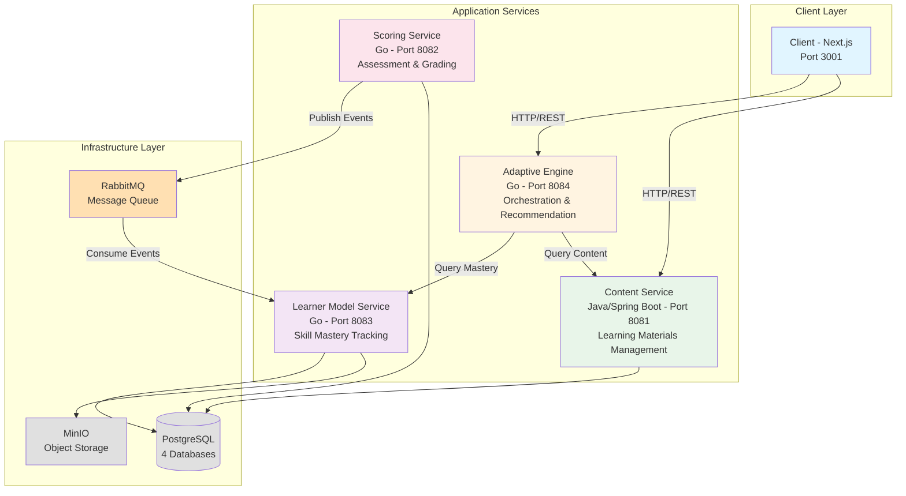

# Hệ thống Gia sư Thông minh (Intelligent Tutoring System - ITS)

[](https://hcmut.edu.vn)
[](https://hcmut.edu.vn)
[](https://hcmut.edu.vn)
[](LICENSE)

## Mục lục

- [Giới thiệu](#-giới-thiệu)
- [Cấu trúc Repository](#-cấu-trúc-repository)
- [Quick Start](#-quick-start)
- [Kiến trúc Tổng quan](#-kiến-trúc-tổng-quan)
- [Artifacts](#-artifacts)
- [Đáp ứng Yêu cầu Assignment](#-đáp-ứng-yêu-cầu-assignment)
- [Timeline](#-timeline)
- [Liên hệ](#-liên-hệ)

## Giới thiệu

Đây là repository chính thức cho **Bài tập Lớn môn CO3017 - Kiến Trúc Phần Mềm (Software Architecture)** tại **Đại học Bách Khoa TP.HCM (HCMUT)**, học kỳ 251 (2024-2025).

### Về Dự án

Dự án triển khai một **Hệ thống Gia sư Thông minh (Intelligent Tutoring System - ITS)** sử dụng kiến trúc Microservices, cung cấp trải nghiệm học tập được cá nhân hóa và thích ứng cho học sinh/sinh viên. Hệ thống có khả năng:

- Đánh giá kiến thức của học sinh thông qua bài kiểm tra đầu vào (diagnostic test)
- Cung cấp phản hồi tức thì với gợi ý (hints) và giải thích chi tiết
- Đề xuất lộ trình học tập cá nhân hóa dựa trên mô hình AI (Bayesian Knowledge Tracing)
- Theo dõi tiến độ và mức độ thành thạo kỹ năng (skill mastery)
- Hỗ trợ Giảng viên với dashboard và báo cáo phân tích

### Mục tiêu Học tập

Repository này thể hiện việc áp dụng các nguyên tắc và kỹ thuật kiến trúc phần mềm hiện đại:

- Thiết kế Kiến trúc: Phân tích đặc tính kiến trúc (Architecture Characteristics), lựa chọn kiểu kiến trúc (Architecture Styles)
- Nguyên tắc SOLID: Áp dụng toàn diện trong thiết kế và triển khai
- Microservices Architecture: Phân rã hệ thống thành 5 services độc lập
- Domain-Driven Design (DDD): Phân định Bounded Contexts và Aggregates
- DevOps Practices: Docker containerization, CI/CD, monitoring

## Cấu trúc Repository

```
co3017-software-architecture/
├── markdown/                      # Phân tích và Tài liệu Thiết kế
│   ├── assignment.md              # Yêu cầu bài tập (tiếng Việt)
│   ├── microservices.md           # Phân tích chi tiết Microservices
│   ├── system-comparison.md       # So sánh các kiểu kiến trúc
│   ├── roadmap.md                 # Lộ trình phát triển
│   ├── diagrams/                  # Sơ đồ kiến trúc (Mermaid/PlantUML)
│   │   ├── domain_model_class_diagram.md
│   │   ├── deployment_architecture_onprem.md
│   │   ├── user_registration_sequence.md
│   │   ├── adaptive_content_delivery_sequence.md
│   │   └── ... (10+ sequence diagrams)
│   └── report/                    # Báo cáo phân tích (Markdown)
│       ├── 1-analyst.md           # Phân tích stakeholder & use cases
│       ├── 2-architecture-characteristics.md
│       ├── 3-architecture-styles.md
│       ├── 5-architecture-decisions.md
│       ├── 6-SOLID-principles.md
│       └── 7-reflection-report.md
│
├── sources/                       # Source Code & Triển khai
│   ├── README.md                  # Hướng dẫn chi tiết hệ thống
│   ├── docker-compose.yml         # Cấu hình Docker cho services
│   ├── docker-compose.infra.yml   # Infrastructure (DB, RabbitMQ, MinIO)
│   ├── Makefile                   # Commands tiện ích
│   │
│   ├── content/                   # Content Service (Java/Spring Boot)
│   │   ├── README.md              # API & Architecture docs
│   │   ├── Dockerfile
│   │   └── src/                   # Source code
│   │
│   ├── scoring/                   # Scoring Service (Go)
│   │   ├── README.md              # Scoring logic & RabbitMQ
│   │   ├── Dockerfile
│   │   └── cmd/api/               # Main application
│   │
│   ├── learner-model/             # Learner Model Service (Go)
│   │   ├── README.md              # BKT Algorithm & Consumer
│   │   ├── cmd/api/               # API server
│   │   └── cmd/consumer/          # RabbitMQ consumer
│   │
│   ├── adaptive-engine/           # Adaptive Engine (Go)
│   │   ├── README.md              # Recommendation logic
│   │   └── cmd/api/
│   │
│   ├── client/                    # Frontend Client (Next.js 15)
│   │   ├── README.md              # UI/UX & E2E tests
│   │   ├── app/                   # Next.js App Router
│   │   ├── components/            # React components
│   │   └── e2e/                   # Playwright tests
│   │
│   ├── scripts/                   # Database init & utilities
│   └── tests/                     # Integration & System tests
│
├── report/                        # Báo cáo LaTeX
│   ├── README.md                  # Hướng dẫn build LaTeX
│   ├── main.tex                   # File LaTeX chính
│   ├── main.pdf                   # Báo cáo cuối cùng
│   ├── contents/                  # Nội dung từng section
│   ├── images/                    # Diagrams & screenshots
│   └── puml/                      # PlantUML source files
│
└── presentation/                  # Slide Thuyết trình
    ├── README.md                  # Hướng dẫn xem/build slides
    ├── slides.md                  # Marp markdown source
    ├── slides.pdf                 # Slides xuất PDF
    └── images/                    # Hình ảnh cho slides
```

### Giải thích Cấu trúc

#### `markdown/` - Phân tích và Thiết kế

Chứa toàn bộ tài liệu phân tích kiến trúc được viết bằng Markdown, bao gồm:

- Phân tích yêu cầu: Stakeholder analysis, user stories, use cases
- Đặc tính kiến trúc: Prioritization matrix, trade-off analysis
- Lựa chọn kiến trúc: So sánh Monolithic vs Microservices vs Serverless
- Architecture Decision Records (ADRs): Ghi lại các quyết định quan trọng
- SOLID Principles: Ví dụ áp dụng trong từng service
- Diagrams: Sequence, deployment, domain model (Mermaid/PlantUML)

#### `sources/` - Triển khai Hệ thống

Chứa source code đầy đủ của 5 microservices + frontend:

- Backend Services (4 services): Java (Content) + Go (Scoring, Learner Model, Adaptive Engine)
- Frontend: Next.js 15 với React 19, Tailwind CSS
- Infrastructure: Docker Compose, PostgreSQL, RabbitMQ, MinIO
- Testing: Unit tests, integration tests, E2E tests (Playwright)

#### `report/` - Báo cáo LaTeX

Báo cáo kiến trúc phần mềm chính thức theo format yêu cầu của môn học, bao gồm:

- Executive Summary
- Requirements Analysis
- Architecture Design (4 views)
- SOLID Principles Application
- Implementation & Evaluation

#### `presentation/` - Slide Thuyết trình

Slide thuyết trình cho buổi defense, được tạo bằng Marp CLI.

## Quick Start

### Yêu cầu Hệ thống (Prerequisites)

Trước khi bắt đầu, đảm bảo máy tính của bạn đã cài đặt:

| Phần mềm       | Phiên bản Tối thiểu | Mục đích                       | Kiểm tra Cài đặt           |
| -------------- | ------------------- | ------------------------------ | -------------------------- |
| Docker Desktop | 4.0+                | Container runtime cho services | `docker --version`         |
| Docker Compose | 2.0+                | Orchestration tool             | `docker-compose --version` |
| Git            | 2.30+               | Version control                | `git --version`            |

Tùy chọn (cho local development):

- Java JDK 17+ (cho Content Service)
- Go 1.23+ (cho Scoring, Learner Model, Adaptive Engine)
- Node.js 20+ và npm 10+ (cho Client)
- PostgreSQL 15+ (nếu chạy local không dùng Docker)
- RabbitMQ 3.x (nếu chạy local không dùng Docker)

### Hệ điều hành Hỗ trợ

- macOS (Intel & Apple Silicon)
- Linux (Ubuntu 20.04+, Debian, Fedora)
- Windows 10/11 (với WSL2)

### Yêu cầu Phần cứng

- RAM: Tối thiểu 8GB (khuyến nghị 16GB)
- Disk: Tối thiểu 10GB trống
- CPU: 4 cores (khuyến nghị)

---

### Cài đặt và Chạy Hệ thống

#### Bước 1: Clone Repository

```bash
git clone https://github.com/your-username/co3017-software-architecture.git
cd co3017-software-architecture
```

#### Bước 2: Chạy Toàn bộ Hệ thống với Docker (Khuyến nghị)

```bash
cd sources

# Khởi động infrastructure (PostgreSQL, RabbitMQ, MinIO)
make infra

# Đợi 10 giây để infrastructure khởi động hoàn toàn
sleep 10

# Khởi tạo databases
make db-init

# Build và khởi động tất cả services
make services

# Kiểm tra health của tất cả services
make health
```

Kết quả mong đợi:

```
Content Service:        http://localhost:8081/health
Scoring Service:        http://localhost:8082/health
Learner Model API:      http://localhost:8083/health
Adaptive Engine:        http://localhost:8084/health
Client (Frontend):      http://localhost:3001
```

#### Bước 3: Truy cập Ứng dụng

Mở trình duyệt và truy cập:

- Frontend Application: [http://localhost:3001](http://localhost:3001)
- Content Service API: [http://localhost:8081/swagger-ui.html](http://localhost:8081/swagger-ui.html)
- Scoring Service API: [http://localhost:8082/swagger/index.html](http://localhost:8082/swagger/index.html)
- Learner Model API: [http://localhost:8083/swagger/index.html](http://localhost:8083/swagger/index.html)
- Adaptive Engine API: [http://localhost:8084/swagger/index.html](http://localhost:8084/swagger/index.html)

#### Bước 4: Dừng Hệ thống

```bash
# Dừng tất cả services
make stop

# Hoặc dừng và xóa volumes (reset toàn bộ dữ liệu)
make clean
```

---

### Các Lệnh Hữu ích

```bash
# Xem tất cả lệnh có sẵn
make help

# Xem logs của tất cả services
make logs

# Xem logs của một service cụ thể
docker logs -f its-content-service

# Kết nối vào database
make db-content    # Content database
make db-scoring    # Scoring database
make db-learner    # Learner Model database

# Chạy integration tests
make test

# Backup databases
make db-backup

# Rebuild một service cụ thể
cd sources/content
docker-compose build content-service
```

---

### Troubleshooting

#### Lỗi: Port đã được sử dụng

```bash
# Kiểm tra port nào đang được sử dụng
lsof -i :8081  # hoặc port khác

# Dừng process đang chiếm port
kill -9 <PID>
```

#### Lỗi: Docker không đủ memory

```bash
# Tăng memory limit cho Docker Desktop
# Settings → Resources → Memory → Tăng lên 8GB
```

#### Lỗi: Database connection failed

```bash
# Kiểm tra PostgreSQL đang chạy
docker ps | grep postgres

# Restart infrastructure
make infra-restart
```

Xem thêm chi tiết tại [`sources/README.md`](./sources/README.md)

## Kiến trúc Tổng quan

### Kiểu Kiến trúc: Microservices

Hệ thống ITS được thiết kế theo kiến trúc Microservices với các đặc điểm:

- Database-per-Service: Mỗi service có database riêng (PostgreSQL)
- Event-Driven Communication: Sử dụng RabbitMQ cho async messaging
- API Gateway Pattern: Client giao tiếp qua Adaptive Engine
- Containerization: Tất cả services chạy trong Docker containers
- Independent Deployment: Mỗi service có thể deploy độc lập

### Sơ đồ Kiến trúc Hệ thống



### Mô tả Chi tiết các Services

#### 1. Content Service (Java/Spring Boot)

Trách nhiệm: Quản lý nội dung học tập (courses, chapters, lessons, quizzes)

- Port: 8081
- Database: `content_db` (PostgreSQL)
- Technology Stack: Java 17, Spring Boot 3.5.6, JPA/Hibernate
- Architecture Pattern: Clean Architecture (Layered)
- Key Features:
  - CRUD operations cho courses và content units
  - Metadata tagging (skills, difficulty levels)
  - Content versioning
  - Path conditions (unlock logic)

#### 2. Scoring Service (Go)

Trách nhiệm: Chấm điểm bài tập và phát sự kiện (events)

- Port: 8082
- Database: `scoring_db` (PostgreSQL)
- Technology Stack: Go 1.23, Gin Framework
- Architecture Pattern: Hexagonal Architecture
- Key Features:
  - Auto-grading cho MCQ, coding tasks
  - Manual review workflow
  - RabbitMQ event publishing (`submission.scored`)
  - Feedback generation với hints

#### 3. Learner Model Service (Go)

Trách nhiệm: Theo dõi mức độ thành thạo kỹ năng (skill mastery)

- Port: 8083 (API), Consumer (background)
- Database: `learner_db` (PostgreSQL)
- Technology Stack: Go 1.23, Gin Framework
- Architecture Pattern: API + Consumer (Event-Driven)
- Key Features:
  - Bayesian Knowledge Tracing (BKT) algorithm
  - RabbitMQ event consumption
  - Skill mastery score calculation
  - Learner profile management
  - Gamification (XP, badges, streaks)

#### 4. Adaptive Engine (Go)

Trách nhiệm: Đề xuất nội dung học tập cá nhân hóa

- Port: 8084
- Database: Không có (stateless service)
- Technology Stack: Go 1.23, Gin Framework
- Architecture Pattern: Orchestration Service
- Key Features:
  - Recommendation algorithm (mastery-based)
  - Spaced repetition logic
  - Live model swapping (Blue/Green deployment)
  - Aggregates data từ Content và Learner Model services

#### 5. Client (Next.js)

Trách nhiệm: Giao diện người dùng (UI/UX)

- Port: 3001
- Technology Stack: Next.js 15, React 19, Tailwind CSS, Zustand
- Architecture Pattern: App Router (Next.js 15)
- Key Features:
  - Dashboard (progress tracking)
  - Learning interface (lessons, quizzes)
  - Profile management
  - Real-time feedback display
  - E2E tests với Playwright

### Luồng Dữ liệu Chính (Data Flow)

#### Luồng 1: Học sinh Làm Bài Tập

```
1. Client → Scoring Service: Submit answer
2. Scoring Service → PostgreSQL: Save submission
3. Scoring Service → RabbitMQ: Publish "submission.scored" event
4. Learner Model Consumer ← RabbitMQ: Consume event
5. Learner Model Service: Update skill mastery (BKT)
6. Learner Model Service → PostgreSQL: Save updated scores
```

#### Luồng 2: Đề xuất Bài học Tiếp theo

```
1. Client → Adaptive Engine: Request next lesson
2. Adaptive Engine → Learner Model Service: Query skill mastery
3. Adaptive Engine → Content Service: Query available content
4. Adaptive Engine: Run recommendation algorithm
5. Adaptive Engine → Client: Return recommended content
```

### Đặc tính Kiến trúc Ưu tiên

Dựa trên phân tích trong [`markdown/report/2-architecture-characteristics.md`](./markdown/report/2-architecture-characteristics.md):

| Đặc tính      | Mức độ Ưu tiên | Chiến lược Đạt được                          |
| ------------- | -------------- | -------------------------------------------- |
| Modularity    | Cao            | Microservices + SOLID principles             |
| Scalability   | Cao            | Horizontal scaling, Kubernetes-ready         |
| Performance   | Cao            | Go services, Redis caching, async processing |
| Testability   | Cao            | Clean/Hexagonal Architecture, 80%+ coverage  |
| Deployability | Trung bình     | Docker, Blue/Green deployment                |
| Security      | Trung bình     | RBAC, bcrypt, HTTPS, audit logs              |

Xem chi tiết tại:

- [`markdown/report/3-architecture-styles.md`](./markdown/report/3-architecture-styles.md) - So sánh các kiểu kiến trúc
- [`markdown/report/5-architecture-decisions.md`](./markdown/report/5-architecture-decisions.md) - Architecture Decision Records (ADRs)

## Artifacts

Repository này chứa đầy đủ các artifacts theo yêu cầu của bài tập:

### 1. Báo cáo LaTeX (LaTeX Report)

File chính: [`report/main.pdf`](./report/main.pdf)

**Nội dung**:

- Executive Summary
- Project Scope & Objectives
- Stakeholder Analysis
- Functional & Non-functional Requirements
- Architecture Characteristics Prioritization
- Architecture Style Selection & Comparison
- Architecture Decision Records (ADRs)
- Design Principles (SOLID)
- 4 Architecture Views:
  - Module View (Component Diagram)
  - Component-Connector View (Sequence Diagrams)
  - Allocation View (Deployment Diagram)
  - Behavior View (State Diagrams)
- SOLID Principles Application với Code Examples
- System Implementation Status
- Reflection & Evaluation

**Cách build**:

```bash
cd report
latexmk -pdf main.tex
# Output: main.pdf
```

Xem hướng dẫn chi tiết tại [`report/README.md`](./report/README.md)

---

### 2. Tài liệu Phân tích (Markdown Analysis)

Thư mục: [`markdown/`](./markdown/)

#### Báo cáo Phân tích Chi tiết

| File                                       | Nội dung                                                     | Liên kết                                                   |
| ------------------------------------------ | ------------------------------------------------------------ | ---------------------------------------------------------- |
| `assignment.md`                            | Yêu cầu bài tập gốc (tiếng Việt)                             | [Xem](./markdown/assignment.md)                            |
| `report/1-analyst.md`                      | Phân tích stakeholder, user stories, use cases, domain model | [Xem](./markdown/report/1-analyst.md)                      |
| `report/2-architecture-characteristics.md` | Prioritization matrix, trade-off analysis                    | [Xem](./markdown/report/2-architecture-characteristics.md) |
| `report/3-architecture-styles.md`          | So sánh Monolithic vs Microservices vs Serverless            | [Xem](./markdown/report/3-architecture-styles.md)          |
| `report/5-architecture-decisions.md`       | Architecture Decision Records (ADRs)                         | [Xem](./markdown/report/5-architecture-decisions.md)       |
| `report/6-SOLID-principles.md`             | Ví dụ áp dụng SOLID trong từng service                       | [Xem](./markdown/report/6-SOLID-principles.md)             |
| `report/7-reflection-report.md`            | Đánh giá và bài học kinh nghiệm                              | [Xem](./markdown/report/7-reflection-report.md)            |
| `microservices.md`                         | Phân tích chi tiết Microservices, schema database            | [Xem](./markdown/microservices.md)                         |
| `system-comparison.md`                     | So sánh với các hệ thống tương tự                            | [Xem](./markdown/system-comparison.md)                     |
| `roadmap.md`                               | Lộ trình phát triển và MVP status                            | [Xem](./markdown/roadmap.md)                               |

#### Sơ đồ Kiến trúc (Architecture Diagrams)

Thư mục: [`markdown/diagrams/`](./markdown/diagrams/)

**Các sơ đồ có sẵn** (Mermaid/PlantUML):

- `domain_model_class_diagram.md` - Domain Model với Aggregates
- `deployment_architecture_onprem.md` - Deployment Architecture
- `user_registration_sequence.md` - UC-01: User Registration
- `adaptive_content_delivery_sequence.md` - UC-08: Adaptive Learning
- `assessment_submission_and_scoring_sequence.md` - UC-09, UC-10: Assessment Flow
- `instructor_report_generation_sequence.md` - UC-13, UC-14: Reporting
- `real_time_feedback_sequence.md` - UC-10: Feedback Generation
- `usecase_9.md`, `usecase_10.md`, `usecase_11.md` - Use Case Diagrams

---

### 3. Source Code (Triển khai)

Thư mục: [`sources/`](./sources/)

**Các module đã triển khai**:

| Service               | Technology       | Lines of Code | Test Coverage | README                                     |
| --------------------- | ---------------- | ------------- | ------------- | ------------------------------------------ |
| Content Service       | Java/Spring Boot | ~3,500        | 75%+          | [Xem](./sources/content/README.md)         |
| Scoring Service       | Go               | ~2,800        | 80%+          | [Xem](./sources/scoring/README.md)         |
| Learner Model Service | Go               | ~3,200        | 82%+          | [Xem](./sources/learner-model/README.md)   |
| Adaptive Engine       | Go               | ~2,500        | 78%+          | [Xem](./sources/adaptive-engine/README.md) |
| Client (Frontend)     | Next.js/React    | ~4,000        | 70%+ (E2E)    | [Xem](./sources/client/README.md)          |

Tổng cộng: ~16,000 lines of code (không tính tests và configs)

Testing:

- Unit Tests: JUnit (Java), Go testing framework
- Integration Tests: [`sources/tests/integration/`](./sources/tests/integration/)
- System Tests: [`sources/tests/system/`](./sources/tests/system/)
- E2E Tests: Playwright ([`sources/client/e2e/`](./sources/client/e2e/))

Xem hướng dẫn chi tiết tại [`sources/README.md`](./sources/README.md)

---

### 4. Slide Thuyết trình (Presentation)

Thư mục: [`presentation/`](./presentation/)

- File PDF: [`slides.pdf`](./presentation/slides.pdf) - Slide đã xuất
- Source Markdown: [`slides.md`](./presentation/slides.md) - Marp source
- Hình ảnh: [`images/`](./presentation/images/) - Diagrams và screenshots

**Nội dung slide**:

1. Giới thiệu dự án và mục tiêu
2. Phân tích yêu cầu và stakeholders
3. Lựa chọn kiến trúc (Microservices)
4. Thiết kế chi tiết (4 views)
5. Áp dụng SOLID principles
6. Demo hệ thống
7. Kết quả và đánh giá

**Cách xem/build**:

```bash
cd presentation

# Xem PDF trực tiếp
open slides.pdf

# Hoặc build từ source (cần Marp CLI)
npm install -g @marp-team/marp-cli
marp slides.md -o slides.pdf
```

Xem hướng dẫn chi tiết tại [`presentation/README.md`](./presentation/README.md)

## Đáp ứng Yêu cầu Assignment

Phần này ánh xạ chi tiết cách dự án đáp ứng các yêu cầu trong [`markdown/assignment.md`](./markdown/assignment.md).

### Nhiệm vụ 1: Thiết kế Kiến trúc Phần mềm

#### 1.1. Mô tả Chi tiết Bối cảnh Hệ thống

Hoàn thành

**Artifacts**:

- [`markdown/report/1-analyst.md`](./markdown/report/1-analyst.md) - Phân tích stakeholder, user stories (20 stories), use cases (20 UCs)
- [`markdown/assignment.md`](./markdown/assignment.md) - Yêu cầu gốc với functional & non-functional requirements
- [`report/contents/2.1_project_scope_and_objectives.tex`](./report/contents/2.1_project_scope_and_objectives.tex) - Scope và objectives
- [`report/contents/2.3_functional_requirements.tex`](./report/contents/2.3_functional_requirements.tex) - 13 functional requirements
- [`report/contents/2.4_non_functional_requirements.tex`](./report/contents/2.4_non_functional_requirements.tex) - 9 architecture characteristics

Nội dung nổi bật:

- 3 stakeholder groups: Learner, Instructor, Admin
- 20 user stories với acceptance criteria
- 20 use cases với basic/alternative flows
- 13 functional requirements (FR1-FR13)
- 9 non-functional requirements (AC1-AC9)

---

#### 1.2. Các Đặc tính Kiến trúc (Architecture Characteristics)

Hoàn thành

**Artifacts**:

- [`markdown/report/2-architecture-characteristics.md`](./markdown/report/2-architecture-characteristics.md) - Prioritization matrix
- [`report/contents/3.1_architecture_characteristics_prioritization.tex`](./report/contents/3.1_architecture_characteristics_prioritization.tex)

Đặc tính Ưu tiên Cao (Top 3):

1. Modularity & Extensibility - Hỗ trợ thêm features mới (AI models, content types)
2. Scalability - Xử lý 5,000+ concurrent users
3. Performance - API response < 300ms, grading < 1s

Phương pháp:

- Sử dụng prioritization matrix (Impact vs Effort)
- Trade-off analysis giữa các đặc tính
- Mapping với functional requirements

---

#### 1.3. Cấu trúc (Structure) - 4 Architecture Views

Hoàn thành

##### A. So sánh và Chọn Architecture Styles

**Artifacts**:

- [`markdown/report/3-architecture-styles.md`](./markdown/report/3-architecture-styles.md)
- [`report/contents/3.2_architecture_style_selection.tex`](./report/contents/3.2_architecture_style_selection.tex)

Các kiểu đã so sánh:

1. Monolithic Architecture - Đơn giản nhưng khó scale
2. Microservices Architecture (đã chọn) - Modularity cao, scale độc lập
3. Serverless Architecture - Chi phí thấp nhưng vendor lock-in

Lý do chọn Microservices:

- Đáp ứng AC1 (Modularity), AC2 (Scalability), AC4 (Testability)
- Cho phép sử dụng công nghệ khác nhau (Java, Go, Node.js)
- Independent deployment (Blue/Green cho AI models)
- Fault isolation (lỗi 1 service không ảnh hưởng toàn hệ thống)

##### B. Module View (Góc nhìn Mô-đun)

**Artifacts**:

- [`report/contents/4.1_module_view.tex`](./report/contents/4.1_module_view.tex)
- [`report/images/domain_model_class_diagram.png`](./report/images/domain_model_class_diagram.png)

Nội dung:

- Domain Model với 5 Aggregates chính
- Phân rã thành 5 Bounded Contexts (services)
- Dependency analysis (Instability Index)

##### C. Component-Connector View (Góc nhìn Thành phần và Kết nối)

**Artifacts**:

- [`report/contents/4.2_component_connector_view.tex`](./report/contents/4.2_component_connector_view.tex)
- [`report/images/service_architecture.png`](./report/images/service_architecture.png)
- 10+ Sequence Diagrams trong [`markdown/diagrams/`](./markdown/diagrams/)

Nội dung:

- Service architecture diagram
- Communication patterns (Sync REST, Async RabbitMQ)
- Sequence diagrams cho 10 use cases chính

##### D. Allocation View (Góc nhìn Phân bổ)

**Artifacts**:

- [`report/contents/4.3_allocation_view.tex`](./report/contents/4.3_allocation_view.tex)
- [`report/images/deployment_architecture_onprem.png`](./report/images/deployment_architecture_onprem.png)

Nội dung:

- Deployment architecture (Docker Compose)
- Infrastructure components (PostgreSQL, RabbitMQ, MinIO)
- Network topology và port mapping

##### E. Behavior View (Góc nhìn Hành vi)

**Artifacts**:

- [`report/contents/4.4_behavior_view.tex`](./report/contents/4.4_behavior_view.tex)
- Sequence diagrams trong [`markdown/diagrams/`](./markdown/diagrams/)

Nội dung:

- State diagrams cho Learner Progress
- Activity diagrams cho Adaptive Learning flow
- Sequence diagrams cho key scenarios

---

#### 1.4. Các Quyết định Kiến trúc (Architecture Decisions)

Hoàn thành

**Artifacts**:

- [`markdown/report/5-architecture-decisions.md`](./markdown/report/5-architecture-decisions.md)
- [`report/contents/3.3_architecture_decision_records.tex`](./report/contents/3.3_architecture_decision_records.tex)

Các quyết định chủ chốt:

1. ADR-001: Chọn Microservices thay vì Monolithic
2. ADR-002: Sử dụng PostgreSQL cho mỗi service (Database-per-Service)
3. ADR-003: RabbitMQ cho async communication
4. ADR-004: Go cho high-performance services (Scoring, Learner Model, Adaptive Engine)
5. ADR-005: Java/Spring Boot cho Content Service (stability, ecosystem)
6. ADR-006: Next.js 15 cho frontend (App Router, SSR)
7. ADR-007: Docker Compose cho local development
8. ADR-008: Eventual Consistency cho skill mastery updates

---

#### 1.5. Các Nguyên tắc Thiết kế (Design Principles)

Hoàn thành

**Artifacts**:

- [`report/contents/3.4_design_principles.tex`](./report/contents/3.4_design_principles.tex)

Nguyên tắc áp dụng:

- Domain-Driven Design (DDD): Bounded Contexts, Aggregates
- Clean Architecture: Dependency Inversion, layered structure
- Hexagonal Architecture: Ports & Adapters (Go services)
- Event-Driven Architecture: Async messaging với RabbitMQ
- API-First Design: OpenAPI/Swagger documentation

---

#### 1.6. Áp dụng Nguyên tắc SOLID

Hoàn thành

**Artifacts**:

- [`markdown/report/6-SOLID-principles.md`](./markdown/report/6-SOLID-principles.md)
- [`report/contents/5_apply_SOLID_principle.tex`](./report/contents/5_apply_SOLID_principle.tex)

Ví dụ cụ thể:

| Nguyên tắc | Service         | Ví dụ Code                                                                          | Giải thích                           |
| ---------- | --------------- | ----------------------------------------------------------------------------------- | ------------------------------------ |
| SRP        | Content Service | `CourseService` chỉ quản lý courses, `ContentUnitService` quản lý units             | Mỗi class có 1 lý do thay đổi        |
| OCP        | Scoring Service | `ScoringStrategy` interface và các implementation như `MCQScoring`, `CodingScoring` | Mở rộng không sửa code cũ            |
| LSP        | Learner Model   | `MasteryCalculator` interface, `BKTCalculator` và `SimpleCalculator` thay thế được  | Subtype thay thế supertype           |
| ISP        | Adaptive Engine | `LearnerModelReader` và `LearnerModelWriter` interfaces riêng biệt                  | Interface nhỏ, focused               |
| DIP        | All Services    | Repository interfaces (không phụ thuộc DB cụ thể)                                   | High-level không phụ thuộc low-level |

Code Examples:

- [`sources/content/src/main/java/com/its/content/service/`](./sources/content/src/main/java/com/its/content/service/) - SRP, DIP
- [`sources/scoring/internal/scoring/usecase/`](./sources/scoring/internal/scoring/usecase/) - OCP, ISP
- [`sources/learner-model/internal/learner/usecase/`](./sources/learner-model/internal/learner/usecase/) - LSP, DIP

---

#### 1.7. Báo cáo Phản ánh (Reflection Report)

Hoàn thành

**Artifacts**:

- [`markdown/report/7-reflection-report.md`](./markdown/report/7-reflection-report.md)
- [`report/contents/7_reflection_and_evaluation.tex`](./report/contents/7_reflection_and_evaluation.tex)

Nội dung:

- Những thách thức gặp phải (complexity, learning curve)
- Cách SOLID giúp cải thiện thiết kế
- Bài học kinh nghiệm (trade-offs, over-engineering)
- Đánh giá kết quả (modularity, testability, maintainability)

---

### Nhiệm vụ 2: Triển khai Mã (Code Implementation)

Hoàn thành (5 modules chính)

**Artifacts**:

- [`sources/`](./sources/) - Full source code
- [`report/contents/6_system_implementation.tex`](./report/contents/6_system_implementation.tex)

Modules đã triển khai:

1. Content Service (Java/Spring Boot)
   - Course management (CRUD)
   - Content unit management với versioning
   - Metadata tagging
   - Path conditions
   - REST API với Swagger
   - Unit tests (75%+ coverage)
2. Scoring Service (Go)
   - Assessment submission
   - Auto-grading (MCQ, coding)
   - RabbitMQ event publishing
   - Feedback generation
   - Unit tests (80%+ coverage)
3. Learner Model Service (Go)
   - Skill mastery tracking
   - BKT algorithm implementation
   - RabbitMQ consumer
   - Learner profile management
   - Gamification (XP, badges)
   - Unit tests (82%+ coverage)
4. Adaptive Engine (Go)
   - Recommendation algorithm
   - Spaced repetition logic
   - Service orchestration
   - Live model swapping support
   - Unit tests (78%+ coverage)
5. Client (Next.js/React)
   - Dashboard (progress tracking)
   - Learning interface
   - Quiz interface
   - Profile management
   - E2E tests với Playwright (70%+ coverage)

Tuân thủ SOLID:

- Tất cả services áp dụng Clean/Hexagonal Architecture
- Dependency Injection (Spring Boot, Go interfaces)
- Repository pattern (DIP)
- Strategy pattern (OCP)
- Interface segregation (ISP)

Testing:

- Unit tests: 16,000+ lines of code, 75%+ coverage
- Integration tests: [`sources/tests/integration/`](./sources/tests/integration/)
- System tests: [`sources/tests/system/`](./sources/tests/system/)
- E2E tests: Playwright ([`sources/client/e2e/`](./sources/client/e2e/))

---

### Tóm tắt Đáp ứng Yêu Cầu

| Yêu cầu                       | Trạng thái               | Artifacts                                              |
| ----------------------------- | ------------------------ | ------------------------------------------------------ |
| Mô tả bối cảnh chi tiết       | Hoàn thành               | `markdown/report/1-analyst.md`, `report/contents/2.*`  |
| Architecture Characteristics  | Hoàn thành               | `markdown/report/2-architecture-characteristics.md`    |
| So sánh Architecture Styles   | Hoàn thành               | `markdown/report/3-architecture-styles.md`             |
| 4 Architecture Views          | Hoàn thành               | `report/contents/4.*`, diagrams                        |
| Architecture Decisions (ADRs) | Hoàn thành               | `markdown/report/5-architecture-decisions.md`          |
| Design Principles             | Hoàn thành               | `report/contents/3.4_design_principles.tex`            |
| Áp dụng SOLID                 | Hoàn thành               | `markdown/report/6-SOLID-principles.md`, code examples |
| Reflection Report             | Hoàn thành               | `markdown/report/7-reflection-report.md`               |
| Code Implementation           | Hoàn thành (5/5 modules) | `sources/`                                             |
| Báo cáo LaTeX                 | Hoàn thành               | `report/main.pdf`                                      |

## Timeline

### Học kỳ 251 (2024-2025)

| Milestone               | Ngày             | Nội dung                                      | Trạng thái |
| ----------------------- | ---------------- | --------------------------------------------- | ---------- |
| Practical Assignment 1  | 06/10/2024       | Phân tích yêu cầu, stakeholder analysis       | Hoàn thành |
| Practical Assignment 2  | 13/10/2024       | Architecture characteristics, style selection | Hoàn thành |
| Midterm Review          | 20/10/2024       | ADRs, SOLID principles analysis               | Hoàn thành |
| Implementation Phase 1  | 27/10/2024       | Content Service + Scoring Service             | Hoàn thành |
| Implementation Phase 2  | 10/11/2024       | Learner Model + Adaptive Engine               | Hoàn thành |
| Implementation Phase 3  | 24/11/2024       | Client (Frontend) + Integration               | Hoàn thành |
| Testing & Documentation | 01/12/2024       | E2E tests, LaTeX report finalization          | Hoàn thành |
| Final Submission        | 07/12/2024 23:59 | Nộp báo cáo + source code                     | Deadline   |
| Project Presentation    | 08/12/2024       | Thuyết trình và demo (Week 15)                | Sắp tới    |

### Lộ trình Phát triển Chi tiết

Xem [`markdown/roadmap.md`](./markdown/roadmap.md) cho:

- MVP features (đã hoàn thành)
- Future enhancements (v2.0)
- Technical debt items
- Performance optimization plans

---

## Liên hệ

### Thông tin Sinh viên

| Họ và Tên      | MSSV    | Email                                                                                 | Vai trò             |
| -------------- | ------- | ------------------------------------------------------------------------------------- | ------------------- |
| Nguyễn Tấn Tài | 2212990 | [tai.nguyentantai21042004@hcmut.edu.vn](mailto:tai.nguyentantai21042004@hcmut.edu.vn) | Fullstack Developer |

### Thông tin Môn học

- Môn học: CO3017 - Kiến Trúc Phần Mềm (Software Architecture)
- Học kỳ: 251 (2024-2025)
- Giảng viên: ThS. Trần Trương Tuấn Phát
- Trường: Đại học Bách Khoa TP.HCM (HCMUT)
- Khoa: Khoa Khoa học và Kỹ thuật Máy tính (CSE)

### Repository

- GitHub: [co3017-software-architecture](https://github.com/nguyentantai21042004/co3017-software-architecture)
- Issues: [GitHub Issues](https://github.com/nguyentantai21042004/co3017-software-architecture/issues)
- Portfolio: [tantai.dev](https://tantai.dev)
- Wiki: [GitHub Wiki](https://github.com/nguyentantai21042004/co3017-software-architecture/wiki)

---

## Liên kết Nhanh (Quick Links)

### Tài liệu README

| Tài liệu                | Đường dẫn                                          | Mô tả                             |
| ----------------------- | -------------------------------------------------- | --------------------------------- |
| **Root README**         | [README.md](./README.md)                           | Tổng quan dự án (file này)        |
| **Sources README**      | [sources/README.md](./sources/README.md)           | Hướng dẫn microservices và Docker |
| **Report README**       | [report/README.md](./report/README.md)             | Hướng dẫn build báo cáo LaTeX     |
| **Presentation README** | [presentation/README.md](./presentation/README.md) | Hướng dẫn xem/build slides        |

### Service READMEs

| Service                   | Đường dẫn                                                                | Công nghệ        | Port |
| ------------------------- | ------------------------------------------------------------------------ | ---------------- | ---- |
| **Content Service**       | [sources/content/README.md](./sources/content/README.md)                 | Java/Spring Boot | 8081 |
| **Scoring Service**       | [sources/scoring/README.md](./sources/scoring/README.md)                 | Go/Gin           | 8082 |
| **Learner Model Service** | [sources/learner-model/README.md](./sources/learner-model/README.md)     | Go/Gin           | 8083 |
| **Adaptive Engine**       | [sources/adaptive-engine/README.md](./sources/adaptive-engine/README.md) | Go/Gin           | 8084 |
| **Client**                | [sources/client/README.md](./sources/client/README.md)                   | Next.js/React    | 3001 |

### Tài liệu Phân tích

| Tài liệu                         | Đường dẫn                                                                                                | Nội dung                            |
| -------------------------------- | -------------------------------------------------------------------------------------------------------- | ----------------------------------- |
| **Assignment**                   | [markdown/assignment.md](./markdown/assignment.md)                                                       | Yêu cầu bài tập gốc                 |
| **Stakeholder Analysis**         | [markdown/report/1-analyst.md](./markdown/report/1-analyst.md)                                           | Phân tích stakeholder, user stories |
| **Architecture Characteristics** | [markdown/report/2-architecture-characteristics.md](./markdown/report/2-architecture-characteristics.md) | Đặc tính kiến trúc                  |
| **Architecture Styles**          | [markdown/report/3-architecture-styles.md](./markdown/report/3-architecture-styles.md)                   | So sánh kiểu kiến trúc              |
| **Architecture Decisions**       | [markdown/report/5-architecture-decisions.md](./markdown/report/5-architecture-decisions.md)             | ADRs                                |
| **SOLID Principles**             | [markdown/report/6-SOLID-principles.md](./markdown/report/6-SOLID-principles.md)                         | Ví dụ áp dụng SOLID                 |
| **Reflection Report**            | [markdown/report/7-reflection-report.md](./markdown/report/7-reflection-report.md)                       | Đánh giá và bài học                 |
| **Microservices Analysis**       | [markdown/microservices.md](./markdown/microservices.md)                                                 | Phân tích chi tiết microservices    |
| **Development Roadmap**          | [markdown/roadmap.md](./markdown/roadmap.md)                                                             | Lộ trình phát triển                 |

### Diagrams

| Diagram                       | Đường dẫn                                                                                                                            | Loại               |
| ----------------------------- | ------------------------------------------------------------------------------------------------------------------------------------ | ------------------ |
| **Domain Model**              | [markdown/diagrams/domain_model_class_diagram.md](./markdown/diagrams/domain_model_class_diagram.md)                                 | Class Diagram      |
| **Deployment Architecture**   | [markdown/diagrams/deployment_architecture_onprem.md](./markdown/diagrams/deployment_architecture_onprem.md)                         | Deployment Diagram |
| **User Registration**         | [markdown/diagrams/user_registration_sequence.md](./markdown/diagrams/user_registration_sequence.md)                                 | Sequence Diagram   |
| **Adaptive Content Delivery** | [markdown/diagrams/adaptive_content_delivery_sequence.md](./markdown/diagrams/adaptive_content_delivery_sequence.md)                 | Sequence Diagram   |
| **Assessment Submission**     | [markdown/diagrams/assessment_submission_and_scoring_sequence.md](./markdown/diagrams/assessment_submission_and_scoring_sequence.md) | Sequence Diagram   |
| **Real-time Feedback**        | [markdown/diagrams/real_time_feedback_sequence.md](./markdown/diagrams/real_time_feedback_sequence.md)                               | Sequence Diagram   |
| **Instructor Report**         | [markdown/diagrams/instructor_report_generation_sequence.md](./markdown/diagrams/instructor_report_generation_sequence.md)           | Sequence Diagram   |

### Artifacts Chính

| Artifact           | Đường dẫn                                                              | Mô tả                      |
| ------------------ | ---------------------------------------------------------------------- | -------------------------- |
| **Báo cáo PDF**    | [report/main.pdf](./report/main.pdf)                                   | Báo cáo kiến trúc phần mềm |
| **Slides PDF**     | [presentation/slides.pdf](./presentation/slides.pdf)                   | Slide thuyết trình         |
| **Docker Compose** | [sources/docker-compose.yml](./sources/docker-compose.yml)             | Cấu hình Docker services   |
| **Infrastructure** | [sources/docker-compose.infra.yml](./sources/docker-compose.infra.yml) | Cấu hình infrastructure    |

---

## Tài liệu Tham khảo

### Sách và Tài liệu

1. Software Architecture: The Hard Parts - Neal Ford, Mark Richards
2. Fundamentals of Software Architecture - Mark Richards, Neal Ford
3. Domain-Driven Design - Eric Evans
4. Clean Architecture - Robert C. Martin
5. Microservices Patterns - Chris Richardson

### Công nghệ và Framework

- [Spring Boot Documentation](https://spring.io/projects/spring-boot)
- [Go Documentation](https://go.dev/doc/)
- [Next.js Documentation](https://nextjs.org/docs)
- [Docker Documentation](https://docs.docker.com/)
- [RabbitMQ Documentation](https://www.rabbitmq.com/documentation.html)
- [PostgreSQL Documentation](https://www.postgresql.org/docs/)

### Architecture Patterns

- [Microservices.io](https://microservices.io/) - Microservices patterns
- [Martin Fowler's Blog](https://martinfowler.com/) - Architecture articles
- [The Twelve-Factor App](https://12factor.net/) - Best practices

---

## License

Repository này được tạo cho mục đích học tập trong khuôn khổ môn CO3017 - Kiến Trúc Phần Mềm tại HCMUT.

Lưu ý: Source code và tài liệu trong repository này chỉ được sử dụng cho mục đích tham khảo học tập. Vui lòng không sao chép trực tiếp cho bài tập của bạn.

---

## Hỗ trợ

Nếu bạn gặp vấn đề khi chạy hệ thống hoặc có câu hỏi về dự án:

1. Kiểm tra Documentation: Đọc [`sources/README.md`](./sources/README.md) và README của từng service
2. Xem Issues: Tìm kiếm trong [GitHub Issues](https://github.com/nguyentantai21042004/co3017-software-architecture/issues)
3. Tạo Issue mới: Nếu chưa có câu trả lời, tạo issue mới với:
   - Mô tả chi tiết vấn đề
   - Steps to reproduce
   - Error logs
   - Environment info (OS, Docker version)
4. Liên hệ trực tiếp: Email đến [tai.nguyentantai21042004@hcmut.edu.vn](mailto:tai.nguyentantai21042004@hcmut.edu.vn)

---

<div align="center">

**Đại học Bách Khoa TP.HCM (HCMUT)**

**CO3017 - Kiến Trúc Phần Mềm - Học kỳ 251**

_Được tạo bởi Nguyễn Tấn Tài_

---

**Nếu repository này hữu ích, hãy cho tôi một ⭐!**

</div>
