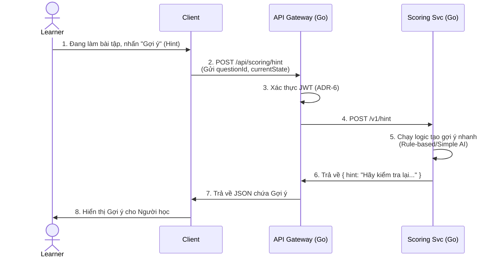

# Real Time Feedback Sequence

```mermaid
sequenceDiagram
    actor Learner
    participant Client
    participant APIGW as API Gateway (Go)
    participant ScoringSvc as Scoring Svc (Go)

    Learner ->> Client: 1. Đang làm bài tập, nhấn "Gợi ý" (Hint)
    Client ->> APIGW: 2. POST /api/scoring/hint<br>(Gửi questionId, currentState)
    
    APIGW ->> APIGW: 3. Xác thực JWT (ADR-6)
    APIGW ->> ScoringSvc: 4. POST /v1/hint

    ScoringSvc ->> ScoringSvc: 5. Chạy logic tạo gợi ý nhanh<br>(Rule-based/Simple AI)
    ScoringSvc ->> APIGW: 6. Trả về { hint: "Hãy kiểm tra lại..." }
    
    APIGW ->> Client: 7. Trả về JSON chứa Gợi ý
    Client ->> Learner: 8. Hiển thị Gợi ý cho Người học
```
