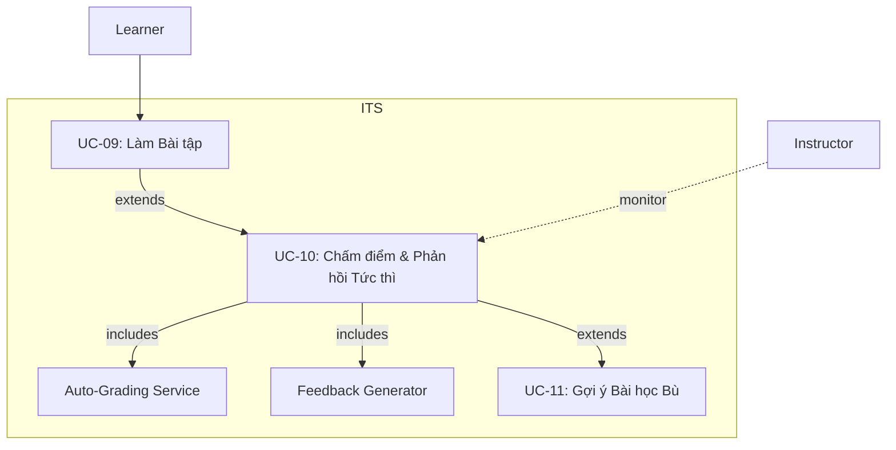

<b>UC-10 – Chấm điểm và Phản hồi Tức thì</b>

<b>Mục tiêu:</b> Tự động chấm điểm và trả phản hồi nhanh cho người học (&lt; 1 s), đồng thời cập nhật Learner Model.

<b>Giải thích:</b> 
- UC-10 bao gồm hai chức năng chính: 
  - <b>Auto-Grading Service</b>: tính điểm. 
  - <b>Feedback Generator</b>: tạo gợi ý/hints. 
- Nếu kết quả kém, hệ thống mở rộng đến UC-11 để đề xuất bài học bù.
