# Báo Cáo Chuyên Sâu: Phân Định Miền và Thiết Kế Schema Dữ Liệu cho Nền Tảng Học Tập Thích Ứng

Việc thiết kế một nền tảng học tập thích ứng (Adaptive Learning Management System - LMS) theo kiến trúc Microservices đòi hỏi sự phân chia miền (Bounded Contexts) rõ ràng dựa trên các quy tắc nghiệp vụ cốt lõi. Mục tiêu là đảm bảo mỗi dịch vụ sở hữu dữ liệu riêng tư (Database-per-Service) và duy trì tính nhất quán giao dịch (Transactional Consistency) trong phạm vi các Aggregate Roots.

Báo cáo này trình bày chi tiết về việc phân định trách nhiệm dữ liệu (Aggregate Roots) cho 5 dịch vụ đã định nghĩa, và đề xuất chi tiết schema cơ sở dữ liệu quan hệ (sử dụng PostgreSQL) để đáp ứng các yêu cầu chức năng (FRs) và Usecase (UCs) đã nêu, đặc biệt chú trọng đến hiệu suất và khả năng mở rộng.

---

## PHẦN I: XÁC ĐỊNH RANH GIỚI MIỀN VÀ CÁC AGGREGATE ROOTS

Việc phân chia miền theo Domain-Driven Design (DDD) giúp xác định ranh giới nhất quán. Trong kiến trúc này, giao dịch không được vượt qua ranh giới Aggregate. Mỗi Microservice sở hữu một hoặc nhiều Aggregate Roots, chịu trách nhiệm duy trì các bất biến nghiệp vụ (invariants) bên trong cụm đối tượng đó.

---

### 1.1. User Management Service (UMS)

UMS, được xây dựng trên Java (Spring Boot), là miền cốt lõi chịu trách nhiệm về danh tính, xác thực (AuthN) và ủy quyền (AuthZ).

| **Aggregate Root Cốt lõi** | **Trách nhiệm Đơn nhất (SRP) & Ranh giới Nhất quán** | **FRs/UCs Hỗ trợ** |
|----------------------------|-----------------------------------------------------|-------------------|
| **UserAccount** | Đảm bảo tính nhất quán của thông tin đăng nhập (email/password hash), trạng thái tài khoản, và vai trò cơ bản (FR1, UC-01, UC-02). | FR1, UC-01, UC-02 |
| **Role/Permission** | Đảm bảo cấu trúc phân quyền RBAC (Role-Based Access Control) là hợp lệ và được gán chính xác cho UserAccount (FR11, UC-17). | FR11, UC-17 |
| **AuditLog** | Đảm bảo mọi thay đổi nhạy cảm (ví dụ: gán vai trò, thay đổi trạng thái tài khoản) được ghi lại một cách bất biến, phục vụ mục đích tuân thủ và bảo mật (FR11, FR12, UC-17). | FR11, FR12 |

**Sự phân định quan trọng trong UMS** là việc tách biệt Hồ sơ cốt lõi khỏi Hồ sơ học tập. UMS chỉ nên sở hữu các thuộc tính danh tính (ID, email, vai trò) để duy trì tính toàn vẹn của AuthN/AuthZ. Dữ liệu hồ sơ học tập chi tiết (trình độ, mục tiêu học, lịch học - FR2, UC-03) thường xuyên thay đổi và được Adaptive Engine sử dụng. Nếu UMS lưu trữ toàn bộ dữ liệu này, nó sẽ vi phạm SRP, vì các giao dịch cập nhật mục tiêu học tập không liên quan đến việc xác thực người dùng. Do đó, UMS chỉ cung cấp ID và Role, còn dữ liệu hồ sơ học tập chi tiết sẽ được sở hữu bởi dịch vụ khác (Learner Model Service).

---

### 1.2. Content Service

Content Service (Java/Spring Boot) quản lý tài nguyên học tập tĩnh, cấu trúc và định nghĩa các mối quan hệ logic giữa các đơn vị nội dung.

| **Aggregate Root Cốt lõi** | **Trách nhiệm Đơn nhất (SRP) & Ranh giới Nhất quán** | **FRs/UCs Hỗ trợ** |
|----------------------------|-----------------------------------------------------|-------------------|
| **Course** | Đảm bảo tính nhất quán của cấu trúc tổng thể khóa học, mục tiêu, và phân loại (FR4, UC-05, UC-07). | FR4, UC-05, UC-07 |
| **ContentUnit** | Đảm bảo định nghĩa của một đơn vị nội dung (bài học, quiz, coding task) và các quy tắc nội tại của nó (FR3, UC-05). | FR3, UC-05, UC-06 |
| **ContentVersion** | Đảm bảo lịch sử và tính bất biến của nội dung thực tế thông qua cơ chế quản lý phiên bản (versioning). | FR3, UC-05 |

Để hỗ trợ thuật toán thích ứng (FR7), dịch vụ này không chỉ lưu trữ nội dung mà còn là Nguồn Sự Thật (Source of Truth) cho các Metadata Tags (kỹ năng, độ khó) (UC-06). Schema tagging cần được chuẩn hóa (ví dụ, mô hình 3 bảng) để dễ dàng ánh xạ ContentUnit tới các Skill liên quan. Tính nhất quán của định nghĩa kỹ năng là tối quan trọng; do đó, bất kỳ thay đổi nào trong MetadataTag cần được đồng bộ hóa (ví dụ: qua Event Sourcing) sang các dịch vụ tiêu thụ khác, như Learner Model Service, để dịch vụ này có thể theo dõi tiến độ dựa trên cùng một bộ kỹ năng.

---

### 1.3. Learner Model Service

Learner Model Service (Golang) là trái tim của hệ thống thích ứng, quản lý trạng thái học tập động của người học và cần truy vấn nhanh.

| **Aggregate Root Cốt lõi** | **Trách nhiệm Đơn nhất (SRP) & Ranh giới Nhất quán** | **FRs/UCs Hỗ trợ** |
|----------------------------|-----------------------------------------------------|-------------------|
| **LearnerProfile** | Đảm bảo tính nhất quán của các cài đặt học tập cá nhân, kết quả kiểm tra đầu vào (diagnostic_test) (FR2, UC-03, UC-04). | FR2, UC-03, UC-04 |
| **SkillMasteryScore** | Đảm bảo điểm số làm chủ kỹ năng (thường là xác suất BKT hoặc mô hình khác) được cập nhật chính xác dựa trên lịch sử tương tác. | FR7, UC-04, UC-10 |
| **LearnerProgress/Gamification** | Đảm bảo tiến độ học tập và các chỉ số động lực (XP, Badges, Streaks) là nhất quán. Sự kiện hoàn thành bài học phải ngay lập tức được phản ánh vào tiến độ và điểm XP. | FR8, FR13, UC-12, UC-20 |

Do yêu cầu về hiệu suất và sự phức tạp của việc tính toán mô hình Kiến thức (Knowledge Tracing), cần áp dụng chiến lược Eventual Consistency cho việc cập nhật SkillMasteryScore. Khi Scoring/Feedback Service hoàn tất chấm điểm (UC-10), nó sẽ phát ra một Event (SubmissionCompleted). Learner Model Service sẽ nhận Event này và chạy logic tính toán/cập nhật SkillMasteryScore một cách bất đồng bộ. Việc này cho phép Scoring Service trả về kết quả ngay lập tức (đáp ứng FR6: Phản hồi tức thì) mà không cần đợi quá trình tính toán Mastery phức tạp hoàn tất, duy trì hiệu suất hệ thống. Adaptive Engine sẽ sử dụng điểm số làm chủ (Score) được cập nhật cho lần tương tác tiếp theo của người học (UC-08).

---

### 1.4. Scoring/Feedback Service

Scoring/Feedback Service (Golang) là dịch vụ có cường độ I/O cao nhất, xử lý các giao dịch nộp bài và chấm điểm thời gian thực (< 500ms).

| **Aggregate Root Cốt lõi** | **Trách nhiệm Đơn nhất (SRP) & Ranh giới Nhất quán** | **FRs/UCs Hỗ trợ** |
|----------------------------|-----------------------------------------------------|-------------------|
| **Submission** | Đảm bảo tính toàn vẹn của một lần nộp bài (câu trả lời, thời gian, trạng thái). | FR5, UC-09, UC-10 |
| **AssessmentResult** | Đảm bảo kết quả chấm điểm cuối cùng và phản hồi chi tiết (feedback, hints, giải thích đáp án) được tạo ra và lưu trữ trong cùng một giao dịch nhất quán với Submission (FR6, UC-10, UC-11). | FR6, UC-10, UC-11 |

Để đáp ứng yêu cầu hiệu suất cao, schema dữ liệu cho dịch vụ này cần tối ưu hóa cho tốc độ ghi/truy vấn. Submission là lượng ghi (write) lớn nhất, do đó, quá trình xử lý cần đảm bảo tính nguyên tử (atomic). Việc sử dụng Golang hỗ trợ độ trễ thấp, và việc lưu trữ Submission cùng với kết quả chấm điểm (AssessmentResult) trong một giao dịch duy nhất giúp đảm bảo tính toàn vẹn dữ liệu cho Gradebook.

---

### 1.5. Adaptive Engine Service

Adaptive Engine Service (Golang) là Policy Engine. Nó không lưu trữ trạng thái người học chi tiết, mà chứa logic Policy để đưa ra quyết định tối ưu về lộ trình học tập (UC-08).

| **Aggregate Root Cốt lõi** | **Trách nhiệm Đơn nhất (SRP) & Ranh giới Nhất quán** | **FRs/UCs Hỗ trợ** |
|----------------------------|-----------------------------------------------------|-------------------|
| **AdaptivePolicy** | Đảm bảo cấu hình thuật toán và Rule Set điều chỉnh lộ trình là nhất quán và sẵn sàng để tải vào bộ nhớ (In-Memory). | FR7, UC-08, UC-18 |

Dịch vụ này chỉ lưu trữ các tham số mô hình (ví dụ: tham số BKT) và Rule Sets cấu hình. Khi người học yêu cầu bài học tiếp theo, Engine sẽ đọc LearnerModel (qua API) và ContentMetadata (qua API), sau đó áp dụng AdaptivePolicy cục bộ để đề xuất ContentID tối ưu. Việc tách biệt logic quyết định (Engine) khỏi dữ liệu trạng thái (Learner Model Service) giúp Engine duy trì tính nhanh nhẹn và hỗ trợ cho quy trình vận hành phức tạp như Hoán đổi Mô hình AI trực tiếp (Live Model Swapping - FR12, UC-18).

---

## PHẦN II: THIẾT KẾ SCHEMA CƠ SỞ DỮ LIỆU CHI TIẾT

Thiết kế dưới đây sử dụng PostgreSQL, tận dụng khả năng của kiểu dữ liệu UUID cho ID dịch vụ phân tán, và JSONB để lưu trữ dữ liệu phi cấu trúc, linh hoạt mà vẫn có thể lập chỉ mục (indexing) hiệu quả.

---

### 2.1. Schema: User Management Service (UMS)

Schema này tập trung vào quản lý người dùng, phân quyền RBAC, và ghi nhật ký kiểm toán (Audit Log).

#### Table 1: User Management - Schema RBAC và Audit Log

| **Tên Bảng** | **Trường Cốt lõi** | **Kiểu dữ liệu** | **Mục đích / Nhận xét** |
|--------------|-------------------|-----------------|------------------------|
| **User** | `user_id` (PK) | UUID | ID duy nhất, làm khóa ngoại cho các dịch vụ khác. |
| | `email` | VARCHAR(255) | Độc nhất, cho AuthN (FR1). |
| | `password_hash` | VARCHAR(100) | Hash mật khẩu. |
| | `account_status` | VARCHAR(20) | ACTIVE, PENDING_VERIFICATION. |
| | `created_at` | TIMESTAMP | |
| **Role** | `role_id` (PK) | INT | Ví dụ: 1 (Learner), 2 (Instructor), 3 (Admin). |
| | `role_name` | VARCHAR(50) | Tên vai trò (FR11). |
| **UserRole** | `user_id` (FK) | UUID | Liên kết N:M. |
| | `role_id` (FK) | INT | |
| **Permission** | `permission_id` (PK) | INT | ID quyền. |
| | `action_name` | VARCHAR(100) | Tên quyền chi tiết (e.g., course:edit, report:view_all). |
| **RolePermission** | `role_id` (FK) | INT | Liên kết N:M. |
| | `permission_id` (FK) | INT | |
| **AuditLog** | `log_id` (PK) | BIGINT | ID log tự tăng. |
| | `user_id` (FK) | UUID | Người thực hiện hành động. |
| | `action` | VARCHAR(100) | Loại hành động (FR11, FR12). |
| | `resource_type` | VARCHAR(50) | Tài nguyên bị ảnh hưởng. |
| | `resource_id` | UUID/INT | ID của tài nguyên (ví dụ: User.user_id). |
| | `timestamp` | TIMESTAMP | |
| | `details` | JSONB | Chi tiết thay đổi, IP, old/new values. Cần GIN index cho các truy vấn phức tạp trên JSONB. |

Việc sử dụng mô hình RBAC 5 bảng cung cấp sự linh hoạt để quản lý quyền chi tiết, rất quan trọng cho các vai trò khác nhau như Giảng viên, Học sinh, và Admin (FR10, FR11).

---

### 2.2. Schema: Content Service

Schema này quản lý cấu trúc phân cấp của nội dung, hỗ trợ gắn thẻ metadata và điều kiện lộ trình học tập.

#### Table 2: Content Service - Schema Cấu Trúc Khóa Học, Versioning và Tagging

| **Tên Bảng** | **Trường Cốt lõi** | **Kiểu dữ liệu** | **Mục đích / Nhận xét** |
|--------------|-------------------|-----------------|------------------------|
| **Course** | `course_id` (PK) | UUID | Aggregate Root. |
| | `title`, `description` | VARCHAR, TEXT | |
| | `instructor_id` (FK) | UUID | ID của Giảng viên (từ UMS). |
| | `structure_type` | VARCHAR(20) | LINEAR, ADAPTIVE (FR4). |
| **Chapter** | `chapter_id` (PK) | UUID | |
| | `course_id` (FK) | UUID | |
| | `sequence_number` | INT | Thứ tự trong khóa học. |
| **ContentUnit** | `unit_id` (PK) | UUID | Đơn vị nội dung (bài học/quiz/assignment). |
| | `chapter_id` (FK) | UUID | |
| | `unit_type` | VARCHAR(20) | TEXT, VIDEO, QUIZ, CODING_TASK (FR3). |
| | `metadata_config` | JSONB | Cấu hình Quiz (ví dụ: câu hỏi, đáp án, auto-grading rules). |
| **ContentVersion** | `version_id` (PK) | BIGINT | ID phiên bản. |
| | `unit_id` (FK) | UUID | |
| | `version_number` | VARCHAR(20) | Sử dụng Semantic Versioning (X.Y.Z) để theo dõi các thay đổi lớn/nhỏ (FR3). |
| | `content_data` | JSONB | Nội dung thực tế. |
| | `is_active` | BOOLEAN | Phiên bản đang được phục vụ. |
| **MetadataTag** | `tag_id` (PK) | INT | Danh sách kỹ năng/chủ đề cốt lõi (Source of Truth). |
| | `tag_name` | VARCHAR(100) | Ví dụ: "Kỹ năng X", "Mức độ Y". |
| **UnitTag** | `unit_id` (FK) | UUID | Liên kết N:M. |
| | `tag_id` (FK) | INT | |
| | `relevance_score` | FLOAT | Mức độ liên quan của bài học đến kỹ năng. |
| **PathCondition** | `condition_id` (PK) | UUID | Hỗ trợ cấu hình lộ trình (FR4, UC-07). |
| | `source_unit_id` (FK) | UUID | |
| | `target_unit_id` (FK) | UUID | |
| | `required_score_pct` | INT | Ví dụ: 70 (phần trăm điểm cần đạt). |

Việc lưu trữ ContentVersion đảm bảo tính bất biến của các bài học đã xuất bản, cho phép hệ thống quay lại phiên bản cũ hoặc kiểm tra hiệu suất của các phiên bản nội dung khác nhau. Bảng PathCondition là công cụ để Giảng viên định nghĩa các điều kiện mở khóa bài học dựa trên điểm số hoặc hoàn thành (FR4), hỗ trợ cả lộ trình tuyến tính và thích ứng.

---

### 2.3. Schema: Learner Model Service

Dịch vụ này quản lý trạng thái động và cần tốc độ truy xuất nhanh chóng cho Adaptive Engine.

#### Table 3: Learner Model Service - Schema Mastery Tracking, Hồ sơ và Gamification

| **Tên Bảng** | **Trường Cốt lõi** | **Kiểu dữ liệu** | **Mục đích / Nhận xét** |
|--------------|-------------------|-----------------|------------------------|
| **LearnerProfile** | `learner_id` (PK) | UUID | ID người học (từ UMS). |
| | `learning_goal` | TEXT | Mục tiêu học tập, sở thích (FR2). |
| | `schedule_config` | JSONB | Lịch học, cấu hình push/email notification. |
| | `diagnostic_data` | JSONB | Kết quả bài kiểm tra đầu vào thô (UC-04). |
| **SkillMasteryScore** | `mastery_id` (PK) | BIGINT | ID điểm làm chủ. |
| | `learner_id` (FK) | UUID | |
| | `tag_id` (FK) | INT | Liên kết với MetadataTag (từ Content Service). |
| | `current_score` | FLOAT | Điểm làm chủ (xác suất 0.0 - 1.0). |
| | `model_parameters` | JSONB | Lưu trữ trạng thái mô hình Knowledge Tracing (ví dụ: p(L₀), p(T)) để tính toán tiếp theo. |
| | `last_updated` | TIMESTAMP | Cần cho Spaced Repetition (FR7). |
| **LearnerProgress** | `progress_id` (PK) | BIGINT | |
| | `learner_id` (FK) | UUID | |
| | `course_id` (FK) | UUID | |
| | `current_unit_id` | UUID | Bài học hiện tại. |
| | `completion_status` | FLOAT | Tỉ lệ hoàn thành. |
| **LearnerXP** | `learner_id` (PK, FK) | UUID | 1:1 với LearnerProfile, lưu trữ chỉ số Gamification. |
| | `total_xp` | INT | Điểm kinh nghiệm (FR13). |
| | `current_level` | INT | |
| | `streak_days` | INT | Chuỗi ngày học liên tục. |
| **LearnerBadge** | `badge_id` (PK) | INT | |
| | `learner_id` (FK) | UUID | |
| | `award_time` | TIMESTAMP | |

Việc lưu trữ trạng thái mô hình Knowledge Tracing (model_parameters trong SkillMasteryScore) cho phép dịch vụ Golang này tối ưu hóa việc cập nhật làm chủ kỹ năng (Mastery). Thay vì phải truy xuất toàn bộ lịch sử tương tác của người học để tính toán lại điểm làm chủ (ví dụ: BKT), dịch vụ có thể bắt đầu tính toán từ trạng thái gần nhất, đảm bảo tốc độ phản hồi cho Adaptive Engine (UC-08).

---

### 2.4. Schema: Scoring/Feedback Service

Schema này chịu trách nhiệm cho các giao dịch nộp bài (submission) và lưu trữ kết quả tức thì.

#### Table 4: Scoring/Feedback Service - Schema Submission và Kết quả

| **Tên Bảng** | **Trường Cốt lõi** | **Kiểu dữ liệu** | **Mục đích / Nhận xét** |
|--------------|-------------------|-----------------|------------------------|
| **AssessmentSubmission** | `submission_id` (PK) | UUID | Aggregate Root. |
| | `learner_id` (FK) | UUID | |
| | `unit_id` (FK) | UUID | |
| | `submit_time` | TIMESTAMP | Quan trọng cho giới hạn thời gian (FR5). |
| | `raw_response` | JSONB | Lưu trữ câu trả lời thô của người học. |
| | `is_auto_graded` | BOOLEAN | |
| **AssessmentResult** | `submission_id` (PK, FK) | UUID | Liên kết 1:1. |
| | `final_score` | FLOAT | Điểm số cuối cùng. |
| | `feedback_details` | JSONB | Phản hồi, gợi ý (hints), giải thích đáp án (FR6, UC-10). |
| | `graded_by_user_id` (FK) | UUID | Nếu chấm thủ công. |
| **ReviewTask** | `review_id` (PK) | UUID | Dành riêng cho các bài cần Giảng viên chấm thủ công (FR5). |
| | `submission_id` (FK) | UUID | |
| | `reviewer_id` (FK) | UUID | ID Giảng viên/Admin. |
| | `status` | VARCHAR(20) | PENDING, COMPLETED. |

Việc sử dụng JSONB cho raw_response và feedback_details là một hình thức Denormalization có chủ ý trong kiến trúc Microservices để đạt được hiệu suất I/O cao và độ trễ thấp theo yêu cầu. Bằng cách giữ tất cả dữ liệu liên quan đến một lần nộp bài trong một bảng (hoặc hai bảng liên kết 1:1) và sử dụng các trường JSONB, dịch vụ Golang có thể nhanh chóng tính toán và trả về phản hồi tức thì (FR6) mà không cần phải thực hiện các JOIN phức tạp.

---

### 2.5. Schema: Adaptive Engine Service

Dịch vụ này chỉ lưu trữ dữ liệu cấu hình để hỗ trợ logic quyết định.

#### Table 5: Adaptive Engine Service - Schema Policy Configuration

| **Tên Bảng** | **Trường Cốt lõi** | **Kiểu dữ liệu** | **Mục đích / Nhận xét** |
|--------------|-------------------|-----------------|------------------------|
| **AdaptivePolicyConfig** | `policy_config_id` (PK) | INT | ID cấu hình Policy. |
| | `policy_name` | VARCHAR(100) | Tên mô hình (e.g., BKT_V2). |
| | `model_version` | VARCHAR(50) | Phiên bản mô hình (Hỗ trợ Live Swap FR12, UC-18). |
| | `parameters` | JSONB | Các tham số runtime của mô hình (ví dụ: ngưỡng làm chủ, hệ số phạt Spaced Repetition). |
| | `is_active` | BOOLEAN | Cờ kích hoạt/chuyển đổi mô hình. |
| **RemediationRule** | `rule_id` (PK) | UUID | Quy tắc bù trừ nghiệp vụ (FR6, UC-11). |
| | `trigger_tag_id` (FK) | INT | Kỹ năng kích hoạt. |
| | `required_mastery_threshold` | FLOAT | Ngưỡng làm chủ yêu cầu. |
| | `remediation_content_tag` | INT | Kỹ năng nội dung bù cần gợi ý. |

Việc lưu trữ Policy Configuration trong cơ sở dữ liệu và sử dụng cờ is_active là một kỹ thuật kiến trúc quan trọng để hỗ trợ Live Model Swapping (FR12, UC-18). Thay vì yêu cầu triển khai lại toàn bộ dịch vụ khi cập nhật mô hình AI, Admin có thể tải mô hình mới và các tham số của nó vào bảng này. Adaptive Engine Service (Golang) có thể tải cấu hình này vào bộ nhớ và chỉ cần chuyển cờ is_active để chuyển đổi Policy Engine tức thì, đảm bảo hoạt động liên tục (zero downtime).

---

## PHẦN III: TƯƠNG TÁC GIỮA CÁC SERVICES VÀ BIỆN MINH KIẾN TRÚC

Việc phân chia thành 5 dịch vụ độc lập giúp giảm thiểu phạm vi ảnh hưởng (Blast Radius) và cho phép lựa chọn công nghệ tối ưu. Việc sử dụng Golang cho ba dịch vụ hiệu suất cao (Learner Model, Scoring/Feedback, Adaptive Engine) là phù hợp do khả năng xử lý concurrency và độ trễ thấp của ngôn ngữ này.

---

### 3.1. Quản lý Tính Nhất Quán Giữa Các Aggregate

Mô hình này quản lý chặt chẽ các mối quan hệ liên-Aggregate thông qua hai phương pháp chính:

#### **Tính Nhất Quán Cuối Cùng (Eventual Consistency)**

Được áp dụng trong luồng phản hồi tức thì. Scoring/Feedback Service phải phản hồi ngay lập tức cho người học (UC-10). Việc cập nhật SkillMasteryScore (trong Learner Model Service) là một quy trình tính toán phức tạp (có thể mất thời gian) và được thực hiện bất đồng bộ thông qua các sự kiện (Events). Điều này đảm bảo trải nghiệm người dùng không bị chậm trễ do các tác vụ backend nặng (FR6).

#### **Truy vấn Đồng bộ (Synchronous Query)**

Adaptive Engine Service thực hiện các cuộc gọi API đồng bộ tới Learner Model Service để lấy trạng thái làm chủ hiện tại của người học, và tới Content Service để ánh xạ các kỹ năng được gắn thẻ tới các bài học có sẵn (UC-08). Đây là các hoạt động chỉ đọc (read operations) và cần phải nhanh chóng.

#### **Bảng Tương Tác**

| **Tương tác** | **Mục đích** | **Phương pháp** | **Tác động Kiến trúc** |
|---------------|--------------|-----------------|----------------------|
| Scoring → Learner Model | Cập nhật điểm làm chủ (Mastery Score). | Event (Async) | Bảo vệ Scoring Service khỏi độ trễ tính toán mô hình phức tạp. |
| Adaptive Engine → Learner Model | Lấy trạng thái SkillMasteryScore. | API Query (Sync) | Quyết định lộ trình học tập tiếp theo dựa trên dữ liệu mới nhất. |
| Adaptive Engine → Content | Lấy danh sách nội dung/kỹ năng liên quan. | API Query (Sync) | Đề xuất nội dung chính xác (UC-11). |

---

### 3.2. Tối Ưu Hóa Dữ Liệu cho Hiệu Suất Cao

Để đảm bảo hiệu suất Golang cho các luồng thời gian thực:

#### **Lập chỉ mục (Indexing) Chiến lược**

- **Scoring/Feedback:** Bảng AssessmentSubmission cần chỉ mục đa cột trên `(learner_id, unit_id, submit_time)` để hỗ trợ các truy vấn Gradebook (FR5, FR8) và việc phân tích tốc độ hoàn thành.

- **Learner Model:** Bảng SkillMasteryScore phải có chỉ mục chính xác trên `(learner_id, tag_id)`. Đây là truy vấn quan trọng nhất mà Adaptive Engine thực hiện.

#### **Sử dụng Caching**

Learner Model Service nên triển khai một lớp Cache tốc độ cao (ví dụ: Redis) cho các Aggregate được truy cập thường xuyên như SkillMasteryScore và LearnerXP. Điều này giảm tải cho PostgreSQL và đảm bảo Adaptive Engine có thể truy cập dữ liệu trong micro giây.

---

### 3.3. Hỗ trợ Yêu cầu Báo cáo và Dashboard (FR8)

Các yêu cầu báo cáo tổng hợp (UC-13, UC-14) đòi hỏi phải tổng hợp dữ liệu từ nhiều dịch vụ (Score, Progress, Content Metadata). Trong kiến trúc Microservices, việc thực hiện JOIN giữa các Database của các dịch vụ khác nhau là một hình thức khớp nối chặt (tight coupling) và là một Antipattern.

Để giải quyết vấn đề này, kiến trúc nên áp dụng một mô hình Read/Reporting Database. Một dịch vụ Analytics độc lập sẽ lắng nghe tất cả các Events chính (ví dụ: SubmissionCompleted, MasteryScoreUpdated, UserEnrolled) và tổng hợp dữ liệu vào một kho dữ liệu báo cáo chuyên dụng (có thể là Data Lake hoặc Materialized View trong PostgreSQL/NoSQL). Kho dữ liệu này được tối ưu hóa cho các truy vấn tổng hợp phức tạp mà không làm ảnh hưởng đến hiệu suất giao dịch của các dịch vụ cốt lõi, từ đó hỗ trợ Giảng viên xem báo cáo tổng quan lớp và điểm yếu phổ biến (FR8).

---

## PHẦN IV: TÓM TẮT VÀ KẾT LUẬN

Kiến trúc Microservices cho nền tảng học tập thích ứng này được xây dựng trên sự phân định Aggregate Roots rõ ràng và tuân thủ nguyên tắc mỗi dịch vụ sở hữu dữ liệu riêng tư. Sự lựa chọn công nghệ (Golang cho hiệu suất cao; Java/Spring Boot cho tính ổn định/Maintainability) phù hợp với trách nhiệm nghiệp vụ của từng dịch vụ.

### Table 6: Tóm Tắt Phân Tách Miền và Chiến lược

| **Microservice (Bounded Context)** | **Aggregate Root Cốt lõi** | **Trách nhiệm Chính (SRP)** | **Chiến lược Nhất quán** |
|------------------------------------|---------------------------|---------------------------|------------------------|
| User Management Service (Java) | UserAccount, Role/Permission | AuthN/AuthZ, Bảo mật | Transactional Consistency (ACID) |
| Content Service (Java) | Course, ContentUnit, MetadataTag | Quản lý nội dung, Metadata, Versioning | Transactional Consistency (ACID) |
| Learner Model Service (Golang) | SkillMasteryScore, LearnerProfile | Tính toán/Lưu trữ trạng thái học tập động | Eventual Consistency (Async Update) |
| Scoring/Feedback Service (Golang) | Submission, AssessmentResult | Chấm điểm tức thì, Phản hồi, Gradebook | Transactional Consistency (Low Latency Write) |
| Adaptive Engine Service (Golang) | AdaptivePolicy | Logic quyết định lộ trình tối ưu (Policy Engine) | In-Memory Loading, Config-Driven Swapping |

Việc tách biệt Hồ sơ học tập và Quản lý Kỹ năng (Learner Model Service) khỏi Định nghĩa Kỹ năng (Content Service) đòi hỏi một cơ chế đồng bộ hóa ID kỹ năng qua Event Sourcing. Sự phụ thuộc giữa Adaptive Engine và Learner Model được quản lý bằng các cuộc gọi API đồng bộ, đòi hỏi Learner Model phải triển khai caching mạnh mẽ để duy trì tốc độ.

Thiết kế schema cơ sở dữ liệu đã đề xuất hỗ trợ đầy đủ các yêu cầu chức năng (FRs), đặc biệt là việc sử dụng JSONB để lưu trữ trạng thái mô hình (BKT State) và các tham số cấu hình linh hoạt, cho phép hệ thống mở rộng và phát triển các thuật toán thích ứng phức tạp trong tương lai mà không cần tái cấu trúc cơ sở dữ liệu lớn. Khả năng Hoán đổi Mô hình AI trực tiếp (Live Model Swapping) thông qua việc quản lý cấu hình trong DB của Adaptive Engine đảm bảo tính sẵn sàng và khả năng kiểm thử liên tục của các thuật toán AI mới (FR12).

---

## PHẦN V: SƠ ĐỒ ENTITY-RELATIONSHIP DIAGRAM (ERD)

### Tổng Quan Schema Toàn Hệ Thống

Sơ đồ ERD dưới đây minh họa cấu trúc cơ sở dữ liệu đầy đủ của 5 microservices, bao gồm:
- **User Management Service** (5 tables): RBAC và Audit
- **Content Service** (7 tables): Course structure, versioning, metadata
- **Learner Model Service** (5 tables): Skill mastery, progress, gamification
- **Scoring/Feedback Service** (3 tables): Submission và assessment results
- **Adaptive Engine Service** (2 tables): Policy configuration

**Chú thích:**
- `||--o{`: One-to-Many relationship
- `||--||`: One-to-One relationship
- `}o..||`: Cross-service reference (dotted line)

```mermaid
erDiagram
    %% ================================================================
    %% USER MANAGEMENT SERVICE (Java/Spring Boot)
    %% Database: user_management_db
    %% ================================================================
    USER {
        UUID user_id PK "Unique identifier"
        VARCHAR email UK "Authentication credential"
        VARCHAR password_hash "Bcrypt hashed"
        VARCHAR account_status "ACTIVE|PENDING_VERIFICATION|SUSPENDED"
        TIMESTAMP created_at
    }
    
    ROLE {
        INT role_id PK "1=Learner, 2=Instructor, 3=Admin"
        VARCHAR role_name UK "Role name"
    }
    
    USERROLE {
        UUID user_id FK "Composite PK"
        INT role_id FK "Composite PK"
    }
    
    PERMISSION {
        INT permission_id PK
        VARCHAR action_name UK "e.g., course:edit, report:view_all"
    }
    
    ROLEPERMISSION {
        INT role_id FK "Composite PK"
        INT permission_id FK "Composite PK"
    }
    
    AUDITLOG {
        BIGINT log_id PK "Auto-increment"
        UUID user_id FK
        VARCHAR action "Action type"
        VARCHAR resource_type "Affected resource"
        UUID resource_id "Resource ID"
        TIMESTAMP timestamp
        JSONB details "IP, old/new values (GIN indexed)"
    }
    
    USER ||--o{ USERROLE : "has"
    ROLE ||--o{ USERROLE : "assigned to"
    ROLE ||--o{ ROLEPERMISSION : "grants"
    PERMISSION ||--o{ ROLEPERMISSION : "linked to"
    USER ||--o{ AUDITLOG : "performs"
    
    %% ================================================================
    %% CONTENT SERVICE (Java/Spring Boot)
    %% Database: content_db
    %% ================================================================
    COURSE {
        UUID course_id PK "Aggregate Root"
        VARCHAR title
        TEXT description
        UUID instructor_id FK "Reference to USER"
        VARCHAR structure_type "LINEAR|ADAPTIVE"
    }
    
    CHAPTER {
        UUID chapter_id PK
        UUID course_id FK
        INT sequence_number "Order in course"
    }
    
    CONTENTUNIT {
        UUID unit_id PK "Aggregate Root"
        UUID chapter_id FK
        VARCHAR unit_type "TEXT|VIDEO|QUIZ|CODING_TASK"
        JSONB metadata_config "Quiz config, questions, answers"
    }
    
    CONTENTVERSION {
        BIGINT version_id PK
        UUID unit_id FK
        VARCHAR version_number "Semantic versioning (X.Y.Z)"
        JSONB content_data "Actual content"
        BOOLEAN is_active "Currently served version"
    }
    
    METADATATAG {
        INT tag_id PK "Source of Truth for skills"
        VARCHAR tag_name UK "e.g., Algebra, Calculus"
    }
    
    UNITTAG {
        UUID unit_id FK "Composite PK"
        INT tag_id FK "Composite PK"
        FLOAT relevance_score "0.0-1.0"
    }
    
    PATHCONDITION {
        UUID condition_id PK
        UUID source_unit_id FK
        UUID target_unit_id FK
        INT required_score_pct "Unlock threshold (0-100)"
    }
    
    COURSE ||--o{ CHAPTER : "contains"
    CHAPTER ||--o{ CONTENTUNIT : "contains"
    CONTENTUNIT ||--o{ CONTENTVERSION : "has version"
    CONTENTUNIT ||--o{ UNITTAG : "tagged with"
    METADATATAG ||--o{ UNITTAG : "referenced by"
    CONTENTUNIT ||--o{ PATHCONDITION : "source for"
    CONTENTUNIT ||--o{ PATHCONDITION : "target for"
    
    %% ================================================================
    %% LEARNER MODEL SERVICE (Golang)
    %% Database: learner_model_db
    %% ================================================================
    LEARNERPROFILE {
        UUID learner_id PK "Reference to USER"
        TEXT learning_goal "Personal learning objectives"
        JSONB schedule_config "Notification preferences"
        JSONB diagnostic_data "Initial assessment results"
    }
    
    SKILLMASTERY {
        BIGINT mastery_id PK
        UUID learner_id FK "Indexed with tag_id"
        INT tag_id FK "Reference to METADATATAG"
        FLOAT current_score "Probability 0.0-1.0 (BKT)"
        JSONB model_parameters "BKT state: p(L0), p(T), p(G), p(S)"
        TIMESTAMP last_updated "For spaced repetition"
    }
    
    LEARNERPROGRESS {
        BIGINT progress_id PK
        UUID learner_id FK
        UUID course_id FK "Reference to COURSE"
        UUID current_unit_id "Reference to CONTENTUNIT"
        FLOAT completion_status "Percentage 0.0-1.0"
    }
    
    LEARNERXP {
        UUID learner_id PK "1:1 with LEARNERPROFILE"
        INT total_xp "Experience points"
        INT current_level "Calculated from XP"
        INT streak_days "Consecutive learning days"
    }
    
    LEARNERBADGE {
        INT badge_id PK
        UUID learner_id FK
        TIMESTAMP award_time
    }
    
    LEARNERPROFILE ||--|| LEARNERXP : "has XP"
    LEARNERPROFILE ||--o{ LEARNERPROGRESS : "tracks progress"
    LEARNERPROFILE ||--o{ SKILLMASTERY : "owns mastery"
    LEARNERPROFILE ||--o{ LEARNERBADGE : "earns badge"
    METADATATAG ||--o{ SKILLMASTERY : "measures skill"
    
    %% ================================================================
    %% SCORING/FEEDBACK SERVICE (Golang)
    %% Database: scoring_db
    %% ================================================================
    ASSESSMENTSUB {
        UUID submission_id PK "Aggregate Root"
        UUID learner_id FK "Reference to LEARNERPROFILE"
        UUID unit_id FK "Reference to CONTENTUNIT"
        TIMESTAMP submit_time "Critical for time limits"
        JSONB raw_response "Learner's answer"
        BOOLEAN is_auto_graded
    }
    
    ASSESSMENTRESULT {
        UUID submission_id PK "1:1 with ASSESSMENTSUB"
        FLOAT final_score "0.0-100.0"
        JSONB feedback_details "Hints, explanations, correct answers"
        UUID graded_by_user_id FK "NULL if auto-graded"
    }
    
    REVIEWTASK {
        UUID review_id PK
        UUID submission_id FK
        UUID reviewer_id FK "Reference to USER (Instructor)"
        VARCHAR status "PENDING|COMPLETED"
    }
    
    ASSESSMENTSUB ||--|| ASSESSMENTRESULT : "has result"
    ASSESSMENTSUB ||--o{ REVIEWTASK : "may require review"
    
    %% ================================================================
    %% ADAPTIVE ENGINE SERVICE (Golang)
    %% Database: adaptive_engine_db
    %% ================================================================
    ADAPTIVECONFIG {
        INT policy_config_id PK
        VARCHAR policy_name "e.g., BKT_V2, RL_AGENT_V1"
        VARCHAR model_version "Semantic version"
        JSONB parameters "Runtime params (thresholds, weights)"
        BOOLEAN is_active "Live Model Swapping flag"
    }
    
    REMEDIATIONRULE {
        UUID rule_id PK
        INT trigger_tag_id FK "Skill that triggers remediation"
        FLOAT required_mastery_threshold "e.g., 0.6"
        INT remediation_content_tag "Skill to recommend"
    }
    
    METADATATAG ||--o{ REMEDIATIONRULE : "triggers rule"
    METADATATAG ||--o{ REMEDIATIONRULE : "suggests content"
    
    %% ================================================================
    %% CROSS-SERVICE REFERENCES (via API calls, not DB joins)
    %% Dotted lines indicate logical references across bounded contexts
    %% ================================================================
    USER }o..|| COURSE : "instructor_id"
    USER }o..|| ASSESSMENTRESULT : "graded_by_user_id"
    USER }o..|| REVIEWTASK : "reviewer_id"
    LEARNERPROFILE }o..|| ASSESSMENTSUB : "learner_id"
    CONTENTUNIT }o..|| ASSESSMENTSUB : "unit_id"
    COURSE }o..|| LEARNERPROGRESS : "course_id"
    CONTENTUNIT }o..|| LEARNERPROGRESS : "current_unit_id"
```

---

### Phân Tích ERD

#### 1. **Aggregate Roots** (Highlighted entities)
- `USER`, `COURSE`, `CONTENTUNIT`, `LEARNERPROFILE`, `ASSESSMENTSUB`, `ADAPTIVECONFIG`
- Mỗi Aggregate Root là ranh giới giao dịch (transaction boundary)

#### 2. **Cross-Service References** (Dotted lines)
- Không có Foreign Key constraints vật lý
- Được quản lý qua API calls và eventual consistency
- Ví dụ: `LEARNERPROFILE.learner_id` tham chiếu `USER.user_id` qua API

#### 3. **Shared Entity: METADATATAG**
- Source of Truth trong Content Service
- Được đồng bộ sang Learner Model Service qua Event Sourcing
- Critical cho tính nhất quán của skill tracking

#### 4. **1:1 Relationships**
- `ASSESSMENTSUB ↔ ASSESSMENTRESULT`: Atomic transaction
- `LEARNERPROFILE ↔ LEARNERXP`: Gamification separation

#### 5. **JSONB Usage** (Denormalization strategy)
- `AUDITLOG.details`: Flexible audit data
- `CONTENTUNIT.metadata_config`: Quiz configuration
- `SKILLMASTERY.model_parameters`: BKT state
- `ASSESSMENTSUB.raw_response`: Learner answers
- `ADAPTIVECONFIG.parameters`: Runtime policy params

**Performance Indexes:**
- `(learner_id, tag_id)` on `SKILLMASTERY` (Adaptive Engine critical path)
- `(learner_id, unit_id, submit_time)` on `ASSESSMENTSUB` (Gradebook queries)
- GIN index on all JSONB columns for flexible queries

---