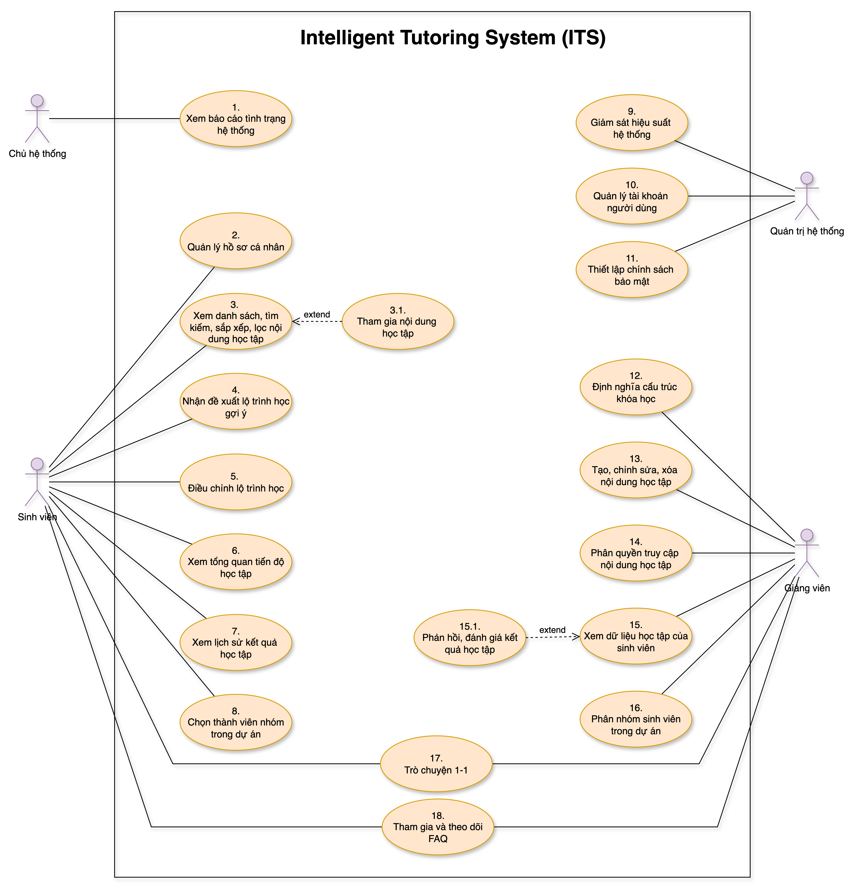

# Nhiệm vụ Chưa Hoàn Thành

## 1. Vẽ Overall Usecase cho Đề tài

- Sử dụng nội dung phần các usecase từ file `1.3-usecase&&model-overview.md`, tách riêng và chuẩn hóa thành một sơ đồ usecase tổng thể (overall usecase) cho toàn bộ đề tài ITS.
- Tham khảo ví dụ minh họa:  
  
