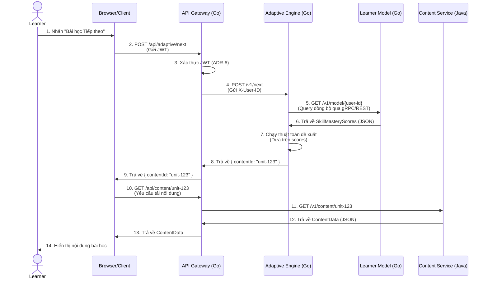

# Adaptive Content Delivery Sequence

```mermaid
sequenceDiagram
    actor Learner
    participant Client as Browser/Client
    participant APIGW as API Gateway (Go)
    participant AdaptiveSvc as Adaptive Engine (Go)
    participant ModelSvc as Learner Model (Go)
    participant ContentSvc as Content Service (Java)

    Learner ->> Client: 1. Nhấn "Bài học Tiếp theo"
    Client ->> APIGW: 2. POST /api/adaptive/next<br>(Gửi JWT)
    
    APIGW ->> APIGW: 3. Xác thực JWT (ADR-6)
    APIGW ->> AdaptiveSvc: 4. POST /v1/next<br>(Gửi X-User-ID)

    AdaptiveSvc ->> ModelSvc: 5. GET /v1/model/{user-id}<br>(Query đồng bộ qua gRPC/REST)
    ModelSvc ->> AdaptiveSvc: 6. Trả về SkillMasteryScores (JSON)

    AdaptiveSvc ->> AdaptiveSvc: 7. Chạy thuật toán đề xuất<br>(Dựa trên scores)
    AdaptiveSvc ->> APIGW: 8. Trả về { contentId: "unit-123" }

    APIGW ->> Client: 9. Trả về { contentId: "unit-123" }

    Client ->> APIGW: 10. GET /api/content/unit-123<br>(Yêu cầu tải nội dung)
    APIGW ->> ContentSvc: 11. GET /v1/content/unit-123

    ContentSvc ->> APIGW: 12. Trả về ContentData (JSON)
    APIGW ->> Client: 13. Trả về ContentData

    Client ->> Learner: 14. Hiển thị nội dung bài học
```