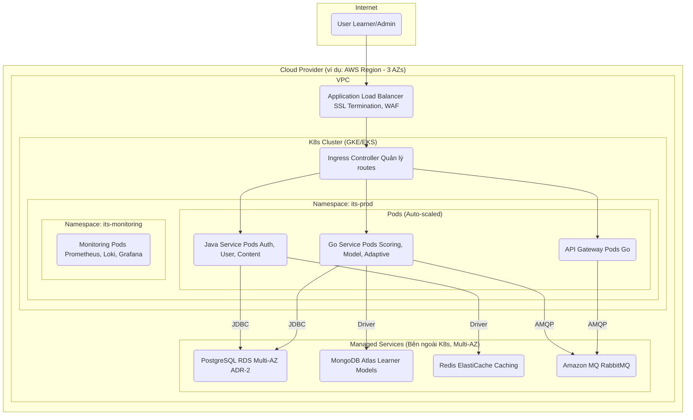

# Deployment Architecture On Premise

```mermaid
graph TD
    subgraph "Internet"
        User(User Learner/Admin)
    end

    subgraph "Cloud Provider (ví dụ: AWS Region - 3 AZs)"
        direction LR
        
        VPC(VPC / Virtual Network)

        subgraph VPC
            direction TB
            ALB(Application Load Balancer SSL Termination, WAF)
            
            subgraph "K8s Cluster (GKE/EKS)"
                direction TB
                Ingress(Ingress Controller Quản lý routes)
                
                subgraph "Namespace: its-prod"
                    direction LR
                    
                    subgraph "Pods (Auto-scaled)"
                        APIPod(API Gateway Pods Go)
                        JavaPods(Java Service Pods Auth, User, Content)
                        GoPods(Go Service Pods Scoring, Model, Adaptive)
                    end
                    
                    subgraph "Namespace: its-monitoring"
                         MonStack(Monitoring Pods Prometheus, Loki, Grafana)
                    end
                end
            end
            
            subgraph "Managed Services (Bên ngoài K8s, Multi-AZ)"
                RDS(PostgreSQL RDS Multi-AZ ADR-2)
                Atlas(MongoDB Atlas Learner Models)
                ElastiCache(Redis ElastiCache Caching)
                AMQ(Amazon MQ RabbitMQ )
            end
        end
        
    end

    User --> ALB
    ALB --> Ingress
    Ingress --> APIPod
    Ingress --> JavaPods
    Ingress --> GoPods
    
    JavaPods -- JDBC --> RDS
    JavaPods -- Driver --> ElastiCache
    GoPods -- Driver --> Atlas
    GoPods -- AMQP --> AMQ
    GoPods -- JDBC --> RDS
    APIPod -- AMQP --> AMQ
```