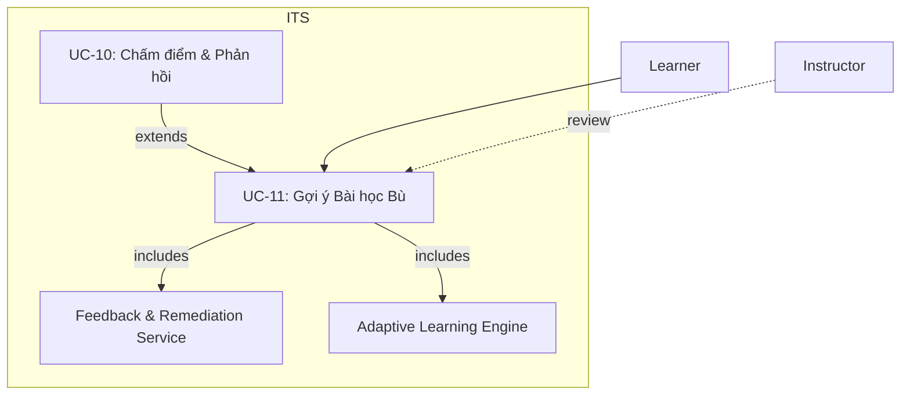
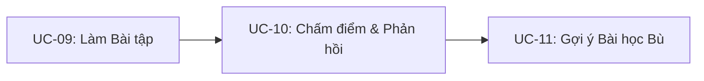

<b>UC-11 – Gợi ý Bài học Bù (Remediation)</b>

<b>Mục tiêu:</b> Khi học viên yếu kỹ năng nào đó, hệ thống đề xuất nội dung phù hợp để củng cố.

- Kích hoạt khi người học sai liên tục hoặc mastery score &lt; 0.6. 
- Adaptive Learning Engine và Feedback Service cùng xử lý để sinh danh sách bài bù. 
- Instructor có thể xem và xác nhận lộ trình ôn tập.

<b>Tổng quan chuỗi Use Case 09 → 10 → 11</b>

