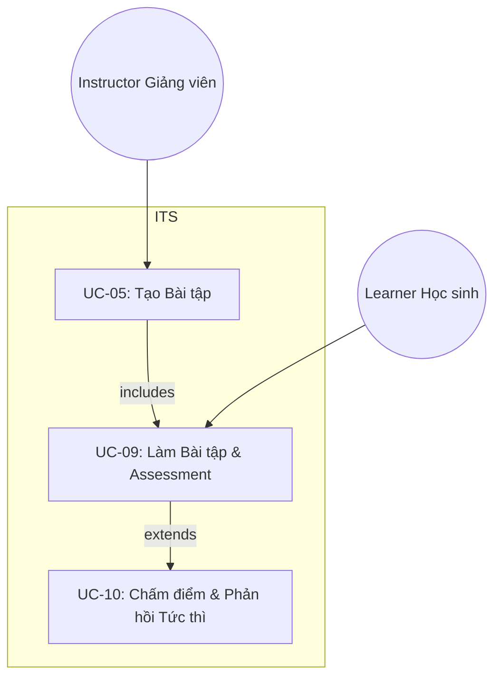

<b>UC-09 – Làm Bài tập và Assessment</b>

<b>Giải thích:</b> 
- Instructor tạo nội dung (UC-05). 
- Learner thực hiện bài tập (UC-09). 
- Khi nộp bài, hệ thống mở rộng (extends) đến UC-10 để chấm điểm và phản hồi.
