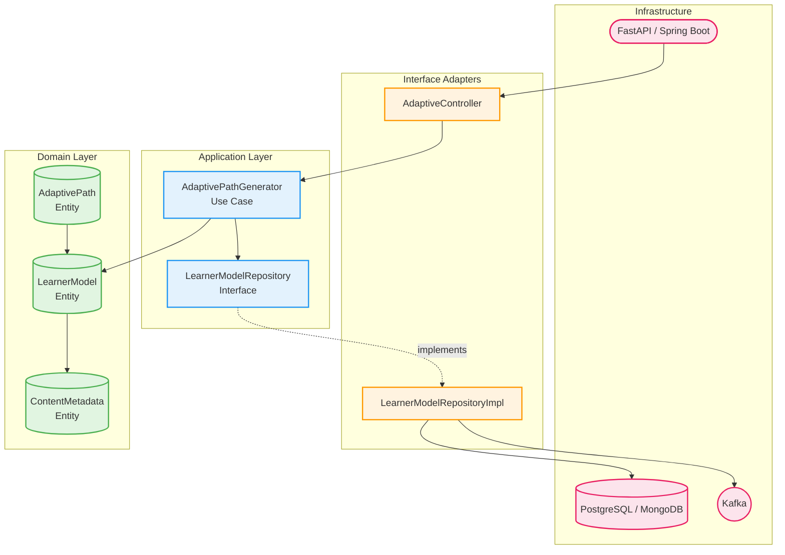
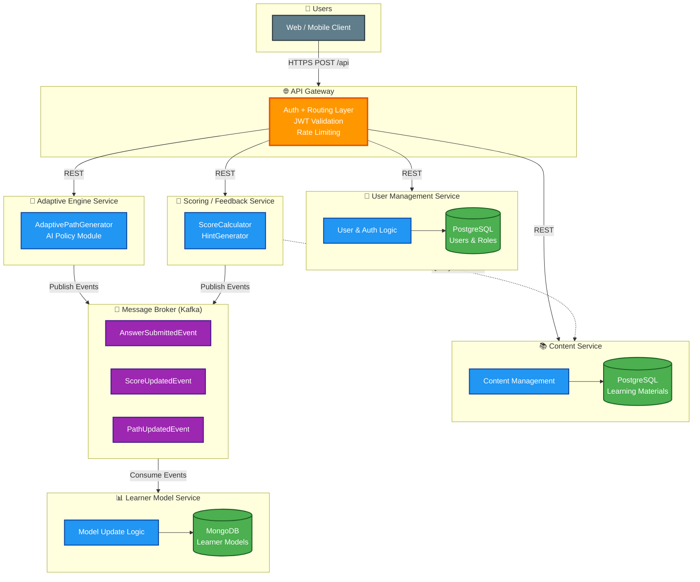
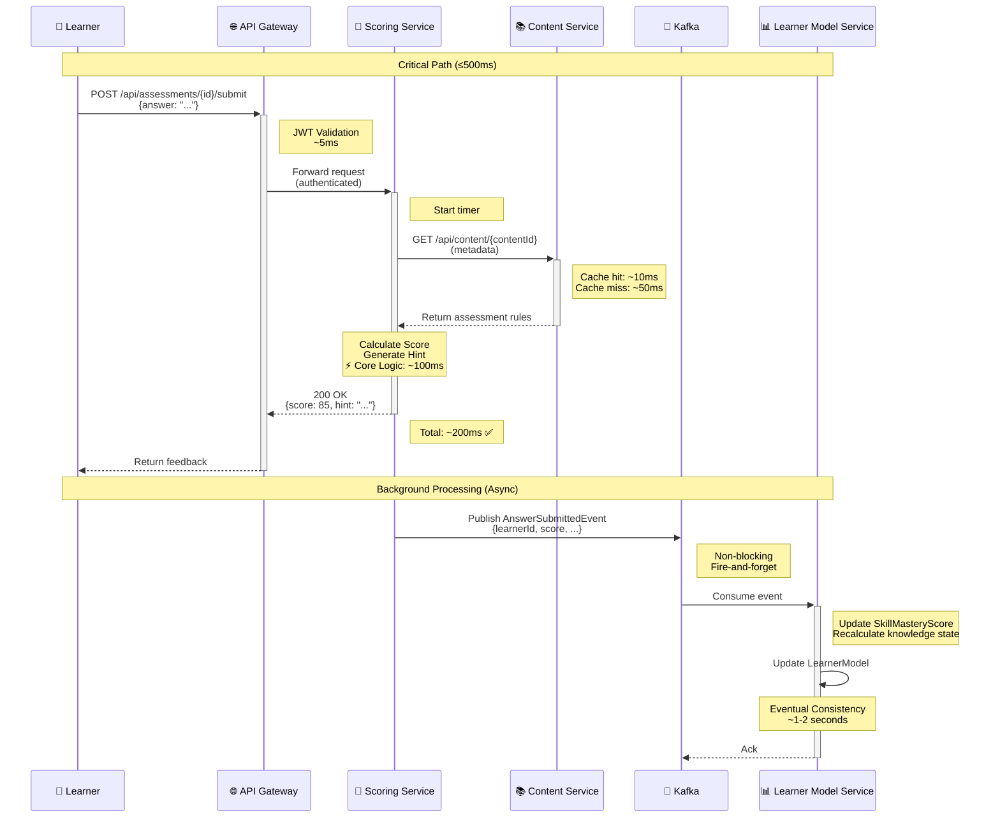
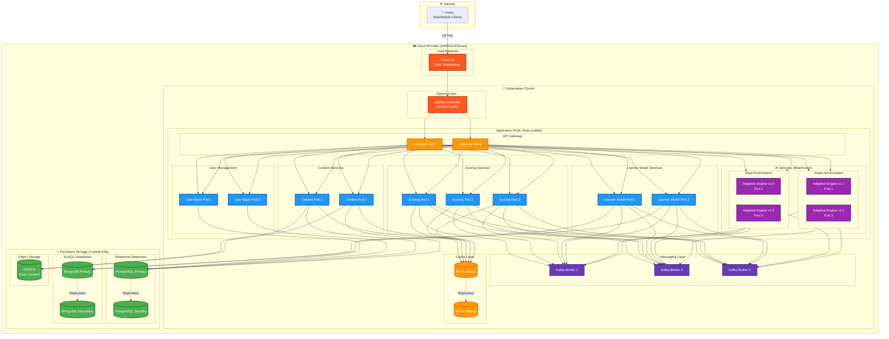
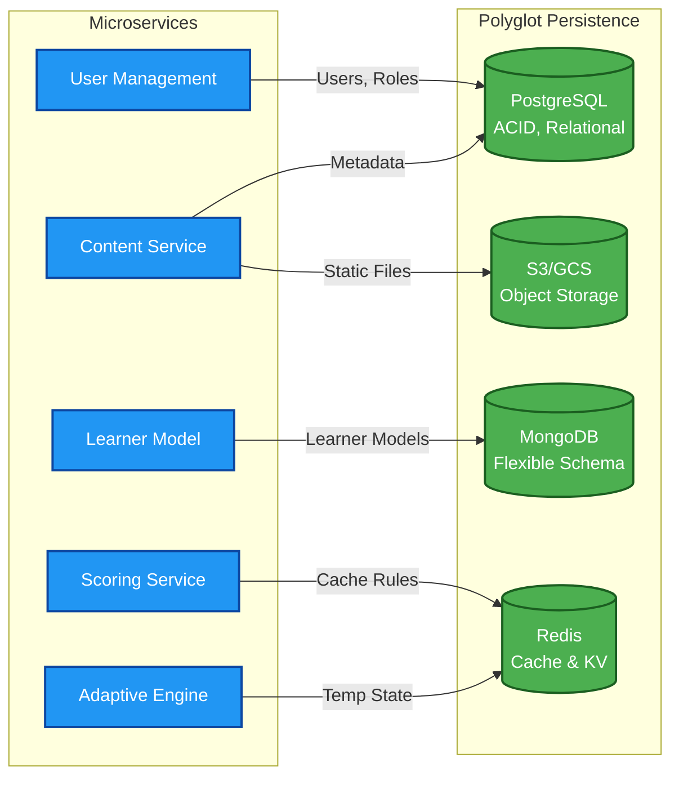

# Góc Nhìn Module (Module Views)

## Mục Tiêu

Trình bày cấu trúc logic của mã nguồn bên trong một **Architecture Quantum** điển hình, đảm bảo tính **Modularity** và **Testability** cao.

---

## 1. Sơ Đồ Cấu Trúc Lớp/Module Nội Bộ

### 1.1. Internal Clean Architecture Diagram

Chúng ta sẽ áp dụng **Clean Architecture** (hoặc Hexagonal Architecture) bên trong **Adaptive Engine Service** để phân tách:
- **Logic AI/Nghiệp vụ (Policy)** khỏi
- **Cơ sở hạ tầng (Details)**

### 1.2. Phân Tích Chi Tiết Các Lớp (Layers)

Kiến trúc này tuân thủ **Dependency Inversion Principle (DIP)**, trong đó các lớp bên ngoài (Infrastructure) luôn phụ thuộc vào các lớp bên trong (Domain/Application).

| **Lớp (Layer)** | **Vai Trò** | **Component Chính trong Adaptive Engine** | **Củng Cố ACs/SOLID** |
|-----------------|-------------|------------------------------------------|----------------------|
| **1. Domain<br>(Entities & Core Rules)** | Chứa các quy tắc nghiệp vụ cốt lõi, độc lập với bất kỳ ứng dụng nào. Đây là tầng ổn định nhất. | - `LearnerModel` (Entity)<br>- `ContentMetadata` (Entity)<br>- `AdaptivePath` (Entity) | **SRP** (Single Responsibility Principle):<br>Chỉ mô tả dữ liệu và quy tắc nghiệp vụ. |
| **2. Application<br>(Use Cases/Interactors)** | Chứa các quy tắc nghiệp vụ cụ thể của ứng dụng (Policy Modules). Điều phối luồng dữ liệu đến và đi từ Domain. | - `AdaptivePathGenerator` (Use Case/Policy): Chứa thuật toán AI quyết định lộ trình tối ưu (FR7)<br>- `LearnerModelRepository` Interface: Định nghĩa hợp đồng cho việc lấy/lưu trữ LearnerModel | **DIP** (Dependency Inversion Principle):<br>Tầng này chỉ phụ thuộc vào Interfaces (ví dụ: `LearnerModelRepository` Interface), không phải DB cụ thể.<br>→ Code rất ổn định (I≈0) |
| **3. Interface Adapters** | Chuyển đổi dữ liệu giữa các định dạng bên ngoài (Web Request, DB Record) và các định dạng bên trong (Domain Entities). | - `AdaptiveController`: Xử lý API Request (REST)<br>- `LearnerModelRepositoryImpl` (Concrete Class): Lớp triển khai Repository Interface, kết nối với Database | **Testability (AC4):**<br>Giúp cô lập logic nghiệp vụ khỏi tầng giao diện/I/O, cho phép Mock DB khi kiểm thử `AdaptivePathGenerator` |
| **4. Infrastructure** | Chứa tất cả các chi tiết triển khai bên ngoài (DB, Web Framework, Message Queue). | - MongoDB/PostgreSQL Driver<br>- Kafka Producer/Consumer<br>- Server Framework (Spring Boot, FastAPI) | **OCP** (Open/Closed Principle):<br>Nếu đổi DB từ MongoDB sang PostgreSQL, chỉ cần thay đổi/mở rộng lớp này mà không cần sửa tầng Application Core |

### 1.3. Sơ Đồ Clean Architecture (Mermaid)



**💡 Nguyên tắc DIP (Dependency Inversion):**
- Application Layer chỉ phụ thuộc vào **Interfaces** (Abstraction)
- Không phụ thuộc vào **Implementation** (Concretion)
- Dependencies luôn hướng vào trong (từ ngoài → trong)

---

## 2. Lý Giải Về Phụ Thuộc Module và Tính Ổn Định

Việc áp dụng Clean Architecture trực tiếp củng cố hai Architecture Characteristics quan trọng nhất:

### 2.1. Củng Cố Testability (AC4)

#### **Tách biệt Policy khỏi Detail**

- **`AdaptivePathGenerator`** (Policy - Logic AI):
  - Nằm ở tầng Application (bên trong)
  - Tách biệt hoàn toàn khỏi `LearnerModelRepositoryImpl` (Detail - kết nối DB)

#### **Thực thi Testing**

Khi kiểm thử `AdaptivePathGenerator`:
1. Chỉ cần **Mock** (giả lập) `LearnerModelRepository` Interface
2. Unit Test tập trung vào **logic thuật toán**
3. Không phụ thuộc vào trạng thái của DB hay Framework

**Lợi ích:**
- ✅ Test nhanh (không cần khởi động DB)
- ✅ Test độc lập (không bị ảnh hưởng bởi infrastructure)
- ✅ Test coverage cao (dễ dàng test edge cases)

### 2.2. Đảm Bảo Tính Ổn Định (Modularity - AC1)

#### **Instability Index (I)**

**Công thức:** 

$$I = \frac{C_e}{C_e + C_a}$$

Trong đó:
- **Cₑ (Efferent Coupling):** Số dependencies đi ra (outgoing)
- **Cₐ (Afferent Coupling):** Số dependencies đi vào (incoming)
- **I ∈ [0, 1]:** 
  - I = 0 → Rất ổn định (nhiều module phụ thuộc vào nó)
  - I = 1 → Rất bất ổn (phụ thuộc nhiều vào module khác)

#### **Phân Tích Các Layer**

| **Layer** | **Cₑ** | **Cₐ** | **I** | **Giải Thích** |
|-----------|--------|--------|-------|----------------|
| **Application Layer**<br>(`AdaptivePathGenerator`) | Thấp<br>(chỉ phụ thuộc Interfaces) | Cao<br>(nhiều lớp bên ngoài phụ thuộc vào nó) | **I ≈ 0**<br>(Rất Ổn định) | Logic AI cốt lõi được **bảo vệ khỏi sự thay đổi**.<br>Khi infrastructure thay đổi, logic AI không bị ảnh hưởng. |
| **Infrastructure Layer**<br>(DB Driver) | Cao<br>(phụ thuộc vào thư viện bên ngoài) | Thấp<br>(ít module phụ thuộc vào nó) | **I ≈ 1**<br>(Rất Bất ổn) | Điều này là **mong muốn**.<br>Chi tiết triển khai (DB, Framework) được mong đợi sẽ thay đổi thường xuyên. |

#### **Minh Họa**

```
┌─────────────────────────────────────────────────┐
│  Application Layer (AdaptivePathGenerator)      │
│  • Cₐ = 5 (Controller, API, Tests... phụ thuộc) │
│  • Cₑ = 1 (chỉ phụ thuộc Interface)              │
│  • I = 1/(1+5) = 0.17 ≈ 0 (RẤT ỔN ĐỊNH)        │
└─────────────────────────────────────────────────┘
                    ↑
                    │ (depends on Interface)
                    │
┌─────────────────────────────────────────────────┐
│  Infrastructure Layer (RepositoryImpl)           │
│  • Cₐ = 1 (chỉ Interface Adapter phụ thuộc)     │
│  • Cₑ = 5 (DB, ORM, Config, Logger...)          │
│  • I = 5/(5+1) = 0.83 ≈ 1 (RẤT BẤT ỔN)         │
└─────────────────────────────────────────────────┘
```

### 2.3. Áp Dụng SOLID Principles

| **Principle** | **Áp Dụng Trong Clean Architecture** | **Lợi Ích** |
|---------------|--------------------------------------|-------------|
| **SRP**<br>(Single Responsibility) | Mỗi layer có một trách nhiệm duy nhất:<br>- Domain: Business rules<br>- Application: Use cases<br>- Adapters: Data conversion | Dễ bảo trì, dễ hiểu |
| **OCP**<br>(Open/Closed) | Mở rộng bằng cách thêm Adapter mới,<br>không sửa Application/Domain | Giảm rủi ro khi thay đổi |
| **LSP**<br>(Liskov Substitution) | Mọi implementation của Repository<br>đều thay thế được cho Interface | Linh hoạt trong testing |
| **ISP**<br>(Interface Segregation) | Interfaces nhỏ, cụ thể<br>(ví dụ: `LearnerModelRepository`) | Tránh phụ thuộc không cần thiết |
| **DIP**<br>(Dependency Inversion) | **Application phụ thuộc Interface,<br>không phụ thuộc Implementation** | **Tính ổn định cao (I≈0)** |

---

## 3. Kết Luận

### 3.1. Tóm Tắt

**Góc nhìn Module** này đã thiết lập một cấu trúc lớp vững chắc, nơi các nguyên tắc **SOLID** được thực thi để đảm bảo:

1. ✅ **Testability (AC4):** 
   - Logic nghiệp vụ tách biệt khỏi infrastructure
   - Dễ dàng mock và test
   - Test coverage cao

2. ✅ **Modularity (AC1):**
   - Application Layer có I≈0 (rất ổn định)
   - Infrastructure Layer có I≈1 (dễ thay đổi)
   - Phân tách rõ ràng giữa Policy và Detail

3. ✅ **Maintainability (AC7):**
   - Mỗi layer có trách nhiệm rõ ràng
   - Thay đổi infrastructure không ảnh hưởng logic
   - Tuân thủ OCP và DIP

### 3.2. Áp Dụng Cho Các Services Khác

Cấu trúc Clean Architecture này được áp dụng **nhất quán** cho tất cả các microservices trong ITS:

- **Learner Model Service**
- **Assessment Engine Service**
- **Content Delivery Service**
- **AI Reasoning Service**

→ Đảm bảo **consistency** và **quality** xuyên suốt toàn bộ hệ thống.

---

**Tài liệu tham khảo:**
- Clean Architecture (Robert C. Martin)
- Fundamentals of Software Architecture (Mark Richards, Neal Ford)
- Domain-Driven Design (Eric Evans)

# Góc Nhìn Component và Connector (Component and Connector Views)

## Mục Tiêu

Góc nhìn này tập trung vào:
- **Architecture Quantum:** Các đơn vị triển khai độc lập
- **Runtime Interactions:** Cách chúng tương tác trong thời gian chạy
- **Communication Patterns:** Đồng bộ (REST) và bất đồng bộ (Event-Driven)

Đây là nơi kiến trúc **Microservices + Event-Driven** của ITS được trực quan hóa.

---

## 1. Sơ Đồ Service (Container Diagram - C4 Model)

### 1.1. Mô Tả Tổng Quan

Sơ đồ này thể hiện **ranh giới vật lý** của các Microservices:
- Mỗi **Service (Container)** là một đơn vị triển khai độc lập
- Giao tiếp qua mạng: **REST** (đồng bộ) hoặc **Messaging** (bất đồng bộ)
- Tuân thủ nguyên tắc **Single Responsibility** ở cấp service

### 1.2. Phân Tích & Vai Trò Của Các Service

| **Service (Container)** | **Vai Trò Chính** | **Giao Tiếp Chính** | **Củng Cố ACs** |
|-------------------------|-------------------|---------------------|-----------------|
| **API Gateway** | Điểm vào duy nhất (Single Entry Point).<br>Xử lý:<br>- Authentication (Xác thực)<br>- Routing (Định tuyến)<br>- Rate limiting | REST (đồng bộ) | **AC6:** Security<br>**AC3:** Performance |
| **User Management Service** | Quản lý tài khoản:<br>- Learner/Instructor/Admin<br>- RBAC (Role-Based Access Control)<br>- Session management | REST API<br>SQL Database | **AC6:** Security |
| **Content Service** | Quản lý nội dung học tập:<br>- Learning materials (FR3)<br>- Metadata (FR5)<br>- Content versioning<br>**Dữ liệu rất ổn định (I≈0)** | REST API<br>SQL Database | **AC1:** Modularity<br>**AC7:** Maintainability |
| **Adaptive Engine Service** | **Policy Module Cốt lõi**<br>- `AdaptivePathGenerator` (FR7)<br>- Quyết định lộ trình học tập<br>- AI/ML algorithms | **Synchronous:** REST (với Gateway)<br>**Asynchronous:** Events (với Learner Model) | **AC1:** Modularity<br>**AC2:** Scalability |
| **Scoring/Feedback Service** | Xử lý đánh giá:<br>- Auto-grading (FR6)<br>- Instant feedback<br>- Hint generation<br>**Target: ≤500ms response** | **Synchronous:** REST (với Gateway)<br>**Asynchronous:** Events (publish scores) | **AC3:** Performance<br>**AC4:** Testability |
| **Learner Model Service** | Quản lý learner state:<br>- `LearnerModel` entity<br>- `SkillMasteryScore` (FR2)<br>- Liên tục cập nhật từ Events | **Asynchronous:** Event-Driven<br>NoSQL Database | **AC2:** Scalability<br>**AC1:** Modularity |
| **Message Broker (Kafka)** | Event distribution:<br>- `AnswerSubmittedEvent`<br>- `ScoreUpdatedEvent`<br>- `PathUpdatedEvent`<br>**Decoupling services** | Messaging<br>(bất đồng bộ) | **AC2:** Scalability<br>**AC1:** Modularity |

### 1.3. Sơ Đồ Container (Mermaid)



**🔑 Chú giải:**
- **Solid arrows (→):** Synchronous communication (REST/HTTP)
- **Dotted arrows (-.->):** Query/Read operations
- **Bold arrows:** Asynchronous communication (Events via Kafka)

**💡 Design Decisions:**

| **Pattern** | **Rationale** | **AC Supported** |
|-------------|---------------|------------------|
| **API Gateway** | Single entry point, centralized auth, simplifies client | Security (AC6), Performance (AC3) |
| **Event-Driven (Kafka)** | Decouple services, async processing, better scalability | Scalability (AC2), Modularity (AC1) |
| **Separate Databases** | Database per service pattern, independent scaling | Modularity (AC1), Scalability (AC2) |
| **REST for Sync** | Simple, stateless, well-understood | Simplicity, Interoperability |

---

## 2. Sơ Đồ Trình Tự (Sequence Diagram)

### 2.1. Use Case: UC-L-02 - Xử Lý Phản Hồi Bài Tập

**Context:** Đây là use case cốt lõi đòi hỏi **Performance cao (≤500ms)** để đảm bảo trải nghiệm người dùng tốt.

**Critical Path:** Chấm điểm và trả về feedback ngay lập tức

### 2.2. Luồng Cơ Bản (Critical Path)

| **STT** | **Bước** | **Chi Tiết Phối Hợp Giữa Services** | **Giao Tiếp & Mục Đích** |
|---------|----------|-------------------------------------|--------------------------|
| **1** | Submit Answer | Learner gửi câu trả lời qua Web/Mobile Client | `POST /api/assessments/{id}/submit`<br>**HTTP** (đồng bộ) |
| **2** | Route Request | API Gateway xác thực JWT và định tuyến đến Scoring Service | **HTTP Routing** (đồng bộ)<br>Latency: ~10ms |
| **3** | Fetch Assessment Metadata | Scoring Service lấy thông tin bài tập từ Content Service | `GET /api/content/{contentId}`<br>**HTTP** (đồng bộ)<br>**Có thể cache** |
| **4** | Calculate Score & Generate Hint | Scoring Service xử lý logic:<br>- Auto-grading<br>- Hint generation | **Internal Logic** (AC3: Performance)<br>**Phần này phải cực nhanh** |
| **5** | ✅ Return Real-Time Feedback | Scoring Service trả về kết quả cho Learner | **HTTP Response** (đồng bộ)<br>**Target: ≤500ms total** |
| **6** | Publish Event (Async) | Scoring Service tạo `AnswerSubmittedEvent` | **Kafka Publish** (bất đồng bộ)<br>**Không block response** |
| **7** | Update Learner Model (Background) | Learner Model Service consume event và cập nhật `SkillMasteryScore` | **Kafka Consumer** (bất đồng bộ)<br>**Eventual Consistency** |

### 2.3. Sequence Diagram (Mermaid)



**🎯 Performance Breakdown:**

| **Phase** | **Time Budget** | **Optimization Strategy** |
|-----------|-----------------|---------------------------|
| Gateway Routing | ~10ms | In-memory JWT validation, connection pooling |
| Fetch Metadata | ~10-50ms | **Redis caching** for frequently accessed content |
| Score Calculation | ~100ms | Optimized algorithms, pre-compiled rules |
| Response Marshalling | ~10ms | Efficient JSON serialization |
| **Total (Synchronous)** | **≤200ms** ✅ | **Well under 500ms target** |
| Event Publishing | ~5ms | Fire-and-forget, non-blocking |
| Model Update (Async) | ~1-2s | Background processing, eventual consistency |

---

## 3. Phân Tích Giao Tiếp Patterns

### 3.1. Synchronous Communication (REST)

**Khi nào sử dụng:**
- ✅ Cần response ngay lập tức (real-time feedback)
- ✅ Client cần biết kết quả để tiếp tục
- ✅ Simple request-response pattern

**Trong ITS:**
- API Gateway ↔ All Services
- Scoring Service ↔ Content Service (fetch metadata)

**Trade-offs:**
- ✅ **Pros:** Simple, immediate feedback, easy debugging
- ⚠️ **Cons:** Tight coupling, cascade failures, latency accumulation

**Mitigation:**
- Circuit breaker pattern
- Timeouts và retries
- Caching (Redis)

### 3.2. Asynchronous Communication (Events)

**Khi nào sử dụng:**
- ✅ Không cần response ngay lập tức
- ✅ Cần decouple services
- ✅ Fan-out pattern (1 event → nhiều consumers)

**Trong ITS:**
- Scoring Service → Kafka → Learner Model Service
- Adaptive Engine → Kafka → Multiple services

**Trade-offs:**
- ✅ **Pros:** Decoupling, scalability, resilience
- ⚠️ **Cons:** Eventual consistency, complexity, debugging harder

**Mitigation:**
- Event schema versioning
- Dead letter queues
- Distributed tracing (Jaeger)

### 3.3. Hybrid Approach (Best of Both Worlds)

**ITS Strategy:**

```
┌─────────────────────────────────────────┐
│  Synchronous (REST) for:                │
│  ✓ User-facing operations (≤500ms)      │
│  ✓ Queries (read operations)            │
│  ✓ Immediate feedback required          │
└─────────────────────────────────────────┘
              +
┌─────────────────────────────────────────┐
│  Asynchronous (Events) for:             │
│  ✓ Background processing                │
│  ✓ Model updates (1-2s acceptable)      │
│  ✓ Cross-service notifications          │
└─────────────────────────────────────────┘
              =
    ⭐ Optimized Architecture ⭐
```

---

## 4. Mapping Tới Architecture Characteristics

### 4.1. Component-Connector View Supports ACs

| **Architecture Characteristic** | **How Component-Connector View Supports It** |
|---------------------------------|----------------------------------------------|
| **AC1: Modularity** | - Each service is independently deployable<br>- Clear boundaries via API contracts<br>- Event-driven decoupling |
| **AC2: Scalability** | - Services scale independently<br>- Kafka enables async processing<br>- Stateless services (easy horizontal scaling) |
| **AC3: Performance** | - Hybrid sync/async patterns<br>- Caching strategies (Redis)<br>- Non-blocking async for background tasks |
| **AC4: Testability** | - Services can be tested independently<br>- Mock external dependencies<br>- Contract testing for APIs |
| **AC5: Deployability** | - Independent deployment per service<br>- Blue/green deployment possible<br>- Canary releases per service |
| **AC6: Security** | - Centralized auth at API Gateway<br>- Service-to-service auth (mTLS possible)<br>- Network segmentation |

### 4.2. Architecture Quantum Analysis

| **Service** | **Quantum Type** | **Coupling** | **Cohesion** |
|-------------|------------------|--------------|--------------|
| Adaptive Engine | **Independent** | Low (async events) | High (single responsibility: path generation) |
| Scoring Service | **Synchronized** (with Content Service) | Medium (REST query) | High (scoring & feedback) |
| Learner Model | **Event-driven** | Low (consumes events only) | High (model management) |

---

## 5. Kết Luận

### 5.1. Key Takeaways

**Component-and-Connector View đã chứng minh:**

1. ✅ **Hybrid Communication Strategy:**
   - **Synchronous (REST)** cho user-facing operations → Đảm bảo **Performance (AC3)**
   - **Asynchronous (Kafka)** cho background processing → Đảm bảo **Scalability (AC2)** và **Modularity (AC1)**

2. ✅ **Decoupling Through Events:**
   - Scoring Service không trực tiếp gọi Learner Model Service
   - Sử dụng Kafka làm intermediary
   - → Giảm coupling, tăng resilience

3. ✅ **Performance Optimization:**
   - Critical path (≤500ms) được tối ưu bằng caching và async processing
   - Background tasks không ảnh hưởng user experience
   - → Đáp ứng NFR về latency

4. ✅ **Independent Scalability:**
   - Mỗi service có database riêng
   - Scale theo nhu cầu thực tế (ví dụ: scale Scoring Service khi có nhiều submissions)
   - → Tối ưu chi phí infrastructure

### 5.2. Architecture Decision Rationale

**Q: Tại sao không dùng toàn bộ REST?**
- A: REST đồng bộ sẽ làm Scoring Service chờ đợi Learner Model Service cập nhật xong → Latency cao, vi phạm Performance (AC3)

**Q: Tại sao không dùng toàn bộ Event-Driven?**
- A: User cần feedback ngay lập tức. Eventual consistency không chấp nhận được cho real-time feedback.

**Q: Tại sao cần API Gateway?**
- A: Centralized auth, routing, rate limiting → Đơn giản hóa client, tăng security (AC6)

### 5.3. Next Steps

Góc nhìn Component-and-Connector đã xác định:
- ✅ Service boundaries
- ✅ Communication patterns
- ✅ Data flow

**Tiếp theo:** 
- Allocation View sẽ mô tả cách deploy các services này lên infrastructure
- Implementation view sẽ chi tiết code organization

---

**Tài liệu tham khảo:**
- Software Architecture in Practice (Len Bass et al.)
- The C4 Model for Visualising Software Architecture (Simon Brown)
- Building Event-Driven Microservices (Adam Bellemare)

# Góc Nhìn Phân Bổ (Allocation Views)

## Mục Tiêu

Góc nhìn này mô tả:
- **Deployment Strategy:** Cách các services được triển khai lên infrastructure
- **Resource Allocation:** Phân bổ tài nguyên (CPU, memory, storage)
- **Data Distribution:** Chiến lược lưu trữ dữ liệu (Polyglot Persistence)
- **Scalability & Availability:** Đảm bảo AC2 và khả năng chịu lỗi

---

## 1. Sơ Đồ Triển Khai (Deployment Diagram)

### 1.1. Mô Tả Tổng Quan

Sơ đồ này minh họa cách các **Microservices** được triển khai trên môi trường **Cloud** sử dụng:
- **Kubernetes (K8s):** Container orchestration
- **Containerization (Docker):** Đóng gói services
- **Blue/Green Deployment:** Cho services AI quan trọng (FR9, FR12)

**Mục tiêu:**
- ✅ Đáp ứng **Scalability (AC2):** Auto-scaling theo tải
- ✅ Đáp ứng **Deployability (AC5):** Independent deployment, zero-downtime
- ✅ Đáp ứng **Availability:** High availability với redundancy

### 1.2. Giả Định Kỹ Thuật

| **Aspect** | **Technology/Strategy** |
|------------|-------------------------|
| **Cloud Provider** | AWS / GCP / Azure (cloud-agnostic via Kubernetes) |
| **Container Orchestration** | Kubernetes (K8s) cluster |
| **Container Runtime** | Docker / containerd |
| **Load Balancing** | Kubernetes Ingress + Cloud Load Balancer |
| **Auto-scaling** | Horizontal Pod Autoscaler (HPA) |
| **Deployment Strategy** | Blue/Green for AI services, Rolling update for others |
| **Service Mesh** | Istio (optional, for advanced traffic management) |

### 1.3. Phân Tích Triển Khai Vật Lý

| **Thành Phần Hạ Tầng** | **Vai Trò Trong ITS** | **Củng Cố ACs** |
|------------------------|----------------------|-----------------|
| **Ingress Controller /<br>Load Balancer** | - Entry point cho external traffic<br>- SSL/TLS termination<br>- Phân phối tải đến API Gateway Pods | **AC2:** Scalability - Horizontal scaling<br>**AC6:** Security - HTTPS enforcement |
| **API Gateway Pods<br>(N ≥ 2)** | - Stateless gateway<br>- Authentication & routing<br>- Rate limiting | **AC2:** Scalability - Auto-scaling<br>**AC5:** Deployability - Rolling updates |
| **Adaptive Engine Pods<br>(N ≥ 3)** | - AI/ML workloads<br>- CPU-intensive computations<br>- **Blue/Green deployment** support | **AC2:** Scalability - Independent scaling<br>**AC5:** Deployability - Live model swapping (FR9)<br>**AC3:** Performance - Multiple replicas |
| **Scoring/Feedback Pods<br>(N ≥ 3)** | - Real-time scoring<br>- High throughput<br>- Low latency requirement (≤500ms) | **AC2:** Scalability - Handle burst traffic<br>**AC3:** Performance - Fast response |
| **Learner Model Pods<br>(N ≥ 2)** | - Event consumers<br>- Model update processing<br>- NoSQL database access | **AC2:** Scalability - Process events async<br>**AC1:** Modularity - Decoupled via events |
| **Content Service Pods<br>(N ≥ 2)** | - Serve learning materials<br>- Read-heavy workload<br>- Cache-friendly | **AC7:** Availability - Always available<br>**AC3:** Performance - With caching layer |
| **User Management Pods<br>(N ≥ 2)** | - Authentication & authorization<br>- RBAC management<br>- Critical service | **AC6:** Security - User data protection<br>**AC7:** Availability - Always online |
| **Kafka Cluster<br>(N ≥ 3 brokers)** | - Event streaming platform<br>- Decouple services<br>- High throughput messaging | **AC2:** Scalability - Handle millions of events<br>**AC1:** Modularity - Async communication |
| **Persistent Storage<br>Cluster** | - Databases (SQL & NoSQL)<br>- File storage (S3/GCS)<br>- Backup & recovery | **AC6:** Security - Data isolation<br>**AC7:** Availability - Data redundancy |
| **Redis Cache Cluster<br>(N ≥ 2)** | - In-memory caching<br>- Session storage<br>- Hot data caching | **AC3:** Performance - Sub-ms latency<br>**AC2:** Scalability - Reduce DB load |

### 1.4. Sơ Đồ Deployment (Mermaid)



### 1.5. Resource Allocation Strategy

#### **A. CPU & Memory Allocation**

| **Service** | **CPU Request** | **CPU Limit** | **Memory Request** | **Memory Limit** | **Replicas** |
|-------------|-----------------|---------------|-------------------|------------------|--------------|
| **API Gateway** | 100m | 500m | 128Mi | 512Mi | 2-5 (HPA) |
| **Adaptive Engine** | 500m | 2000m | 512Mi | 2Gi | 3-10 (HPA) |
| **Scoring Service** | 250m | 1000m | 256Mi | 1Gi | 3-8 (HPA) |
| **Learner Model** | 200m | 800m | 256Mi | 1Gi | 2-6 (HPA) |
| **Content Service** | 100m | 500m | 128Mi | 512Mi | 2-4 (HPA) |
| **User Management** | 100m | 500m | 128Mi | 512Mi | 2-3 | 
| **Kafka Broker** | 500m | 2000m | 1Gi | 4Gi | 3 (StatefulSet) |
| **Redis** | 100m | 500m | 256Mi | 1Gi | 2 (Master-Replica) |

**Chú thích:**
- **Request:** Minimum guaranteed resources
- **Limit:** Maximum allowed resources
- **HPA:** Horizontal Pod Autoscaler (auto-scale based on metrics)

#### **B. Auto-scaling Configuration**

**Horizontal Pod Autoscaler (HPA) Rules:**

```yaml
# Example: Adaptive Engine Service
apiVersion: autoscaling/v2
kind: HorizontalPodAutoscaler
metadata:
  name: adaptive-engine-hpa
spec:
  scaleTargetRef:
    apiVersion: apps/v1
    kind: Deployment
    name: adaptive-engine
  minReplicas: 3
  maxReplicas: 10
  metrics:
  - type: Resource
    resource:
      name: cpu
      target:
        type: Utilization
        averageUtilization: 70
  - type: Resource
    resource:
      name: memory
      target:
        type: Utilization
        averageUtilization: 80
  - type: Pods
    pods:
      metric:
        name: http_requests_per_second
      target:
        type: AverageValue
        averageValue: "1000"
```

**Scaling Triggers:**

| **Service** | **Scale Up When** | **Scale Down When** | **Cooldown** |
|-------------|-------------------|---------------------|--------------|
| Adaptive Engine | CPU > 70% OR Requests > 1000/s | CPU < 30% AND Requests < 300/s | 5 min |
| Scoring Service | CPU > 70% OR Latency > 400ms | CPU < 30% AND Latency < 100ms | 3 min |
| Learner Model | Queue depth > 1000 messages | Queue depth < 100 messages | 5 min |

---

## 2. Blue/Green Deployment Strategy

### 2.1. Concept

**Blue/Green Deployment** cho phép:
- ✅ **Zero-downtime deployment**
- ✅ **Live AI model swapping** (FR9, FR12)
- ✅ **Instant rollback** nếu có lỗi

### 2.2. Implementation for Adaptive Engine

**Luồng Deployment:**

```
┌─────────────────────────────────────────────────────────────┐
│  STEP 1: Both Blue (v1.0) and Green (v1.1) Running          │
│  ━━━━━━━━━━━━━━━━━━━━━━━━━━━━━━━━━━━━━━━━━━━━━━━━━━━━━━━  │
│  Traffic: 100% → Blue (v1.0)                                │
│  Green (v1.1): Running but no traffic (testing phase)       │
└─────────────────────────────────────────────────────────────┘
                          ↓
┌─────────────────────────────────────────────────────────────┐
│  STEP 2: Gradual Traffic Shift (Canary)                     │
│  ━━━━━━━━━━━━━━━━━━━━━━━━━━━━━━━━━━━━━━━━━━━━━━━━━━━━━━━  │
│  Traffic: 90% → Blue, 10% → Green                           │
│  Monitor metrics: latency, error rate, accuracy             │
└─────────────────────────────────────────────────────────────┘
                          ↓
┌─────────────────────────────────────────────────────────────┐
│  STEP 3: Full Cutover                                       │
│  ━━━━━━━━━━━━━━━━━━━━━━━━━━━━━━━━━━━━━━━━━━━━━━━━━━━━━━━  │
│  Traffic: 100% → Green (v1.1)                               │
│  Blue (v1.0): Keep running for 1 hour (rollback window)     │
└─────────────────────────────────────────────────────────────┘
                          ↓
┌─────────────────────────────────────────────────────────────┐
│  STEP 4: Decommission Old Version                           │
│  ━━━━━━━━━━━━━━━━━━━━━━━━━━━━━━━━━━━━━━━━━━━━━━━━━━━━━━━  │
│  Traffic: 100% → Green (v1.1)                               │
│  Blue (v1.0): Terminated                                    │
└─────────────────────────────────────────────────────────────┘
```

### 2.3. Kubernetes Configuration

**Service with selector switching:**

```yaml
# Kubernetes Service (traffic routing)
apiVersion: v1
kind: Service
metadata:
  name: adaptive-engine-service
spec:
  selector:
    app: adaptive-engine
    version: blue  # Switch to 'green' for cutover
  ports:
  - port: 8080
    targetPort: 8080
```

**Blue Deployment:**
```yaml
apiVersion: apps/v1
kind: Deployment
metadata:
  name: adaptive-engine-blue
spec:
  replicas: 3
  selector:
    matchLabels:
      app: adaptive-engine
      version: blue
  template:
    metadata:
      labels:
        app: adaptive-engine
        version: blue
    spec:
      containers:
      - name: adaptive-engine
        image: adaptive-engine:v1.0
        resources:
          requests:
            cpu: 500m
            memory: 512Mi
          limits:
            cpu: 2000m
            memory: 2Gi
```

**Green Deployment:**
```yaml
apiVersion: apps/v1
kind: Deployment
metadata:
  name: adaptive-engine-green
spec:
  replicas: 3
  selector:
    matchLabels:
      app: adaptive-engine
      version: green
  template:
    metadata:
      labels:
        app: adaptive-engine
        version: green
    spec:
      containers:
      - name: adaptive-engine
        image: adaptive-engine:v1.1  # New version
        resources:
          requests:
            cpu: 500m
            memory: 512Mi
          limits:
            cpu: 2000m
            memory: 2Gi
```

---

## 3. Sơ Đồ Phân Bổ Dữ Liệu (Polyglot Persistence)

### 3.1. Chiến Lược Polyglot Persistence

**Concept:** Sử dụng **nhiều loại cơ sở dữ liệu khác nhau** để tối ưu hóa hiệu suất và tính linh hoạt cho từng service.

**Benefits:**
- ✅ **Optimized for use case:** Mỗi DB phù hợp với data model
- ✅ **Independent scaling:** Scale DB theo nhu cầu của từng service
- ✅ **Fault isolation:** Lỗi DB không lan tỏa

### 3.2. Phân Bổ Dữ Liệu Chi Tiết

| **Service** | **Dữ Liệu Quản Lý** | **Loại Cơ Sở Dữ Liệu** | **Lý Do Tối Ưu Hóa (ACs)** |
|-------------|---------------------|-------------------------|----------------------------|
| **User Management** | - `User` entity<br>- `Role` & `Permission`<br>- Authentication tokens | **Relational DB**<br>(PostgreSQL) | **AC6:** Security - ACID properties đảm bảo data integrity cho thông tin xác thực quan trọng<br>**AC7:** Availability - Mature replication & backup |
| **Learner Model** | - `LearnerModel` entity<br>- `SkillMasteryScore`<br>- Learning analytics | **NoSQL Document DB**<br>(MongoDB) | **AC1:** Modularity - Flexible schema cho AI model attributes<br>**AC2:** Scalability - Horizontal scaling cho millions of learners<br>**Flexibility:** Dễ dàng thêm fields mới (Confidence Score, Learning Style) |
| **Content Service** | - `LearningContent` entity<br>- `MetadataTag`<br>- Content versioning | **Relational DB**<br>(PostgreSQL)<br>+<br>**Object Storage**<br>(S3/GCS) | **PostgreSQL:** Relational queries for metadata<br>**S3:** Static files (videos, PDFs, images)<br>**AC7:** Availability - Content always accessible<br>**Cost:** Object storage cheaper for large files |
| **Scoring/Feedback** | - Assessment rules<br>- Grading criteria<br>- Hint templates | **Key-Value Store**<br>(Redis) | **AC3:** Performance - Sub-millisecond access<br>**Caching:** Reduce latency for hot data<br>**TTL:** Auto-expire old cache entries |
| **Adaptive Engine** | - Temporary computation state<br>- Session data | **In-Memory Cache**<br>(Redis) | **AC3:** Performance - Fast state access for AI algorithms<br>**Stateless:** Can restart pods without data loss (cache can be rebuilt) |
| **Event Store<br>(Optional)** | - Event history<br>- Audit logs<br>- Event sourcing | **Event Store DB**<br>(EventStoreDB)<br>or<br>**Kafka + Compaction** | **AC7:** Availability - Event replay capability<br>**Debugging:** Full event history for troubleshooting<br>**Compliance:** Audit trail |

### 3.3. Database Specifications

#### **PostgreSQL (Relational DB)**

**Configuration:**
- **Primary-Standby Replication:** 1 primary + 1 standby
- **Backup Strategy:** Daily full backup + continuous WAL archiving
- **Connection Pooling:** PgBouncer (max 100 connections per service)
- **Storage:** SSD (for low latency)

**Services Using:**
- User Management
- Content Service

#### **MongoDB (NoSQL Document DB)**

**Configuration:**
- **Replica Set:** 3 nodes (1 primary + 2 secondaries)
- **Sharding:** Shard by `learnerId` when > 10M learners
- **Write Concern:** `majority` (ensure durability)
- **Read Preference:** `primaryPreferred` (consistency)

**Services Using:**
- Learner Model Service

**Schema Example:**
```json
{
  "_id": "learner_12345",
  "name": "John Doe",
  "skillMastery": {
    "math_algebra": 0.85,
    "math_calculus": 0.62
  },
  "learningStyle": "visual",
  "confidenceScore": 0.78,
  "lastUpdated": "2025-10-13T10:30:00Z",
  "metadata": {
    // Flexible fields can be added without schema migration
    "preferredDifficulty": "medium",
    "avgSessionTime": 45
  }
}
```

#### **Redis (Key-Value Store & Cache)**

**Configuration:**
- **Deployment:** Master-Replica (1 master + 1 replica)
- **Persistence:** RDB snapshots (every 5 min) + AOF (append-only file)
- **Eviction Policy:** `allkeys-lru` (Least Recently Used)
- **Max Memory:** 2GB per instance

**Use Cases:**
- **Cache:** Assessment rules, content metadata
- **Session Store:** User sessions, temp state
- **Rate Limiting:** API rate limits (sliding window)

**Data Examples:**
```redis
# Assessment rule cache
assessment:rule:123 → "{correctAnswer: 'B', points: 10, hints: [...]}"

# Rate limiting (sliding window)
rate_limit:user:456:window:1697185200 → "15"  (15 requests in this window)

# Session
session:abc123 → "{userId: 789, role: 'learner', exp: 1697188800}"
```

#### **S3/GCS (Object Storage)**

**Configuration:**
- **Bucket Structure:**
  - `its-content-prod/videos/`
  - `its-content-prod/pdfs/`
  - `its-content-prod/images/`
- **CDN:** CloudFront (AWS) / Cloud CDN (GCP) for global distribution
- **Lifecycle Policy:** Archive to Glacier after 1 year
- **Versioning:** Enabled (for content rollback)

**Services Using:**
- Content Service (static files)

### 3.4. Data Flow Diagram



---

## 4. Mapping Tới Architecture Characteristics

### 4.1. Allocation View Supports ACs

| **Architecture Characteristic** | **How Allocation View Supports It** |
|---------------------------------|--------------------------------------|
| **AC1: Modularity** | - Each service has dedicated pods<br>- Independent deployment pipelines<br>- Polyglot persistence (DB per service) |
| **AC2: Scalability** | - Kubernetes HPA (auto-scaling)<br>- Horizontal scaling for stateless services<br>- MongoDB sharding for data<br>- Kafka partitioning for events |
| **AC3: Performance** | - Redis caching reduces DB load<br>- CDN for static content<br>- Resource limits prevent noisy neighbors<br>- SSD storage for low latency |
| **AC5: Deployability** | - Blue/Green deployment for AI services<br>- Rolling updates for others<br>- Independent versioning per service<br>- Zero-downtime deployment |
| **AC6: Security** | - Network policies (pod-to-pod isolation)<br>- Secrets management (K8s Secrets)<br>- Database encryption at rest<br>- TLS for inter-service communication |
| **AC7: Availability** | - Multiple replicas per service (N ≥ 2)<br>- Database replication (primary-standby)<br>- Health checks & auto-restart<br>- Backup & disaster recovery |

### 4.2. Infrastructure Cost Estimation

**Monthly Cost Breakdown (Estimated for 10,000 concurrent users):**

| **Component** | **Configuration** | **Monthly Cost** |
|---------------|-------------------|------------------|
| **Kubernetes Cluster** | 3 nodes (8 vCPU, 32GB RAM each) | $600 |
| **Load Balancer** | 1 instance | $30 |
| **PostgreSQL** | Primary + Standby (4 vCPU, 16GB) | $200 |
| **MongoDB** | 3-node replica set (4 vCPU, 16GB each) | $450 |
| **Redis** | Master + Replica (2 vCPU, 4GB each) | $100 |
| **Kafka** | 3 brokers (4 vCPU, 8GB each) | $300 |
| **S3/Object Storage** | 1TB storage + transfer | $100 |
| **CDN** | CloudFront/Cloud CDN | $50 |
| **Monitoring & Logging** | Datadog/New Relic | $150 |
| **Backup & DR** | Automated backups | $50 |
| **Total** | | **~$2,030/month** |

**Scaling Projections:**

| **Users** | **Cluster Nodes** | **Est. Monthly Cost** |
|-----------|-------------------|-----------------------|
| 10,000 | 3 nodes | $2,030 |
| 50,000 | 6 nodes | $3,500 |
| 100,000 | 12 nodes | $6,200 |

---

## 5. Kết Luận

### 5.1. Key Takeaways

**Allocation View đã chứng minh:**

1. ✅ **Cloud-Native Architecture:**
   - Kubernetes orchestration cho flexibility và portability
   - Container-based deployment cho consistency
   - Auto-scaling cho cost optimization

2. ✅ **Polyglot Persistence Strategy:**
   - PostgreSQL cho transactional data (ACID)
   - MongoDB cho flexible learner models
   - Redis cho high-performance caching
   - S3 cho cost-effective static content storage

3. ✅ **High Availability & Scalability:**
   - Multiple replicas (N ≥ 2) cho mọi service
   - Database replication cho data redundancy
   - Auto-scaling based on metrics (CPU, memory, requests)

4. ✅ **Zero-Downtime Deployment:**
   - Blue/Green deployment cho AI services (FR9)
   - Rolling updates cho stateless services
   - Instant rollback capability

### 5.2. Trade-offs & Decisions

| **Decision** | **Rationale** | **Trade-off Accepted** |
|--------------|---------------|------------------------|
| **Kubernetes over VMs** | Orchestration, auto-scaling, portability | Higher complexity, learning curve |
| **Polyglot Persistence** | Optimized for each use case | Multiple DB technologies to manage |
| **Blue/Green Deployment** | Zero downtime for AI model swapping | Higher resource usage (2x during deployment) |
| **Managed K8s (GKE/EKS)** | Reduced operational overhead | Higher cost vs self-managed |

### 5.3. Operational Considerations

**DevOps Requirements:**
- ✅ CI/CD pipeline (GitLab CI, Jenkins, or GitHub Actions)
- ✅ Infrastructure as Code (Terraform, Helm charts)
- ✅ Monitoring & Alerting (Prometheus, Grafana, Datadog)
- ✅ Logging (ELK stack or Cloud Logging)
- ✅ Distributed Tracing (Jaeger, Zipkin)

**Team Skills Needed:**
- Kubernetes administration
- Container orchestration
- Database management (SQL & NoSQL)
- Cloud platform expertise (AWS/GCP/Azure)
- Security best practices

---

**Tài liệu tham khảo:**
- Kubernetes in Action (Marko Lukša)
- Site Reliability Engineering (Google)
- Designing Data-Intensive Applications (Martin Kleppmann)
- Cloud Native Patterns (Cornelia Davis)
