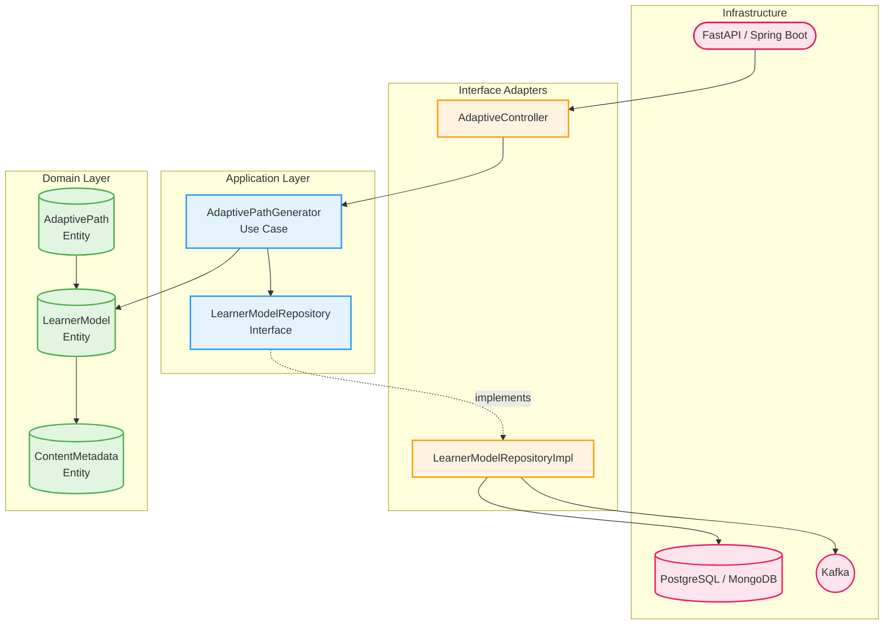

# Góc Nhìn Module (Module Views)

## Mục Tiêu

Trình bày cấu trúc logic của mã nguồn bên trong một **Architecture Quantum** điển hình, đảm bảo tính **Modularity** và **Testability** cao.

---

## 1. Sơ Đồ Cấu Trúc Lớp/Module Nội Bộ

### 1.1. Internal Clean Architecture Diagram

Chúng ta sẽ áp dụng **Clean Architecture** (hoặc Hexagonal Architecture) bên trong **Adaptive Engine Service** để phân tách:
- **Logic AI/Nghiệp vụ (Policy)** khỏi
- **Cơ sở hạ tầng (Details)**

### 1.2. Phân Tích Chi Tiết Các Lớp (Layers)

Kiến trúc này tuân thủ **Dependency Inversion Principle (DIP)**, trong đó các lớp bên ngoài (Infrastructure) luôn phụ thuộc vào các lớp bên trong (Domain/Application).

| **Lớp (Layer)** | **Vai Trò** | **Component Chính trong Adaptive Engine** | **Củng Cố ACs/SOLID** |
|-----------------|-------------|------------------------------------------|----------------------|
| **1. Domain<br>(Entities & Core Rules)** | Chứa các quy tắc nghiệp vụ cốt lõi, độc lập với bất kỳ ứng dụng nào. Đây là tầng ổn định nhất. | - `LearnerModel` (Entity)<br>- `ContentMetadata` (Entity)<br>- `AdaptivePath` (Entity) | **SRP** (Single Responsibility Principle):<br>Chỉ mô tả dữ liệu và quy tắc nghiệp vụ. |
| **2. Application<br>(Use Cases/Interactors)** | Chứa các quy tắc nghiệp vụ cụ thể của ứng dụng (Policy Modules). Điều phối luồng dữ liệu đến và đi từ Domain. | - `AdaptivePathGenerator` (Use Case/Policy): Chứa thuật toán AI quyết định lộ trình tối ưu (FR7)<br>- `LearnerModelRepository` Interface: Định nghĩa hợp đồng cho việc lấy/lưu trữ LearnerModel | **DIP** (Dependency Inversion Principle):<br>Tầng này chỉ phụ thuộc vào Interfaces (ví dụ: `LearnerModelRepository` Interface), không phải DB cụ thể.<br>→ Code rất ổn định (I≈0) |
| **3. Interface Adapters** | Chuyển đổi dữ liệu giữa các định dạng bên ngoài (Web Request, DB Record) và các định dạng bên trong (Domain Entities). | - `AdaptiveController`: Xử lý API Request (REST)<br>- `LearnerModelRepositoryImpl` (Concrete Class): Lớp triển khai Repository Interface, kết nối với Database | **Testability (AC4):**<br>Giúp cô lập logic nghiệp vụ khỏi tầng giao diện/I/O, cho phép Mock DB khi kiểm thử `AdaptivePathGenerator` |
| **4. Infrastructure** | Chứa tất cả các chi tiết triển khai bên ngoài (DB, Web Framework, Message Queue). | - MongoDB/PostgreSQL Driver<br>- Kafka Producer/Consumer<br>- Server Framework (Spring Boot, FastAPI) | **OCP** (Open/Closed Principle):<br>Nếu đổi DB từ MongoDB sang PostgreSQL, chỉ cần thay đổi/mở rộng lớp này mà không cần sửa tầng Application Core |

### 1.3. Sơ Đồ Clean Architecture (Mermaid)



**💡 Nguyên tắc DIP (Dependency Inversion):**
- Application Layer chỉ phụ thuộc vào **Interfaces** (Abstraction)
- Không phụ thuộc vào **Implementation** (Concretion)
- Dependencies luôn hướng vào trong (từ ngoài → trong)

---

## 2. Lý Giải Về Phụ Thuộc Module và Tính Ổn Định

Việc áp dụng Clean Architecture trực tiếp củng cố hai Architecture Characteristics quan trọng nhất:

### 2.1. Củng Cố Testability (AC4)

#### **Tách biệt Policy khỏi Detail**

- **`AdaptivePathGenerator`** (Policy - Logic AI):
  - Nằm ở tầng Application (bên trong)
  - Tách biệt hoàn toàn khỏi `LearnerModelRepositoryImpl` (Detail - kết nối DB)

#### **Thực thi Testing**

Khi kiểm thử `AdaptivePathGenerator`:
1. Chỉ cần **Mock** (giả lập) `LearnerModelRepository` Interface
2. Unit Test tập trung vào **logic thuật toán**
3. Không phụ thuộc vào trạng thái của DB hay Framework

**Lợi ích:**
- ✅ Test nhanh (không cần khởi động DB)
- ✅ Test độc lập (không bị ảnh hưởng bởi infrastructure)
- ✅ Test coverage cao (dễ dàng test edge cases)

### 2.2. Đảm Bảo Tính Ổn Định (Modularity - AC1)

#### **Instability Index (I)**

**Công thức:** 

$$I = \frac{C_e}{C_e + C_a}$$

Trong đó:
- **Cₑ (Efferent Coupling):** Số dependencies đi ra (outgoing)
- **Cₐ (Afferent Coupling):** Số dependencies đi vào (incoming)
- **I ∈ [0, 1]:** 
  - I = 0 → Rất ổn định (nhiều module phụ thuộc vào nó)
  - I = 1 → Rất bất ổn (phụ thuộc nhiều vào module khác)

#### **Phân Tích Các Layer**

| **Layer** | **Cₑ** | **Cₐ** | **I** | **Giải Thích** |
|-----------|--------|--------|-------|----------------|
| **Application Layer**<br>(`AdaptivePathGenerator`) | Thấp<br>(chỉ phụ thuộc Interfaces) | Cao<br>(nhiều lớp bên ngoài phụ thuộc vào nó) | **I ≈ 0**<br>(Rất Ổn định) | Logic AI cốt lõi được **bảo vệ khỏi sự thay đổi**.<br>Khi infrastructure thay đổi, logic AI không bị ảnh hưởng. |
| **Infrastructure Layer**<br>(DB Driver) | Cao<br>(phụ thuộc vào thư viện bên ngoài) | Thấp<br>(ít module phụ thuộc vào nó) | **I ≈ 1**<br>(Rất Bất ổn) | Điều này là **mong muốn**.<br>Chi tiết triển khai (DB, Framework) được mong đợi sẽ thay đổi thường xuyên. |

#### **Minh Họa**

```
┌─────────────────────────────────────────────────┐
│  Application Layer (AdaptivePathGenerator)      │
│  • Cₐ = 5 (Controller, API, Tests... phụ thuộc) │
│  • Cₑ = 1 (chỉ phụ thuộc Interface)              │
│  • I = 1/(1+5) = 0.17 ≈ 0 (RẤT ỔN ĐỊNH)        │
└─────────────────────────────────────────────────┘
                    ↑
                    │ (depends on Interface)
                    │
┌─────────────────────────────────────────────────┐
│  Infrastructure Layer (RepositoryImpl)           │
│  • Cₐ = 1 (chỉ Interface Adapter phụ thuộc)     │
│  • Cₑ = 5 (DB, ORM, Config, Logger...)          │
│  • I = 5/(5+1) = 0.83 ≈ 1 (RẤT BẤT ỔN)         │
└─────────────────────────────────────────────────┘
```

### 2.3. Áp Dụng SOLID Principles

| **Principle** | **Áp Dụng Trong Clean Architecture** | **Lợi Ích** |
|---------------|--------------------------------------|-------------|
| **SRP**<br>(Single Responsibility) | Mỗi layer có một trách nhiệm duy nhất:<br>- Domain: Business rules<br>- Application: Use cases<br>- Adapters: Data conversion | Dễ bảo trì, dễ hiểu |
| **OCP**<br>(Open/Closed) | Mở rộng bằng cách thêm Adapter mới,<br>không sửa Application/Domain | Giảm rủi ro khi thay đổi |
| **LSP**<br>(Liskov Substitution) | Mọi implementation của Repository<br>đều thay thế được cho Interface | Linh hoạt trong testing |
| **ISP**<br>(Interface Segregation) | Interfaces nhỏ, cụ thể<br>(ví dụ: `LearnerModelRepository`) | Tránh phụ thuộc không cần thiết |
| **DIP**<br>(Dependency Inversion) | **Application phụ thuộc Interface,<br>không phụ thuộc Implementation** | **Tính ổn định cao (I≈0)** |

---

## 3. Kết Luận

### 3.1. Tóm Tắt

**Góc nhìn Module** này đã thiết lập một cấu trúc lớp vững chắc, nơi các nguyên tắc **SOLID** được thực thi để đảm bảo:

1. ✅ **Testability (AC4):** 
   - Logic nghiệp vụ tách biệt khỏi infrastructure
   - Dễ dàng mock và test
   - Test coverage cao

2. ✅ **Modularity (AC1):**
   - Application Layer có I≈0 (rất ổn định)
   - Infrastructure Layer có I≈1 (dễ thay đổi)
   - Phân tách rõ ràng giữa Policy và Detail

3. ✅ **Maintainability (AC7):**
   - Mỗi layer có trách nhiệm rõ ràng
   - Thay đổi infrastructure không ảnh hưởng logic
   - Tuân thủ OCP và DIP

### 3.2. Áp Dụng Cho Các Services Khác

Cấu trúc Clean Architecture này được áp dụng **nhất quán** cho tất cả các microservices trong ITS:

- **Learner Model Service**
- **Assessment Engine Service**
- **Content Delivery Service**
- **AI Reasoning Service**

→ Đảm bảo **consistency** và **quality** xuyên suốt toàn bộ hệ thống.

---

**Tài liệu tham khảo:**
- Clean Architecture (Robert C. Martin)
- Fundamentals of Software Architecture (Mark Richards, Neal Ford)
- Domain-Driven Design (Eric Evans)
