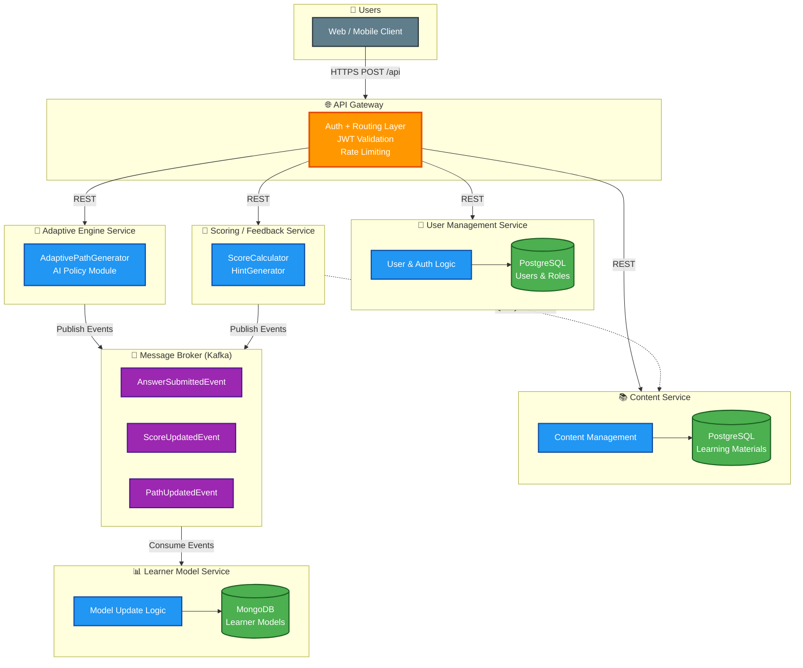
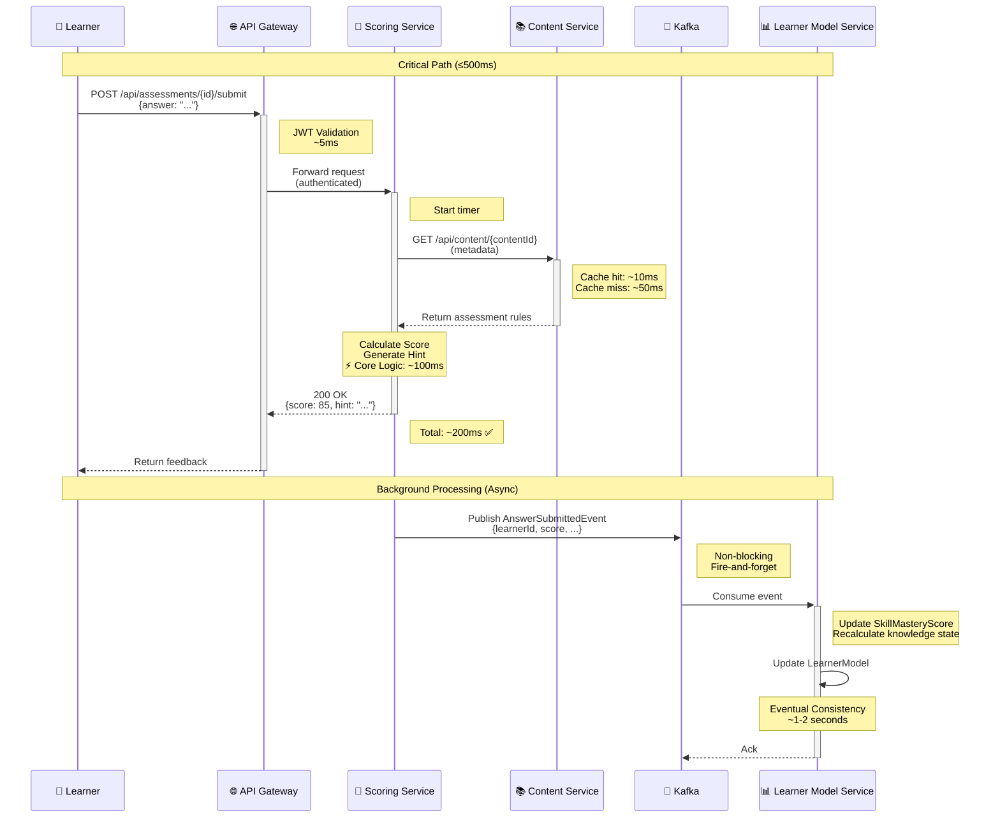

# Góc Nhìn Component và Connector (Component and Connector Views)

## Mục Tiêu

Góc nhìn này tập trung vào:
- **Architecture Quantum:** Các đơn vị triển khai độc lập
- **Runtime Interactions:** Cách chúng tương tác trong thời gian chạy
- **Communication Patterns:** Đồng bộ (REST) và bất đồng bộ (Event-Driven)

Đây là nơi kiến trúc **Microservices + Event-Driven** của ITS được trực quan hóa.

---

## 1. Sơ Đồ Service (Container Diagram - C4 Model)

### 1.1. Mô Tả Tổng Quan

Sơ đồ này thể hiện **ranh giới vật lý** của các Microservices:
- Mỗi **Service (Container)** là một đơn vị triển khai độc lập
- Giao tiếp qua mạng: **REST** (đồng bộ) hoặc **Messaging** (bất đồng bộ)
- Tuân thủ nguyên tắc **Single Responsibility** ở cấp service

### 1.2. Phân Tích & Vai Trò Của Các Service

| **Service (Container)** | **Vai Trò Chính** | **Giao Tiếp Chính** | **Củng Cố ACs** |
|-------------------------|-------------------|---------------------|-----------------|
| **API Gateway** | Điểm vào duy nhất (Single Entry Point).<br>Xử lý:<br>- Authentication (Xác thực)<br>- Routing (Định tuyến)<br>- Rate limiting | REST (đồng bộ) | **AC6:** Security<br>**AC3:** Performance |
| **User Management Service** | Quản lý tài khoản:<br>- Learner/Instructor/Admin<br>- RBAC (Role-Based Access Control)<br>- Session management | REST API<br>SQL Database | **AC6:** Security |
| **Content Service** | Quản lý nội dung học tập:<br>- Learning materials (FR3)<br>- Metadata (FR5)<br>- Content versioning<br>**Dữ liệu rất ổn định (I≈0)** | REST API<br>SQL Database | **AC1:** Modularity<br>**AC7:** Maintainability |
| **Adaptive Engine Service** | **Policy Module Cốt lõi**<br>- `AdaptivePathGenerator` (FR7)<br>- Quyết định lộ trình học tập<br>- AI/ML algorithms | **Synchronous:** REST (với Gateway)<br>**Asynchronous:** Events (với Learner Model) | **AC1:** Modularity<br>**AC2:** Scalability |
| **Scoring/Feedback Service** | Xử lý đánh giá:<br>- Auto-grading (FR6)<br>- Instant feedback<br>- Hint generation<br>**Target: ≤500ms response** | **Synchronous:** REST (với Gateway)<br>**Asynchronous:** Events (publish scores) | **AC3:** Performance<br>**AC4:** Testability |
| **Learner Model Service** | Quản lý learner state:<br>- `LearnerModel` entity<br>- `SkillMasteryScore` (FR2)<br>- Liên tục cập nhật từ Events | **Asynchronous:** Event-Driven<br>NoSQL Database | **AC2:** Scalability<br>**AC1:** Modularity |
| **Message Broker (Kafka)** | Event distribution:<br>- `AnswerSubmittedEvent`<br>- `ScoreUpdatedEvent`<br>- `PathUpdatedEvent`<br>**Decoupling services** | Messaging<br>(bất đồng bộ) | **AC2:** Scalability<br>**AC1:** Modularity |

### 1.3. Sơ Đồ Container (Mermaid)



**🔑 Chú giải:**
- **Solid arrows (→):** Synchronous communication (REST/HTTP)
- **Dotted arrows (-.->):** Query/Read operations
- **Bold arrows:** Asynchronous communication (Events via Kafka)

**💡 Design Decisions:**

| **Pattern** | **Rationale** | **AC Supported** |
|-------------|---------------|------------------|
| **API Gateway** | Single entry point, centralized auth, simplifies client | Security (AC6), Performance (AC3) |
| **Event-Driven (Kafka)** | Decouple services, async processing, better scalability | Scalability (AC2), Modularity (AC1) |
| **Separate Databases** | Database per service pattern, independent scaling | Modularity (AC1), Scalability (AC2) |
| **REST for Sync** | Simple, stateless, well-understood | Simplicity, Interoperability |

---

## 2. Sơ Đồ Trình Tự (Sequence Diagram)

### 2.1. Use Case: UC-L-02 - Xử Lý Phản Hồi Bài Tập

**Context:** Đây là use case cốt lõi đòi hỏi **Performance cao (≤500ms)** để đảm bảo trải nghiệm người dùng tốt.

**Critical Path:** Chấm điểm và trả về feedback ngay lập tức

### 2.2. Luồng Cơ Bản (Critical Path)

| **STT** | **Bước** | **Chi Tiết Phối Hợp Giữa Services** | **Giao Tiếp & Mục Đích** |
|---------|----------|-------------------------------------|--------------------------|
| **1** | Submit Answer | Learner gửi câu trả lời qua Web/Mobile Client | `POST /api/assessments/{id}/submit`<br>**HTTP** (đồng bộ) |
| **2** | Route Request | API Gateway xác thực JWT và định tuyến đến Scoring Service | **HTTP Routing** (đồng bộ)<br>Latency: ~10ms |
| **3** | Fetch Assessment Metadata | Scoring Service lấy thông tin bài tập từ Content Service | `GET /api/content/{contentId}`<br>**HTTP** (đồng bộ)<br>**Có thể cache** |
| **4** | Calculate Score & Generate Hint | Scoring Service xử lý logic:<br>- Auto-grading<br>- Hint generation | **Internal Logic** (AC3: Performance)<br>**Phần này phải cực nhanh** |
| **5** | ✅ Return Real-Time Feedback | Scoring Service trả về kết quả cho Learner | **HTTP Response** (đồng bộ)<br>**Target: ≤500ms total** |
| **6** | Publish Event (Async) | Scoring Service tạo `AnswerSubmittedEvent` | **Kafka Publish** (bất đồng bộ)<br>**Không block response** |
| **7** | Update Learner Model (Background) | Learner Model Service consume event và cập nhật `SkillMasteryScore` | **Kafka Consumer** (bất đồng bộ)<br>**Eventual Consistency** |

### 2.3. Sequence Diagram (Mermaid)



**🎯 Performance Breakdown:**

| **Phase** | **Time Budget** | **Optimization Strategy** |
|-----------|-----------------|---------------------------|
| Gateway Routing | ~10ms | In-memory JWT validation, connection pooling |
| Fetch Metadata | ~10-50ms | **Redis caching** for frequently accessed content |
| Score Calculation | ~100ms | Optimized algorithms, pre-compiled rules |
| Response Marshalling | ~10ms | Efficient JSON serialization |
| **Total (Synchronous)** | **≤200ms** ✅ | **Well under 500ms target** |
| Event Publishing | ~5ms | Fire-and-forget, non-blocking |
| Model Update (Async) | ~1-2s | Background processing, eventual consistency |

---

## 3. Phân Tích Giao Tiếp Patterns

### 3.1. Synchronous Communication (REST)

**Khi nào sử dụng:**
- ✅ Cần response ngay lập tức (real-time feedback)
- ✅ Client cần biết kết quả để tiếp tục
- ✅ Simple request-response pattern

**Trong ITS:**
- API Gateway ↔ All Services
- Scoring Service ↔ Content Service (fetch metadata)

**Trade-offs:**
- ✅ **Pros:** Simple, immediate feedback, easy debugging
- ⚠️ **Cons:** Tight coupling, cascade failures, latency accumulation

**Mitigation:**
- Circuit breaker pattern
- Timeouts và retries
- Caching (Redis)

### 3.2. Asynchronous Communication (Events)

**Khi nào sử dụng:**
- ✅ Không cần response ngay lập tức
- ✅ Cần decouple services
- ✅ Fan-out pattern (1 event → nhiều consumers)

**Trong ITS:**
- Scoring Service → Kafka → Learner Model Service
- Adaptive Engine → Kafka → Multiple services

**Trade-offs:**
- ✅ **Pros:** Decoupling, scalability, resilience
- ⚠️ **Cons:** Eventual consistency, complexity, debugging harder

**Mitigation:**
- Event schema versioning
- Dead letter queues
- Distributed tracing (Jaeger)

### 3.3. Hybrid Approach (Best of Both Worlds)

**ITS Strategy:**

```
┌─────────────────────────────────────────┐
│  Synchronous (REST) for:                │
│  ✓ User-facing operations (≤500ms)      │
│  ✓ Queries (read operations)            │
│  ✓ Immediate feedback required          │
└─────────────────────────────────────────┘
              +
┌─────────────────────────────────────────┐
│  Asynchronous (Events) for:             │
│  ✓ Background processing                │
│  ✓ Model updates (1-2s acceptable)      │
│  ✓ Cross-service notifications          │
└─────────────────────────────────────────┘
              =
    ⭐ Optimized Architecture ⭐
```

---

## 4. Mapping Tới Architecture Characteristics

### 4.1. Component-Connector View Supports ACs

| **Architecture Characteristic** | **How Component-Connector View Supports It** |
|---------------------------------|----------------------------------------------|
| **AC1: Modularity** | - Each service is independently deployable<br>- Clear boundaries via API contracts<br>- Event-driven decoupling |
| **AC2: Scalability** | - Services scale independently<br>- Kafka enables async processing<br>- Stateless services (easy horizontal scaling) |
| **AC3: Performance** | - Hybrid sync/async patterns<br>- Caching strategies (Redis)<br>- Non-blocking async for background tasks |
| **AC4: Testability** | - Services can be tested independently<br>- Mock external dependencies<br>- Contract testing for APIs |
| **AC5: Deployability** | - Independent deployment per service<br>- Blue/green deployment possible<br>- Canary releases per service |
| **AC6: Security** | - Centralized auth at API Gateway<br>- Service-to-service auth (mTLS possible)<br>- Network segmentation |

### 4.2. Architecture Quantum Analysis

| **Service** | **Quantum Type** | **Coupling** | **Cohesion** |
|-------------|------------------|--------------|--------------|
| Adaptive Engine | **Independent** | Low (async events) | High (single responsibility: path generation) |
| Scoring Service | **Synchronized** (with Content Service) | Medium (REST query) | High (scoring & feedback) |
| Learner Model | **Event-driven** | Low (consumes events only) | High (model management) |

---

## 5. Kết Luận

### 5.1. Key Takeaways

**Component-and-Connector View đã chứng minh:**

1. ✅ **Hybrid Communication Strategy:**
   - **Synchronous (REST)** cho user-facing operations → Đảm bảo **Performance (AC3)**
   - **Asynchronous (Kafka)** cho background processing → Đảm bảo **Scalability (AC2)** và **Modularity (AC1)**

2. ✅ **Decoupling Through Events:**
   - Scoring Service không trực tiếp gọi Learner Model Service
   - Sử dụng Kafka làm intermediary
   - → Giảm coupling, tăng resilience

3. ✅ **Performance Optimization:**
   - Critical path (≤500ms) được tối ưu bằng caching và async processing
   - Background tasks không ảnh hưởng user experience
   - → Đáp ứng NFR về latency

4. ✅ **Independent Scalability:**
   - Mỗi service có database riêng
   - Scale theo nhu cầu thực tế (ví dụ: scale Scoring Service khi có nhiều submissions)
   - → Tối ưu chi phí infrastructure

### 5.2. Architecture Decision Rationale

**Q: Tại sao không dùng toàn bộ REST?**
- A: REST đồng bộ sẽ làm Scoring Service chờ đợi Learner Model Service cập nhật xong → Latency cao, vi phạm Performance (AC3)

**Q: Tại sao không dùng toàn bộ Event-Driven?**
- A: User cần feedback ngay lập tức. Eventual consistency không chấp nhận được cho real-time feedback.

**Q: Tại sao cần API Gateway?**
- A: Centralized auth, routing, rate limiting → Đơn giản hóa client, tăng security (AC6)

### 5.3. Next Steps

Góc nhìn Component-and-Connector đã xác định:
- ✅ Service boundaries
- ✅ Communication patterns
- ✅ Data flow

**Tiếp theo:** 
- Allocation View sẽ mô tả cách deploy các services này lên infrastructure
- Implementation view sẽ chi tiết code organization

---

**Tài liệu tham khảo:**
- Software Architecture in Practice (Len Bass et al.)
- The C4 Model for Visualising Software Architecture (Simon Brown)
- Building Event-Driven Microservices (Adam Bellemare)
