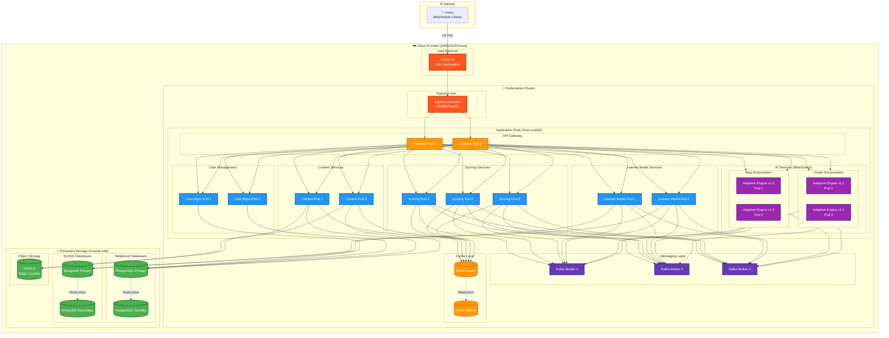
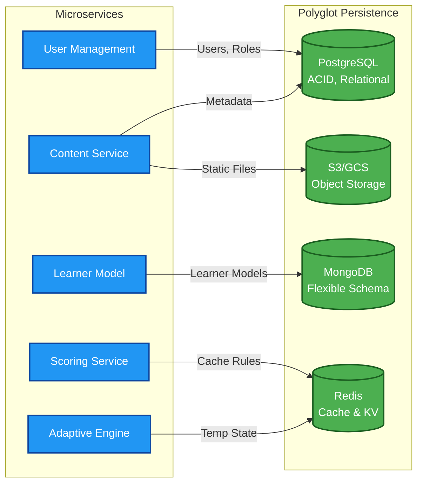

# Góc Nhìn Phân Bổ (Allocation Views)

## Mục Tiêu

Góc nhìn này mô tả:
- **Deployment Strategy:** Cách các services được triển khai lên infrastructure
- **Resource Allocation:** Phân bổ tài nguyên (CPU, memory, storage)
- **Data Distribution:** Chiến lược lưu trữ dữ liệu (Polyglot Persistence)
- **Scalability & Availability:** Đảm bảo AC2 và khả năng chịu lỗi

---

## 1. Sơ Đồ Triển Khai (Deployment Diagram)

### 1.1. Mô Tả Tổng Quan

Sơ đồ này minh họa cách các **Microservices** được triển khai trên môi trường **Cloud** sử dụng:
- **Kubernetes (K8s):** Container orchestration
- **Containerization (Docker):** Đóng gói services
- **Blue/Green Deployment:** Cho services AI quan trọng (FR9, FR12)

**Mục tiêu:**
- ✅ Đáp ứng **Scalability (AC2):** Auto-scaling theo tải
- ✅ Đáp ứng **Deployability (AC5):** Independent deployment, zero-downtime
- ✅ Đáp ứng **Availability:** High availability với redundancy

### 1.2. Giả Định Kỹ Thuật

| **Aspect** | **Technology/Strategy** |
|------------|-------------------------|
| **Cloud Provider** | AWS / GCP / Azure (cloud-agnostic via Kubernetes) |
| **Container Orchestration** | Kubernetes (K8s) cluster |
| **Container Runtime** | Docker / containerd |
| **Load Balancing** | Kubernetes Ingress + Cloud Load Balancer |
| **Auto-scaling** | Horizontal Pod Autoscaler (HPA) |
| **Deployment Strategy** | Blue/Green for AI services, Rolling update for others |
| **Service Mesh** | Istio (optional, for advanced traffic management) |

### 1.3. Phân Tích Triển Khai Vật Lý

| **Thành Phần Hạ Tầng** | **Vai Trò Trong ITS** | **Củng Cố ACs** |
|------------------------|----------------------|-----------------|
| **Ingress Controller /<br>Load Balancer** | - Entry point cho external traffic<br>- SSL/TLS termination<br>- Phân phối tải đến API Gateway Pods | **AC2:** Scalability - Horizontal scaling<br>**AC6:** Security - HTTPS enforcement |
| **API Gateway Pods<br>(N ≥ 2)** | - Stateless gateway<br>- Authentication & routing<br>- Rate limiting | **AC2:** Scalability - Auto-scaling<br>**AC5:** Deployability - Rolling updates |
| **Adaptive Engine Pods<br>(N ≥ 3)** | - AI/ML workloads<br>- CPU-intensive computations<br>- **Blue/Green deployment** support | **AC2:** Scalability - Independent scaling<br>**AC5:** Deployability - Live model swapping (FR9)<br>**AC3:** Performance - Multiple replicas |
| **Scoring/Feedback Pods<br>(N ≥ 3)** | - Real-time scoring<br>- High throughput<br>- Low latency requirement (≤500ms) | **AC2:** Scalability - Handle burst traffic<br>**AC3:** Performance - Fast response |
| **Learner Model Pods<br>(N ≥ 2)** | - Event consumers<br>- Model update processing<br>- NoSQL database access | **AC2:** Scalability - Process events async<br>**AC1:** Modularity - Decoupled via events |
| **Content Service Pods<br>(N ≥ 2)** | - Serve learning materials<br>- Read-heavy workload<br>- Cache-friendly | **AC7:** Availability - Always available<br>**AC3:** Performance - With caching layer |
| **User Management Pods<br>(N ≥ 2)** | - Authentication & authorization<br>- RBAC management<br>- Critical service | **AC6:** Security - User data protection<br>**AC7:** Availability - Always online |
| **Kafka Cluster<br>(N ≥ 3 brokers)** | - Event streaming platform<br>- Decouple services<br>- High throughput messaging | **AC2:** Scalability - Handle millions of events<br>**AC1:** Modularity - Async communication |
| **Persistent Storage<br>Cluster** | - Databases (SQL & NoSQL)<br>- File storage (S3/GCS)<br>- Backup & recovery | **AC6:** Security - Data isolation<br>**AC7:** Availability - Data redundancy |
| **Redis Cache Cluster<br>(N ≥ 2)** | - In-memory caching<br>- Session storage<br>- Hot data caching | **AC3:** Performance - Sub-ms latency<br>**AC2:** Scalability - Reduce DB load |

### 1.4. Sơ Đồ Deployment (Mermaid)



### 1.5. Resource Allocation Strategy

#### **A. CPU & Memory Allocation**

| **Service** | **CPU Request** | **CPU Limit** | **Memory Request** | **Memory Limit** | **Replicas** |
|-------------|-----------------|---------------|-------------------|------------------|--------------|
| **API Gateway** | 100m | 500m | 128Mi | 512Mi | 2-5 (HPA) |
| **Adaptive Engine** | 500m | 2000m | 512Mi | 2Gi | 3-10 (HPA) |
| **Scoring Service** | 250m | 1000m | 256Mi | 1Gi | 3-8 (HPA) |
| **Learner Model** | 200m | 800m | 256Mi | 1Gi | 2-6 (HPA) |
| **Content Service** | 100m | 500m | 128Mi | 512Mi | 2-4 (HPA) |
| **User Management** | 100m | 500m | 128Mi | 512Mi | 2-3 | 
| **Kafka Broker** | 500m | 2000m | 1Gi | 4Gi | 3 (StatefulSet) |
| **Redis** | 100m | 500m | 256Mi | 1Gi | 2 (Master-Replica) |

**Chú thích:**
- **Request:** Minimum guaranteed resources
- **Limit:** Maximum allowed resources
- **HPA:** Horizontal Pod Autoscaler (auto-scale based on metrics)

#### **B. Auto-scaling Configuration**

**Horizontal Pod Autoscaler (HPA) Rules:**

```yaml
# Example: Adaptive Engine Service
apiVersion: autoscaling/v2
kind: HorizontalPodAutoscaler
metadata:
  name: adaptive-engine-hpa
spec:
  scaleTargetRef:
    apiVersion: apps/v1
    kind: Deployment
    name: adaptive-engine
  minReplicas: 3
  maxReplicas: 10
  metrics:
  - type: Resource
    resource:
      name: cpu
      target:
        type: Utilization
        averageUtilization: 70
  - type: Resource
    resource:
      name: memory
      target:
        type: Utilization
        averageUtilization: 80
  - type: Pods
    pods:
      metric:
        name: http_requests_per_second
      target:
        type: AverageValue
        averageValue: "1000"
```

**Scaling Triggers:**

| **Service** | **Scale Up When** | **Scale Down When** | **Cooldown** |
|-------------|-------------------|---------------------|--------------|
| Adaptive Engine | CPU > 70% OR Requests > 1000/s | CPU < 30% AND Requests < 300/s | 5 min |
| Scoring Service | CPU > 70% OR Latency > 400ms | CPU < 30% AND Latency < 100ms | 3 min |
| Learner Model | Queue depth > 1000 messages | Queue depth < 100 messages | 5 min |

---

## 2. Blue/Green Deployment Strategy

### 2.1. Concept

**Blue/Green Deployment** cho phép:
- ✅ **Zero-downtime deployment**
- ✅ **Live AI model swapping** (FR9, FR12)
- ✅ **Instant rollback** nếu có lỗi

### 2.2. Implementation for Adaptive Engine

**Luồng Deployment:**

```
┌─────────────────────────────────────────────────────────────┐
│  STEP 1: Both Blue (v1.0) and Green (v1.1) Running          │
│  ━━━━━━━━━━━━━━━━━━━━━━━━━━━━━━━━━━━━━━━━━━━━━━━━━━━━━━━  │
│  Traffic: 100% → Blue (v1.0)                                │
│  Green (v1.1): Running but no traffic (testing phase)       │
└─────────────────────────────────────────────────────────────┘
                          ↓
┌─────────────────────────────────────────────────────────────┐
│  STEP 2: Gradual Traffic Shift (Canary)                     │
│  ━━━━━━━━━━━━━━━━━━━━━━━━━━━━━━━━━━━━━━━━━━━━━━━━━━━━━━━  │
│  Traffic: 90% → Blue, 10% → Green                           │
│  Monitor metrics: latency, error rate, accuracy             │
└─────────────────────────────────────────────────────────────┘
                          ↓
┌─────────────────────────────────────────────────────────────┐
│  STEP 3: Full Cutover                                       │
│  ━━━━━━━━━━━━━━━━━━━━━━━━━━━━━━━━━━━━━━━━━━━━━━━━━━━━━━━  │
│  Traffic: 100% → Green (v1.1)                               │
│  Blue (v1.0): Keep running for 1 hour (rollback window)     │
└─────────────────────────────────────────────────────────────┘
                          ↓
┌─────────────────────────────────────────────────────────────┐
│  STEP 4: Decommission Old Version                           │
│  ━━━━━━━━━━━━━━━━━━━━━━━━━━━━━━━━━━━━━━━━━━━━━━━━━━━━━━━  │
│  Traffic: 100% → Green (v1.1)                               │
│  Blue (v1.0): Terminated                                    │
└─────────────────────────────────────────────────────────────┘
```

### 2.3. Kubernetes Configuration

**Service with selector switching:**

```yaml
# Kubernetes Service (traffic routing)
apiVersion: v1
kind: Service
metadata:
  name: adaptive-engine-service
spec:
  selector:
    app: adaptive-engine
    version: blue  # Switch to 'green' for cutover
  ports:
  - port: 8080
    targetPort: 8080
```

**Blue Deployment:**
```yaml
apiVersion: apps/v1
kind: Deployment
metadata:
  name: adaptive-engine-blue
spec:
  replicas: 3
  selector:
    matchLabels:
      app: adaptive-engine
      version: blue
  template:
    metadata:
      labels:
        app: adaptive-engine
        version: blue
    spec:
      containers:
      - name: adaptive-engine
        image: adaptive-engine:v1.0
        resources:
          requests:
            cpu: 500m
            memory: 512Mi
          limits:
            cpu: 2000m
            memory: 2Gi
```

**Green Deployment:**
```yaml
apiVersion: apps/v1
kind: Deployment
metadata:
  name: adaptive-engine-green
spec:
  replicas: 3
  selector:
    matchLabels:
      app: adaptive-engine
      version: green
  template:
    metadata:
      labels:
        app: adaptive-engine
        version: green
    spec:
      containers:
      - name: adaptive-engine
        image: adaptive-engine:v1.1  # New version
        resources:
          requests:
            cpu: 500m
            memory: 512Mi
          limits:
            cpu: 2000m
            memory: 2Gi
```

---

## 3. Sơ Đồ Phân Bổ Dữ Liệu (Polyglot Persistence)

### 3.1. Chiến Lược Polyglot Persistence

**Concept:** Sử dụng **nhiều loại cơ sở dữ liệu khác nhau** để tối ưu hóa hiệu suất và tính linh hoạt cho từng service.

**Benefits:**
- ✅ **Optimized for use case:** Mỗi DB phù hợp với data model
- ✅ **Independent scaling:** Scale DB theo nhu cầu của từng service
- ✅ **Fault isolation:** Lỗi DB không lan tỏa

### 3.2. Phân Bổ Dữ Liệu Chi Tiết

| **Service** | **Dữ Liệu Quản Lý** | **Loại Cơ Sở Dữ Liệu** | **Lý Do Tối Ưu Hóa (ACs)** |
|-------------|---------------------|-------------------------|----------------------------|
| **User Management** | - `User` entity<br>- `Role` & `Permission`<br>- Authentication tokens | **Relational DB**<br>(PostgreSQL) | **AC6:** Security - ACID properties đảm bảo data integrity cho thông tin xác thực quan trọng<br>**AC7:** Availability - Mature replication & backup |
| **Learner Model** | - `LearnerModel` entity<br>- `SkillMasteryScore`<br>- Learning analytics | **NoSQL Document DB**<br>(MongoDB) | **AC1:** Modularity - Flexible schema cho AI model attributes<br>**AC2:** Scalability - Horizontal scaling cho millions of learners<br>**Flexibility:** Dễ dàng thêm fields mới (Confidence Score, Learning Style) |
| **Content Service** | - `LearningContent` entity<br>- `MetadataTag`<br>- Content versioning | **Relational DB**<br>(PostgreSQL)<br>+<br>**Object Storage**<br>(S3/GCS) | **PostgreSQL:** Relational queries for metadata<br>**S3:** Static files (videos, PDFs, images)<br>**AC7:** Availability - Content always accessible<br>**Cost:** Object storage cheaper for large files |
| **Scoring/Feedback** | - Assessment rules<br>- Grading criteria<br>- Hint templates | **Key-Value Store**<br>(Redis) | **AC3:** Performance - Sub-millisecond access<br>**Caching:** Reduce latency for hot data<br>**TTL:** Auto-expire old cache entries |
| **Adaptive Engine** | - Temporary computation state<br>- Session data | **In-Memory Cache**<br>(Redis) | **AC3:** Performance - Fast state access for AI algorithms<br>**Stateless:** Can restart pods without data loss (cache can be rebuilt) |
| **Event Store<br>(Optional)** | - Event history<br>- Audit logs<br>- Event sourcing | **Event Store DB**<br>(EventStoreDB)<br>or<br>**Kafka + Compaction** | **AC7:** Availability - Event replay capability<br>**Debugging:** Full event history for troubleshooting<br>**Compliance:** Audit trail |

### 3.3. Database Specifications

#### **PostgreSQL (Relational DB)**

**Configuration:**
- **Primary-Standby Replication:** 1 primary + 1 standby
- **Backup Strategy:** Daily full backup + continuous WAL archiving
- **Connection Pooling:** PgBouncer (max 100 connections per service)
- **Storage:** SSD (for low latency)

**Services Using:**
- User Management
- Content Service

#### **MongoDB (NoSQL Document DB)**

**Configuration:**
- **Replica Set:** 3 nodes (1 primary + 2 secondaries)
- **Sharding:** Shard by `learnerId` when > 10M learners
- **Write Concern:** `majority` (ensure durability)
- **Read Preference:** `primaryPreferred` (consistency)

**Services Using:**
- Learner Model Service

**Schema Example:**
```json
{
  "_id": "learner_12345",
  "name": "John Doe",
  "skillMastery": {
    "math_algebra": 0.85,
    "math_calculus": 0.62
  },
  "learningStyle": "visual",
  "confidenceScore": 0.78,
  "lastUpdated": "2025-10-13T10:30:00Z",
  "metadata": {
    // Flexible fields can be added without schema migration
    "preferredDifficulty": "medium",
    "avgSessionTime": 45
  }
}
```

#### **Redis (Key-Value Store & Cache)**

**Configuration:**
- **Deployment:** Master-Replica (1 master + 1 replica)
- **Persistence:** RDB snapshots (every 5 min) + AOF (append-only file)
- **Eviction Policy:** `allkeys-lru` (Least Recently Used)
- **Max Memory:** 2GB per instance

**Use Cases:**
- **Cache:** Assessment rules, content metadata
- **Session Store:** User sessions, temp state
- **Rate Limiting:** API rate limits (sliding window)

**Data Examples:**
```redis
# Assessment rule cache
assessment:rule:123 → "{correctAnswer: 'B', points: 10, hints: [...]}"

# Rate limiting (sliding window)
rate_limit:user:456:window:1697185200 → "15"  (15 requests in this window)

# Session
session:abc123 → "{userId: 789, role: 'learner', exp: 1697188800}"
```

#### **S3/GCS (Object Storage)**

**Configuration:**
- **Bucket Structure:**
  - `its-content-prod/videos/`
  - `its-content-prod/pdfs/`
  - `its-content-prod/images/`
- **CDN:** CloudFront (AWS) / Cloud CDN (GCP) for global distribution
- **Lifecycle Policy:** Archive to Glacier after 1 year
- **Versioning:** Enabled (for content rollback)

**Services Using:**
- Content Service (static files)

### 3.4. Data Flow Diagram



---

## 4. Mapping Tới Architecture Characteristics

### 4.1. Allocation View Supports ACs

| **Architecture Characteristic** | **How Allocation View Supports It** |
|---------------------------------|--------------------------------------|
| **AC1: Modularity** | - Each service has dedicated pods<br>- Independent deployment pipelines<br>- Polyglot persistence (DB per service) |
| **AC2: Scalability** | - Kubernetes HPA (auto-scaling)<br>- Horizontal scaling for stateless services<br>- MongoDB sharding for data<br>- Kafka partitioning for events |
| **AC3: Performance** | - Redis caching reduces DB load<br>- CDN for static content<br>- Resource limits prevent noisy neighbors<br>- SSD storage for low latency |
| **AC5: Deployability** | - Blue/Green deployment for AI services<br>- Rolling updates for others<br>- Independent versioning per service<br>- Zero-downtime deployment |
| **AC6: Security** | - Network policies (pod-to-pod isolation)<br>- Secrets management (K8s Secrets)<br>- Database encryption at rest<br>- TLS for inter-service communication |
| **AC7: Availability** | - Multiple replicas per service (N ≥ 2)<br>- Database replication (primary-standby)<br>- Health checks & auto-restart<br>- Backup & disaster recovery |

### 4.2. Infrastructure Cost Estimation

**Monthly Cost Breakdown (Estimated for 10,000 concurrent users):**

| **Component** | **Configuration** | **Monthly Cost** |
|---------------|-------------------|------------------|
| **Kubernetes Cluster** | 3 nodes (8 vCPU, 32GB RAM each) | $600 |
| **Load Balancer** | 1 instance | $30 |
| **PostgreSQL** | Primary + Standby (4 vCPU, 16GB) | $200 |
| **MongoDB** | 3-node replica set (4 vCPU, 16GB each) | $450 |
| **Redis** | Master + Replica (2 vCPU, 4GB each) | $100 |
| **Kafka** | 3 brokers (4 vCPU, 8GB each) | $300 |
| **S3/Object Storage** | 1TB storage + transfer | $100 |
| **CDN** | CloudFront/Cloud CDN | $50 |
| **Monitoring & Logging** | Datadog/New Relic | $150 |
| **Backup & DR** | Automated backups | $50 |
| **Total** | | **~$2,030/month** |

**Scaling Projections:**

| **Users** | **Cluster Nodes** | **Est. Monthly Cost** |
|-----------|-------------------|-----------------------|
| 10,000 | 3 nodes | $2,030 |
| 50,000 | 6 nodes | $3,500 |
| 100,000 | 12 nodes | $6,200 |

---

## 5. Kết Luận

### 5.1. Key Takeaways

**Allocation View đã chứng minh:**

1. ✅ **Cloud-Native Architecture:**
   - Kubernetes orchestration cho flexibility và portability
   - Container-based deployment cho consistency
   - Auto-scaling cho cost optimization

2. ✅ **Polyglot Persistence Strategy:**
   - PostgreSQL cho transactional data (ACID)
   - MongoDB cho flexible learner models
   - Redis cho high-performance caching
   - S3 cho cost-effective static content storage

3. ✅ **High Availability & Scalability:**
   - Multiple replicas (N ≥ 2) cho mọi service
   - Database replication cho data redundancy
   - Auto-scaling based on metrics (CPU, memory, requests)

4. ✅ **Zero-Downtime Deployment:**
   - Blue/Green deployment cho AI services (FR9)
   - Rolling updates cho stateless services
   - Instant rollback capability

### 5.2. Trade-offs & Decisions

| **Decision** | **Rationale** | **Trade-off Accepted** |
|--------------|---------------|------------------------|
| **Kubernetes over VMs** | Orchestration, auto-scaling, portability | Higher complexity, learning curve |
| **Polyglot Persistence** | Optimized for each use case | Multiple DB technologies to manage |
| **Blue/Green Deployment** | Zero downtime for AI model swapping | Higher resource usage (2x during deployment) |
| **Managed K8s (GKE/EKS)** | Reduced operational overhead | Higher cost vs self-managed |

### 5.3. Operational Considerations

**DevOps Requirements:**
- ✅ CI/CD pipeline (GitLab CI, Jenkins, or GitHub Actions)
- ✅ Infrastructure as Code (Terraform, Helm charts)
- ✅ Monitoring & Alerting (Prometheus, Grafana, Datadog)
- ✅ Logging (ELK stack or Cloud Logging)
- ✅ Distributed Tracing (Jaeger, Zipkin)

**Team Skills Needed:**
- Kubernetes administration
- Container orchestration
- Database management (SQL & NoSQL)
- Cloud platform expertise (AWS/GCP/Azure)
- Security best practices

---

**Tài liệu tham khảo:**
- Kubernetes in Action (Marko Lukša)
- Site Reliability Engineering (Google)
- Designing Data-Intensive Applications (Martin Kleppmann)
- Cloud Native Patterns (Cornelia Davis)
