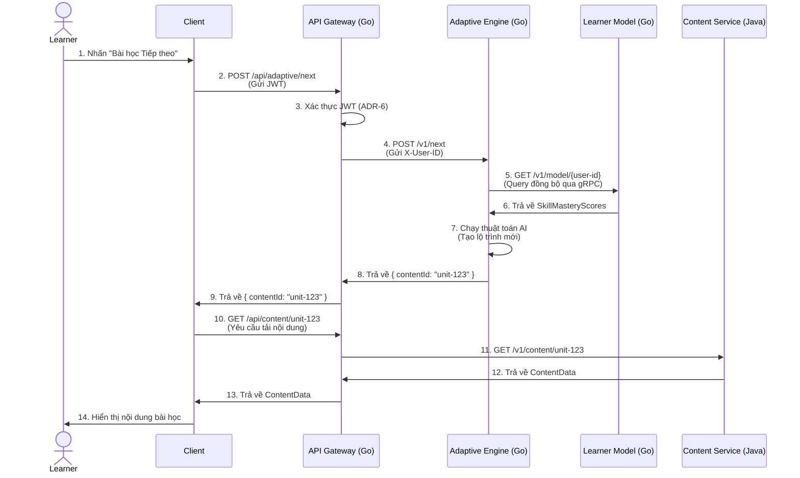
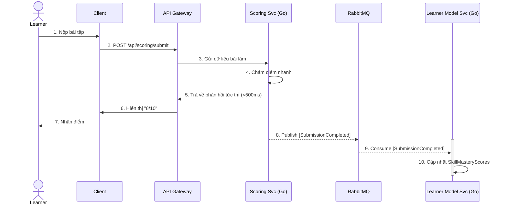

```mermaid
sequenceDiagram
    actor Learner
    participant Client
    participant APIGW as API Gateway (Go)
    participant AdaptiveSvc as Adaptive Engine (Go)
    participant ModelSvc as Learner Model (Go)
    participant ContentSvc as Content Service (Java)

    Learner ->> Client: 1. Nhấn "Bài học Tiếp theo"
    Client ->> APIGW: 2. POST /api/adaptive/next<br>(Gửi JWT)
    
    APIGW ->> APIGW: 3. Xác thực JWT (ADR-6) 
    APIGW ->> AdaptiveSvc: 4. POST /v1/next<br>(Gửi X-User-ID)

    AdaptiveSvc ->> ModelSvc: 5. GET /v1/model/{user-id}<br>(Query đồng bộ qua gRPC)
    ModelSvc ->> AdaptiveSvc: 6. Trả về SkillMasteryScores
    AdaptiveSvc ->> AdaptiveSvc: 7. Chạy thuật toán AI<br>(Tạo lộ trình mới) 
    AdaptiveSvc ->> APIGW: 8. Trả về { contentId: "unit-123" }

    APIGW ->> Client: 9. Trả về { contentId: "unit-123" }

    Client ->> APIGW: 10. GET /api/content/unit-123<br>(Yêu cầu tải nội dung)
    APIGW ->> ContentSvc: 11. GET /v1/content/unit-123
    ContentSvc ->> APIGW: 12. Trả về ContentData
    APIGW ->> Client: 13. Trả về ContentData
    Client ->> Learner: 14. Hiển thị nội dung bài học
```

```mermaid
sequenceDiagram
    actor Learner
    participant Client
    participant APIGW as API Gateway
    participant ScoringSvc as Scoring Svc (Go)
    participant Broker as RabbitMQ
    participant ModelSvc as Learner Model Svc (Go)

    Learner ->> Client: 1. Nộp bài tập
    Client ->> APIGW: 2. POST /api/scoring/submit
    APIGW ->> ScoringSvc: 3. Gửi dữ liệu bài làm

    %% Sync Path
    ScoringSvc ->> ScoringSvc: 4. Chấm điểm nhanh 
    ScoringSvc ->> APIGW: 5. Trả về phản hồi tức thì (<500ms) 
    APIGW ->> Client: 6. Hiển thị "8/10"
    Client ->> Learner: 7. Nhận điểm
    
    %% Async Path
    ScoringSvc -->> Broker: 8. Publish [SubmissionCompleted] 
    
    activate ModelSvc
    Broker -->> ModelSvc: 9. Consume [SubmissionCompleted] 
    ModelSvc ->> ModelSvc: 10. Cập nhật SkillMasteryScores
    deactivate ModelSvc
```