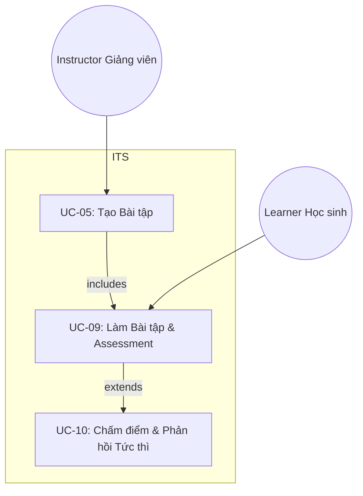
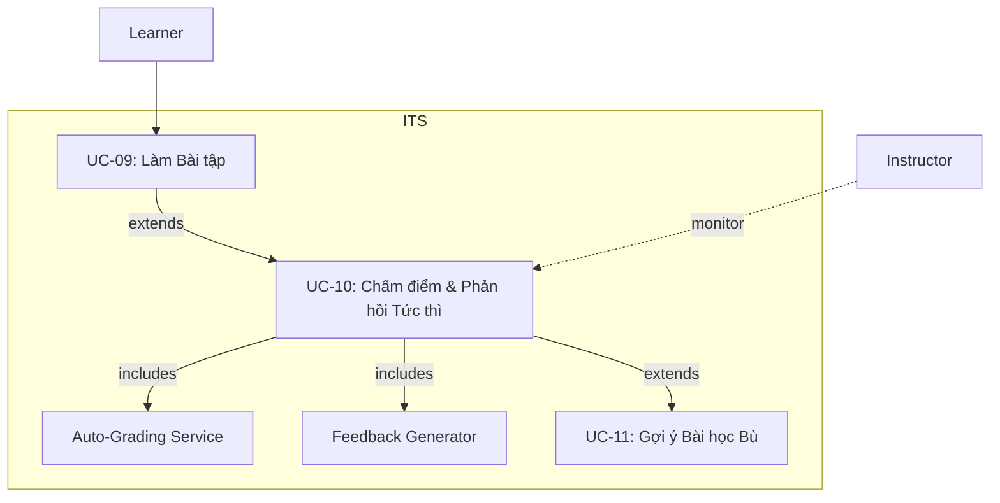
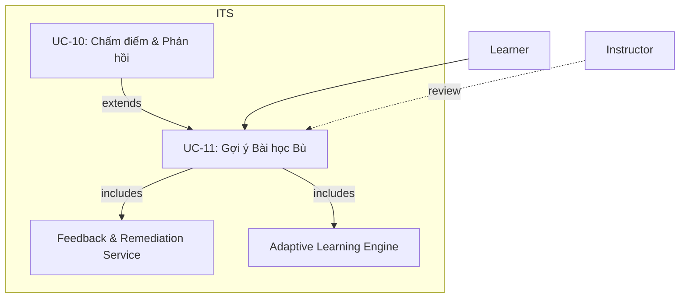
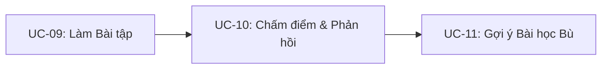
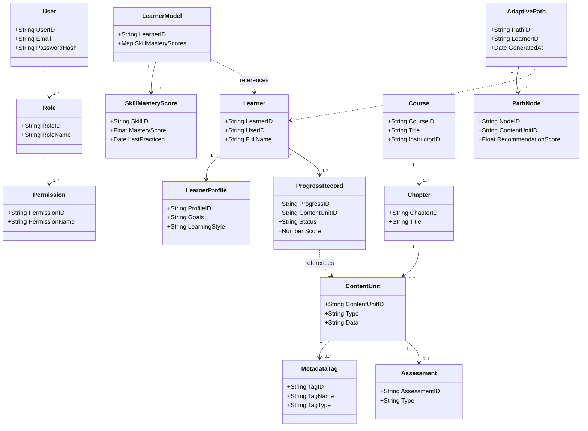

UC-09 – Làm Bài tập và Assessment

Mục tiêu: Học viên thực hiện bài tập hoặc bài kiểm tra; hệ thống lưu kết quả để phục vụ bước chấm điểm.

Giải thích:
- Instructor tạo nội dung (UC-05).
- Learner thực hiện bài tập (UC-09).
- Khi nộp bài, hệ thống mở rộng (extends) đến UC-10 để chấm điểm và phản hồi.

---

UC-10 – Chấm điểm và Phản hồi Tức thì

Mục tiêu: Tự động chấm điểm và trả phản hồi nhanh cho người học (< 1 s), đồng thời cập nhật Learner Model.

Giải thích:
- UC-10 bao gồm hai chức năng chính:
  - Auto-Grading Service: tính điểm.
  - Feedback Generator: tạo gợi ý/hints.
- Nếu kết quả kém, hệ thống mở rộng đến UC-11 để đề xuất bài học bù.

---

UC-11 – Gợi ý Bài học Bù (Remediation)

Mục tiêu: Khi học viên yếu kỹ năng nào đó, hệ thống đề xuất nội dung phù hợp để củng cố.

- Kích hoạt khi người học sai liên tục hoặc mastery score < 0.6.
- Adaptive Learning Engine và Feedback Service cùng xử lý để sinh danh sách bài bù.
- Instructor có thể xem và xác nhận lộ trình ôn tập.

Tổng quan chuỗi Use Case 09 → 10 → 11

Đây là vòng lặp học tập thích ứng của ITS:
1. Người học làm bài (UC-09) →
2. Hệ thống chấm điểm và phản hồi (UC-10) →
3. Nếu cần, đề xuất bài học bù (UC-11) → quay về lộ trình mới.

