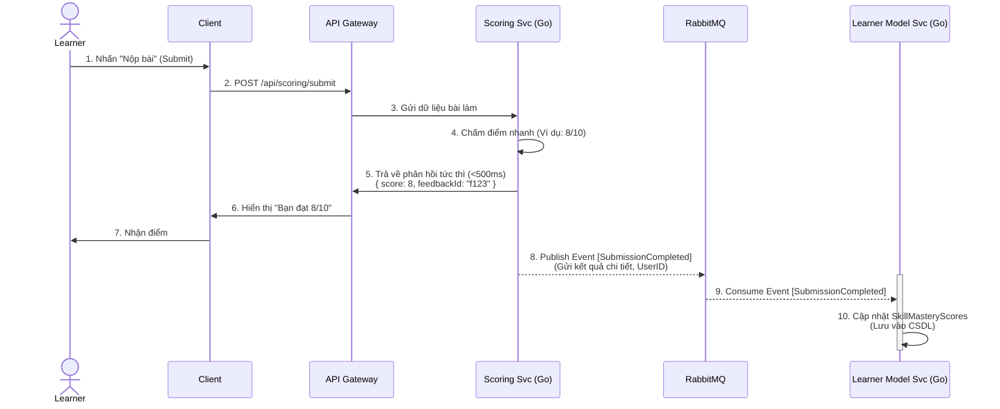

# Assessment Submission and Scoring Sequence

```mermaid
sequenceDiagram
    actor Learner
    participant Client
    participant APIGW as API Gateway
    participant ScoringSvc as Scoring Svc (Go)
    participant Broker as RabbitMQ
    participant ModelSvc as Learner Model Svc (Go)

    Learner ->> Client: 1. Nhấn "Nộp bài" (Submit)
    Client ->> APIGW: 2. POST /api/scoring/submit
    APIGW ->> ScoringSvc: 3. Gửi dữ liệu bài làm

    %% Sync Path (Tức thì)
    ScoringSvc ->> ScoringSvc: 4. Chấm điểm nhanh (Ví dụ: 8/10)
    ScoringSvc ->> APIGW: 5. Trả về phản hồi tức thì (<500ms)<br>{ score: 8, feedbackId: "f123" }
    APIGW ->> Client: 6. Hiển thị "Bạn đạt 8/10"
    Client ->> Learner: 7. Nhận điểm
    
    %% Async Path (Cập nhật nền)
    ScoringSvc -->> Broker: 8. Publish Event [SubmissionCompleted]<br>(Gửi kết quả chi tiết, UserID)
    
    activate ModelSvc
    Broker -->> ModelSvc: 9. Consume Event [SubmissionCompleted]
    ModelSvc ->> ModelSvc: 10. Cập nhật SkillMasteryScores<br>(Lưu vào CSDL)
    deactivate ModelSvc
```