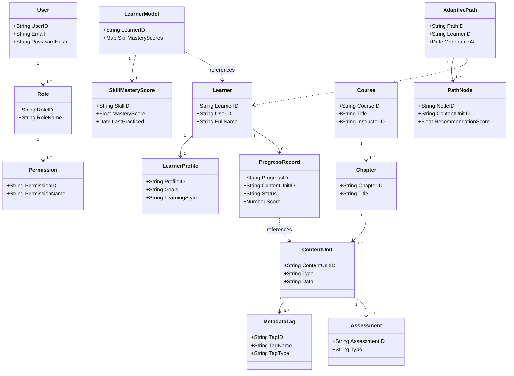

# Domain Model Class Diagram

```mermaid
classDiagram
    %% User Management
    class User {
        +String UserID
        +String Email
        +String PasswordHash
    }
    class Role {
        +String RoleID
        +String RoleName
    }
    class Permission {
        +String PermissionID
        +String PermissionName
    }
    User "1" --> "1..*" Role
    Role "1" --> "1..*" Permission

    %% Learner
    class Learner {
        +String LearnerID
        +String UserID
        +String FullName
    }
    class LearnerProfile {
        +String ProfileID
        +String Goals
        +String LearningStyle
    }
    class ProgressRecord {
        +String ProgressID
        +String ContentUnitID
        +String Status
        +Number Score
    }
    Learner "1" --> "1" LearnerProfile
    Learner "1" --> "0..*" ProgressRecord

    %% Learner Model
    class LearnerModel {
        +String LearnerID
        +Map SkillMasteryScores
    }
    class SkillMasteryScore {
        +String SkillID
        +Float MasteryScore
        +Date LastPracticed
    }
    LearnerModel "1" --> "1..*" SkillMasteryScore

    %% Content
    class Course {
        +String CourseID
        +String Title
        +String InstructorID
    }
    class Chapter {
        +String ChapterID
        +String Title
    }
    class ContentUnit {
        +String ContentUnitID
        +String Type
        +String Data
    }
    class MetadataTag {
        +String TagID
        +String TagName
        +String TagType
    }
    class Assessment {
        +String AssessmentID
        +String Type
    }
    Course "1" --> "1..*" Chapter
    Chapter "1" --> "1..*" ContentUnit
    ContentUnit "1" --> "0..*" MetadataTag
    ContentUnit "1" --> "0..1" Assessment

    %% Adaptive Path
    class AdaptivePath {
        +String PathID
        +String LearnerID
        +Date GeneratedAt
    }
    class PathNode {
        +String NodeID
        +String ContentUnitID
        +Float RecommendationScore
    }
    AdaptivePath "1" --> "1..*" PathNode

    %% Cross-Aggregate references
    LearnerModel ..> Learner : references
    AdaptivePath ..> Learner : references
    ProgressRecord ..> ContentUnit : references
```