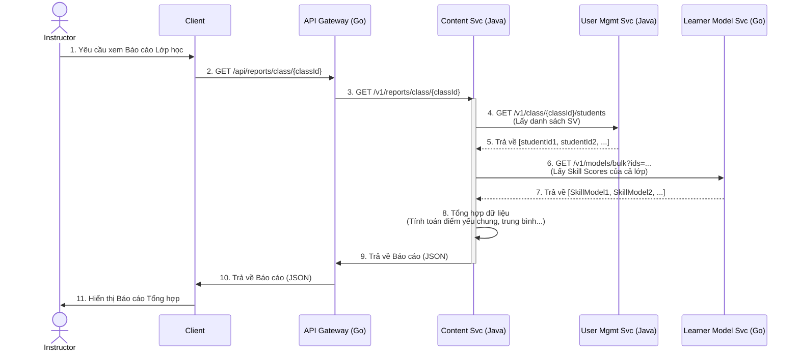

```mermaid
sequenceDiagram
    actor Instructor
    participant Client
    participant APIGW as API Gateway (Go)
    participant ContentSvc as Content Svc (Java)
    participant UserSvc as User Mgmt Svc (Java)
    participant ModelSvc as Learner Model Svc (Go)

    Instructor ->> Client: 1. Yêu cầu xem Báo cáo Lớp học
    Client ->> APIGW: 2. GET /api/reports/class/{classId}
    APIGW ->> ContentSvc: 3. GET /v1/reports/class/{classId}

    activate ContentSvc
    ContentSvc ->> UserSvc: 4. GET /v1/class/{classId}/students<br>(Lấy danh sách SV)
    UserSvc -->> ContentSvc: 5. Trả về [studentId1, studentId2, ...]

    ContentSvc ->> ModelSvc: 6. GET /v1/models/bulk?ids=...<br>(Lấy Skill Scores của cả lớp)
    ModelSvc -->> ContentSvc: 7. Trả về [SkillModel1, SkillModel2, ...]

    ContentSvc ->> ContentSvc: 8. Tổng hợp dữ liệu<br>(Tính toán điểm yếu chung, trung bình...)
    
    ContentSvc ->> APIGW: 9. Trả về Báo cáo (JSON)
    deactivate ContentSvc
    
    APIGW ->> Client: 10. Trả về Báo cáo (JSON)
    Client ->> Instructor: 11. Hiển thị Báo cáo Tổng hợp
```
