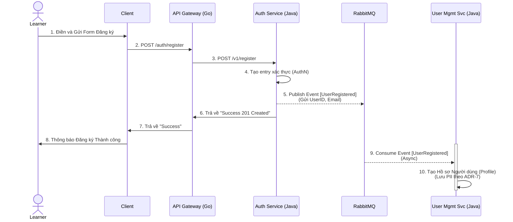

# User Registration Sequence

```mermaid
sequenceDiagram
    actor Learner
    participant Client
    participant APIGW as API Gateway (Go)
    participant AuthSvc as Auth Service (Java)
    participant Broker as RabbitMQ
    participant UserSvc as User Mgmt Svc (Java)

    Learner ->> Client: 1. Điền và Gửi Form Đăng ký
    Client ->> APIGW: 2. POST /auth/register
    APIGW ->> AuthSvc: 3. POST /v1/register
    
    AuthSvc ->> AuthSvc: 4. Tạo entry xác thực (AuthN)
    AuthSvc -->> Broker: 5. Publish Event [UserRegistered]<br>(Gửi UserID, Email)
    
    AuthSvc ->> APIGW: 6. Trả về "Success 201 Created"
    APIGW ->> Client: 7. Trả về "Success"
    Client ->> Learner: 8. Thông báo Đăng ký Thành công
    
    activate UserSvc
    Broker -->> UserSvc: 9. Consume Event [UserRegistered]<br>(Async)
    UserSvc ->> UserSvc: 10. Tạo Hồ sơ Người dùng (Profile)<br>(Lưu PII theo ADR-7)
    deactivate UserSvc
```