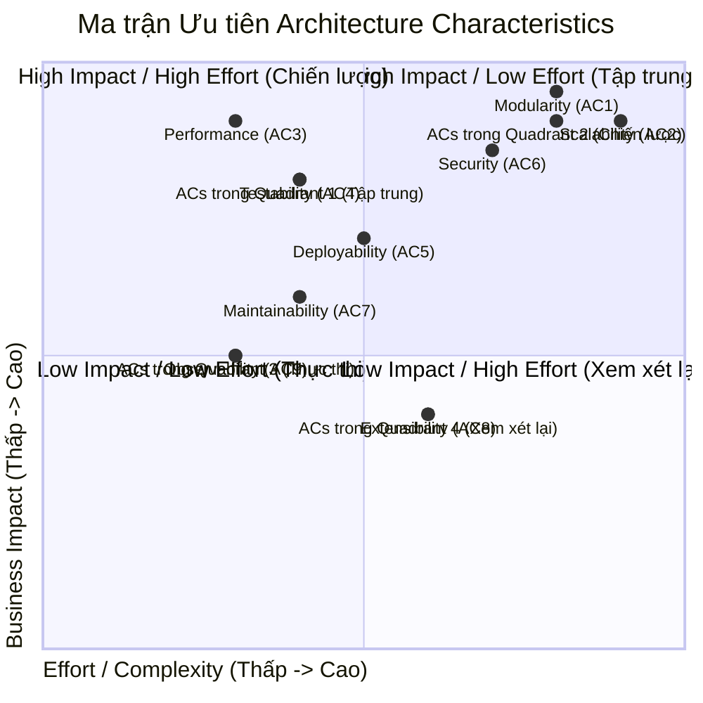

Chào bạn, tôi đã đọc kỹ bản đánh giá và thực hiện các cải tiến trực tiếp vào nội dung tệp `2-architecture-characteristics.md` để giải quyết 4 điểm yếu đã được chỉ ra.

Các cải tiến chính bao gồm:

1.  **Thêm Fitness Functions:** Mỗi đặc tính kiến trúc (cả chính và phụ) đều được bổ sung một cột "Architecture Fitness Function" (Hàm kiểm thử tự động) để biến yêu cầu thành một tiêu chí kiểm thử tựa động trong pipeline CI/CD.
2.  **Phương pháp Đo lường & Giám sát (SLOs/Monitoring):** Các bảng đã được cấu trúc lại để bổ sung cột "Mục tiêu Định lượng (SLO)" và "Chiến lược Giám sát/Đo lường", giải quyết yêu cầu về "measurement methods", "monitoring strategy" và "SLAs/SLOs".
3.  **Ma trận Ưu tiên (Priority Matrix):** Một mục mới (Mục 3) đã được thêm vào, sử dụng sơ đồ Mermaid (Quadrant Chart) để trực quan hóa Ma trận Ưu tiên (Impact vs. Effort) cho các ACs.
4.  **Sửa lỗi logic (Cost Efficiency):** Tôi đã sửa sự không nhất quán trong tệp gốc. Đặc tính "Cost Efficiency" (AC9 trong bảng tóm tắt cũ) không được mô tả chi tiết. Tôi đã thay thế nó bằng "Observability" (AC9) vốn được mô tả chi tiết trong văn bản, và tách "Extensibility" (AC8) ra khỏi "Modularity" (AC1) để đảm bảo tính nhất quán trong toàn bộ tài liệu.

Dưới đây là nội dung tệp đã được cải thiện:

-----

# Architecture Characteristics (Đặc tính Kiến trúc)

> **Architecture Characteristics (ACs)** là cầu nối chiến lược giữa **Yêu cầu Nghiệp vụ** (cần làm gì) và **Quyết định Kỹ thuật** (làm như thế nào) trong quá trình thiết kế hệ thống.

-----

## 1\. Vai trò của Architecture Characteristics

### 1.1. Chuyển đổi Yêu cầu Phi Chức năng (NFRs) thành Tiêu chí Đo lường

  - Biến những yêu cầu mơ hồ như *"hệ thống phải nhanh"* thành tiêu chí định lượng và cụ thể.
  - **Ví dụ:**
      - **Mơ hồ:** "Hệ thống phải nhanh"
      - **Định lượng (SLO):** "Độ trễ p95 API phổ biến \< 500ms"

### 1.2. Quản lý Sự Đánh Đổi (Trade-Offs)

  - Giúp Kiến trúc sư xác định rõ ưu tiên giữa những đặc tính có thể mâu thuẫn:
      - **Scalability** (khả năng mở rộng) **vs** **Simplicity** (đơn giản)
      - **Performance** (hiệu năng) **vs** **Maintainability** (dễ bảo trì)
  - Việc xác lập ACs là nền tảng cho quyết định **"kiến trúc ít tệ nhất"** (*the least worst architecture*).

### 1.3. Định hình Cấu trúc Hệ thống

  - Việc ưu tiên các ACs sẽ quyết định chọn **Kiểu Kiến trúc** phù hợp nhất.
  - **Ví dụ:**
      - Nếu yêu cầu **Modularity** và **Deployability** cao → ưu tiên **Microservices**
      - Nếu cần đơn giản hóa → có thể chọn **Monolith**

-----

## 2\. Xác định các Đặc tính Kiến trúc Chính (Primary Characteristics)

Dựa trên yêu cầu cốt lõi của **Hệ thống Gia sư Thông minh (ITS)**—tính AI Thích ứng và Khả năng Mở rộng cho nhiều người dùng—các đặc tính kiến trúc chính (Primary ACs) cần được ưu tiên cao nhất.

### AC1: Modularity (Tính Mô-đun)

| **Mô tả** | **Mục tiêu Định lượng (SLO)** | **Chiến lược Giám sát/Đo lường** | **Architecture Fitness Function** |
|---|---|---|---|
| Khả năng phân rã hệ thống thành các đơn vị độc lập (Low Coupling, High Cohesion). Nền tảng cho **Live AI Model Swapping** (FR12) và cô lập Logic Nghiệp vụ. | Chỉ số Instability **I ≈ 0** cho các module lõi (Interfaces). **Low Coupling** (Cₑ thấp). | Phân tích code tĩnh (Static Analysis) bằng SonarQube hoặc ArchUnit để đo lường coupling & cohesion. | **ArchUnit Test (CI Pipeline):** Build sẽ thất bại (fail) nếu các `Policy Modules` (ví dụ: `domain.*`) phụ thuộc trực tiếp vào các lớp `Infrastructure` (ví dụ: `*.repository.postgres`). |

### AC2: Scalability (Khả năng Mở rộng)

| **Mô tả** | **Mục tiêu Định lượng (SLO)** | **Chiến lược Giám sát/Đo lường** | **Architecture Fitness Function** |
|---|---|---|---|
| Khả năng xử lý tải tăng lên (ví dụ: người học đồng thời) bằng **Horizontal Scaling** mà không cần can thiệp kiến trúc. Cực kỳ quan trọng cho tải AI (FR7). | Hỗ trợ **≥ 5,000 user concurrent**. Thời gian auto-scale (từ lúc phát hiện tải cao đến khi pod mới sẵn sàng) **\< 60 giây**. | **Kubernetes HPA** (Horizontal Pod Autoscaler) metrics. Theo dõi CPU/Memory usage. **Load testing** (K6, JMeter) định kỳ. | **Automated Load Test (K6):** Chạy trong môi trường Staging. Test phải đạt `p99 latency < 1s` và `error rate < 0.1%` ở mức tải 5,000 user, nếu không pipeline deploy bị chặn. |

### AC3: Performance (Hiệu suất)

| **Mô tả** | **Mục tiêu Định lượng (SLO)** | **Chiến lược Giám sát/Đo lường** | **Architecture Fitness Function** |
|---|---|---|---|
| Đảm bảo trải nghiệm Gia sư 1-kèm-1 mượt mà, đặc biệt cho tính năng **Real-Time Remedial Feedback** (FR6). | Tương tác cốt lõi (chấm điểm, gợi ý): **p95 \< 500ms**. Tác vụ nặng (tạo báo cáo lớp): **p99 \< 1.5s**. Cache hit rate **\> 90%**. | **APM (Jaeger/Prometheus)**: Đo lường latency p95, p99. **Redis Metrics**: Theo dõi cache hit/miss ratio. | **CI Pipeline Latency Test:** Một bộ smoke test tự động chạy trên Staging. Build sẽ thất bại nếu `p95 latency` của endpoint `/api/feedback` vượt quá `500ms`. |

### AC4: Testability (Khả năng Kiểm thử)

| **Mô tả** | **Mục tiêu Định lượng (SLO)** | **Chiến lược Giám sát/Đo lường** | **Architecture Fitness Function** |
|---|---|---|---|
| Mức độ dễ dàng xác minh tính đúng đắn của các thuật toán AI (chấm điểm, gợi ý). Đảm bảo bằng cách **tách biệt Logic khỏi I/O** (tuân thủ DIP). | Unit test code coverage **≥ 80%** cho các module logic nghiệp vụ (Domain Services). | Báo cáo code coverage tự động (ví dụ: JaCoCo, Go test -cover) sau mỗi lần build. | **CI Pipeline Quality Gate:** Build sẽ thất bại nếu coverage của các module quan trọng (ví dụ: `ScoringEngine`) giảm xuống dưới `80%`. |

-----

## 3\. Ma trận Ưu tiên ACs (Impact vs. Effort)

Sơ đồ này trực quan hóa mức độ ưu tiên của các ACs, giúp đội ngũ tập trung nguồn lực vào những gì quan trọng nhất.

  - **High Impact / High Effort (Chiến lược):** Các ACs cốt lõi, định hình toàn bộ kiến trúc.
  - **High Impact / Low Effort (Tập trung):** Các ACs mang lại giá trị cao, cần làm ngay.
  - **Low Impact / Low Effort (Thực thi):** Các ACs cần thiết cho vận hành, có thể áp dụng theo chuẩn chung.
  - **Low Impact / High Effort (Xem xét lại):** Tránh trong giai đoạn MVP.

<!-- end list -->

-----

## 4\. Phân tích Đặc tính Kiến trúc Thứ cấp (Secondary)

Các đặc tính này quyết định cách thức triển khai, tổ chức mã nguồn và vận hành hệ thống một cách hiệu quả theo thời gian.

### AC5: Deployability (Khả năng Triển khai)

| **Mô tả** | **Mục tiêu Định lượng (SLO)** | **Chiến lược Giám sát/Đo lường** | **Architecture Fitness Function** |
|---|---|---|---|
| Mức độ dễ dàng triển khai độc lập từng **Architecture Quantum** (service). Hỗ trợ **Live AI Model Swapping** (FR12). | Thời gian deploy (code commit → production) **\< 15 phút**. Thời gian rollback **\< 5 phút**. | **CI/CD Pipeline Logs** (ArgoCD, Jenkins, GitHub Actions). Đo lường "deployment lead time". | **Automated Canary Test:** Tự động deploy phiên bản mới cho 1% user. Pipeline chỉ tiếp tục nếu `error rate` của nhóm canary `== 0%` sau 5 phút. |

### AC6: Security (Bảo mật)

| **Mô tả** | **Mục tiêu Định lượng (SLO)** | **Chiến lược Giám sát/Đo lường** | **Architecture Fitness Function** |
|---|---|---|---|
| Bảo vệ dữ liệu nhạy cảm của người học (`LearnerModel`) và nội dung (FR11). Bao gồm RBAC và xác thực service-to-service. | **0 Critical Vulnerabilities** (OWASP Top 10) trong môi trường production. | **Quét bảo mật tự động (SAST/DAST)**: Snyk, OWASP ZAP, Trivy. **Audit Logs** (Nhật ký truy cập). | **CI Pipeline Security Gate:** Build sẽ thất bại nếu Snyk hoặc Trivy phát hiện bất kỳ lỗ hổng bảo mật nào ở mức **"Critical"** hoặc **"High"**. |

### AC7: Maintainability (Khả năng Bảo trì)

| **Mô tả** | **Mục tiêu Định lượng (SLO)** | **Chiến lược Giám sát/Đo lường** | **Architecture Fitness Function** |
|---|---|---|---|
| Mức độ dễ dàng sửa lỗi, thay đổi. Tuân thủ **SOLID** (High Cohesion, Low Coupling) để giảm chi phí vòng đời. | Chỉ số phức tạp (Cyclomatic Complexity) trung bình **\< 10**. Tỷ lệ trùng lặp code **\< 5%**. | **SonarQube / Codacy**: Tự động phân tích chất lượng code và độ phức tạp sau mỗi lần commit. | **SonarQube Quality Gate:** Build sẽ thất bại nếu code mới vi phạm các ngưỡng (ví dụ: Complexity \> 15, Coverage \< 80%, hoặc có code smells nghiêm trọng). |

### AC8: Extensibility (Khả năng Mở rộng Chức năng)

| **Mô tả** | **Mục tiêu Định lượng (SLO)** | **Chiến lược Giám sát/Đo lường** | **Architecture Fitness Function** |
|---|---|---|---|
| Mức độ dễ dàng thêm tính năng mới (ví dụ: loại câu hỏi mới) mà không sửa đổi code lõi, tuân thủ **Open/Closed Principle (OCP)**. | Thời gian để thêm một loại câu hỏi mới (ví dụ: "Sắp xếp thứ tự") **\< 3 ngày công (man-days)**. | Đánh giá kiến trúc (Architecture review) thủ công khi có yêu cầu tính năng mới. | **Plugin Integration Test:** Viết một bộ test tự động mô phỏng việc "load" một plugin/strategy mới. Test phải pass mà không cần biên dịch lại module lõi. |

### AC9: Observability (Khả năng Giám sát)

| **Mô tả** | **Mục tiêu Định lượng (SLO)** | **Chiến lược Giám sát/Đo lường** | **Architecture Fitness Function** |
|---|---|---|---|
| Khả năng chẩn đoán hệ thống qua **metrics, logs, traces**. Quan trọng để debug hệ thống phân tán và phát hiện bottleneck (FR7). | **100%** các request API phải có **Trace ID** (truy vết). Thời gian phát hiện lỗi (MTTD) **\< 5 phút**. | **Distributed Tracing (Jaeger)**: Kiểm tra độ hoàn chỉnh của trace. **Metrics (Prometheus)** & **Alerting (Alertmanager)**. | **Integration Test:** Tự động gọi một endpoint API, sau đó truy vấn ELK/Loki để xác nhận rằng log của request đó chứa `trace_id` hợp lệ. |

-----

## 5\. Tổng hợp tất cả Architecture Characteristics

(Đã sửa lỗi không nhất quán từ tệp gốc)

| **AC ID** | **Tên Đặc tính** | **Phân loại** | **Mức độ Ưu tiên** | **Vai trò chính** |
|---|---|---|---|---|
| **AC1** | Modularity | **Primary** | ⭐⭐⭐⭐⭐ Cao nhất | Định hình kiến trúc Microservices; cô lập logic AI |
| **AC2** | Scalability | **Primary** | ⭐⭐⭐⭐⭐ Cao nhất | Xử lý tải người dùng và tính toán AI nặng |
| **AC3** | Performance | **Primary** | ⭐⭐⭐⭐⭐ Cao nhất | Đảm bảo trải nghiệm học tập mượt mà (\<500ms) |
| **AC4** | Testability | **Primary** | ⭐⭐⭐⭐ Cao | Đảm bảo tính đúng đắn của thuật toán AI |
| **AC5** | Deployability | **Secondary** | ⭐⭐⭐ Trung bình | Hỗ trợ triển khai độc lập (Live Model Swapping) |
| **AC6** | Security | **Secondary** | ⭐⭐⭐⭐ Cao | Bảo vệ dữ liệu người học và nội dung |
| **AC7** | Maintainability | **Secondary** | ⭐⭐⭐⭐ Cao | Giảm chi phí vòng đời, dễ sửa lỗi |
| **AC8** | Extensibility | **Secondary** | ⭐⭐ Thấp | Hỗ trợ thêm tính năng mới (tuân thủ OCP) |
| **AC9** | Observability | **Secondary** | ⭐⭐⭐ Trung bình | Debug, monitor, phát hiện sự cố hệ thống phân tán |

-----

## 6\. Ánh xạ Architecture Characteristics → Non-Functional Requirements

(Đã cập nhật để nhất quán với 9 ACs ở trên)

| **AC** | **NFR tương ứng** | **Mục tiêu Định lượng** | **Chiến lược Kỹ thuật** | **User Stories** |
|---|---|---|---|---|
| **AC1: Modularity** | Mở rộng chức năng | Cô lập logic, giảm coupling | Microservices, Clean Architecture | US8, US4 |
| **AC2: Scalability** | Khả năng Mở rộng | ≥ 5,000 user concurrent | Horizontal scaling (Kubernetes), Kafka/RabbitMQ | US2, US5, US6 |
| **AC3: Performance** | Hiệu năng | API \< 500ms; Grading \< 1s | Redis caching, Indexing, Async workers | US0, US1, US2 |
| **AC4: Testability** | Kiểm thử | Unit test ≥ 80% | SOLID, DIP, Mocking, CI/CD | US8 |
| **AC5: Deployability** | (Hỗ trợ AC1) | Deploy \< 15 phút, Rollback \< 5 phút | Containerization, CI/CD, Blue/Green | US8 |
| **AC6: Security & Privacy** | Bảo mật | 0 Critical Vulnerabilities | RBAC (FR11), Audit logs, HTTPS, OWASP Top 10 | US7 |
| **AC7: Maintainability** | (Hỗ trợ AC4) | Cyclomatic Complexity \< 10 | SOLID, Clean Code, SonarQube | - |
| **AC8: Extensibility** | (Hỗ trợ AC1) | Thêm tính năng không sửa code lõi | OCP, Plugin Architecture, Strategy Pattern | US4 |
| **AC9: Observability** | Giám sát | 100% request có Trace ID, MTTD \< 5 phút | Metrics (Prometheus), Tracing (Jaeger), Logging (ELK) | US5, US6, US7 |

-----

## 7\. So sánh Primary vs Secondary Characteristics

| **Tiêu chí** | **Primary ACs** | **Secondary ACs** |
|---|---|---|
| **Vai trò chính** | Định hình **kiểu kiến trúc** (Microservices, Monolith, etc.) | Định hình **cách triển khai** và tổ chức code |
| **Ảnh hưởng** | Cấu trúc tổng thể hệ thống | Chi tiết implementation bên trong services |
| **Ví dụ** | AC1-AC4: Modularity, Scalability, Performance, Testability | AC5-AC9: Deployability, Security, Maintainability, Extensibility, Observability |
| **Ưu tiên** | Phải được quyết định **đầu tiên** | Được thực thi **sau khi** chọn kiến trúc |
| **Số lượng khuyến nghị** | 3-5 ACs (tập trung) | Không giới hạn (nhưng nên ưu tiên) |

-----

## 8\. Nguyên tắc Lựa chọn Architecture Characteristics

### 8.1. **Nguyên tắc "Ít hơn là Nhiều hơn"**

  - Không nên cố gắng tối ưu **tất cả** ACs cùng lúc
  - Chọn **3-5 Primary ACs** quan trọng nhất cho domain
  - Quá nhiều ACs → kiến trúc phức tạp, khó maintain

### 8.2. **Traceability: ACs phải đến từ Requirements**

  - Mỗi AC phải có **lý do nghiệp vụ rõ ràng**
  - Liên kết với **User Stories**, **Functional Requirements**, **NFRs**
  - Tránh "architecture astronaut" (thiết kế quá phức tạp không cần thiết)

### 8.3. **Trade-offs là Không Thể Tránh Khỏi**

  - Tối ưu một AC thường **ảnh hưởng tiêu cực** đến AC khác
  - Ví dụ:
      - **Scalability ↑** → **Simplicity ↓** (Microservices phức tạp hơn Monolith)
      - **Security ↑** → **Performance ↓** (Encryption tốn CPU)
      - **Extensibility ↑** → **Performance ↓** (Abstraction layers thêm overhead)

### 8.4. **Context-Driven: Phụ thuộc vào Domain**

  - ITS (Intelligent Tutoring System) → **Modularity, Scalability, Performance** là top priority
  - Banking System → **Security, Reliability, Consistency** là top priority
  - Startup MVP → **Simplicity, Time-to-Market** là top priority

# 9\. Trade-off Analysis (Phân tích Đánh đổi)

## Nguyên tắc

> **"Mọi thứ đều là sự đánh đổi"** - Nguyên tắc vàng trong kiến trúc phần mềm

Mục tiêu của bước này là đưa ra quyết định **chấp nhận rủi ro ở đâu** và **tối ưu hóa ở đâu** để đạt được **"kiến trúc ít tệ nhất"** (*the least worst architecture*) phù hợp với ngữ cảnh ITS.

-----

## Các Xung đột Architecture Characteristics

### 9.1. Scalability (AC2) & Modularity (AC1) ↔ Simplicity

| **Phân tích Đánh đổi** | **Quyết định và Lý do** |
|---|---|
| Các phong cách kiến trúc tối ưu hóa Scalability (ví dụ: **Microservices**) có độ phức tạp cao hơn về phát triển, vận hành, và giám sát so với **Monolithic**. Độ phức tạp cao làm giảm Simplicity. | ✅ **Ưu tiên: Scalability & Modularity**  Chúng ta chấp nhận **Độ phức tạp Vận hành** (Complexity) cao hơn vì **Modularity** là bắt buộc để thực hiện **Live AI Model Swapping** (FR12), vốn là yêu cầu cốt lõi. |

-----

### 9.2. Performance (AC3) ↔ Modularity/Coupling

| **Phân tích Đánh đổi** | **Quyết định và Lý do** |
|---|---|
| Việc phân chia quá mịn (**Too Fine-Grained Components**) để đạt Modularity có thể dẫn đến quá nhiều lời gọi mạng (network calls), làm tăng độ trễ (Latency) và ảnh hưởng tiêu cực đến Performance. | ⚖️ **Ưu tiên: Cân bằng (Balanced Granularity)**  Phải đảm bảo các chức năng nghiệp vụ **liên quan chặt chẽ** (**Functional Cohesion**) được đóng gói trong cùng một Service (ví dụ: Logic Chấm điểm và Cập nhật Model) để tránh giao tiếp mạng không cần thiết, duy trì **Latency ≤ 500ms**. |

-----

### 9.3. Security (AC6) ↔ Performance (AC3)

| **Phân tích Đánh đổi** | **Quyết định và Lý do** |
|---|---|
| Tăng cường bảo mật (ví dụ: mã hóa dữ liệu người học (PII) khi truyền tải (**in transit**) và khi lưu trữ (**at rest**), hoặc thêm lớp xác thực giữa các service) sẽ làm tăng chi phí xử lý và độ trễ. | ✅ **Ưu tiên: Security (Data Protection)**  Chúng ta chấp nhận độ trễ nhỏ **có thể chấp nhận được** do mã hóa (TLS/HTTPS) để bảo vệ **Learner Model** (FR2) và PII. **Bảo mật là không thể thương lượng**. |

-----

### 9.4. Testability (AC4) ↔ Development Cost

| **Phân tích Đánh đổi** | **Quyết định và Lý do** |
|---|---|
| Áp dụng **Clean/Hexagonal Architecture** để đạt Testability cao (tuân thủ **DIP/SRP**) yêu cầu cấu trúc mã nguồn phức tạp hơn, dẫn đến chi phí phát triển ban đầu cao hơn và đường cong học tập khó hơn cho đội ngũ. | ✅ **Ưu tiên: Testability**  Chi phí ban đầu cao hơn được đánh đổi với **chi phí bảo trì** (Maintainability) thấp hơn về lâu dài và **độ tin cậy cao hơn** cho các thuật toán AI (FR7). Đây là một **quyết định chiến lược** cho tuổi thọ hệ thống. |

-----

## Bảng Tổng hợp Trade-offs

| **Xung đột ACs** | **Quyết định** | **AC được Ưu tiên** | **AC bị Hy sinh** | **Lý do Chính** |
|---|---|---|---|---|
| Scalability & Modularity ↔ Simplicity | Ưu tiên Scalability & Modularity | AC1, AC2 | Simplicity | Live AI Model Swapping (FR12) là yêu cầu cốt lõi |
| Performance ↔ Modularity | Cân bằng (Balanced Granularity) | AC3, AC1 | - | Duy trì latency ≤ 500ms bằng Functional Cohesion |
| Security ↔ Performance | Ưu tiên Security | AC6 | AC3 (chấp nhận +50-100ms) | Bảo vệ PII và LearnerModel không thể thương lượng |
| Testability ↔ Development Cost | Ưu tiên Testability | AC4 | - (chi phí ban đầu cao) | Độ tin cậy thuật toán AI và chi phí bảo trì dài hạn |