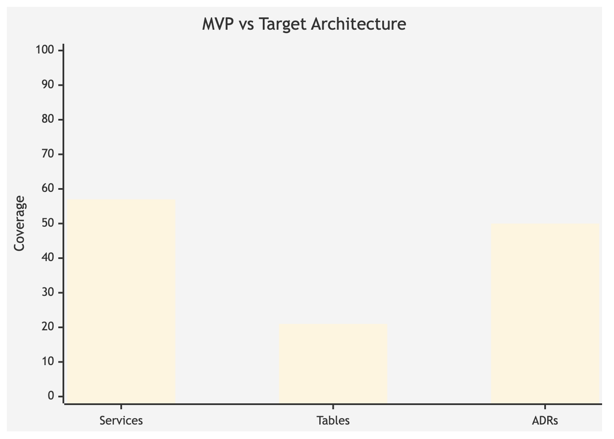
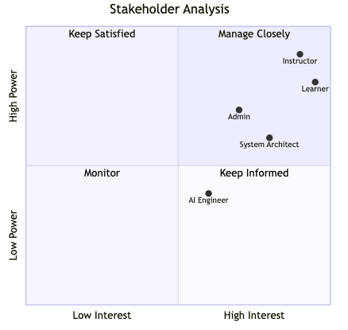
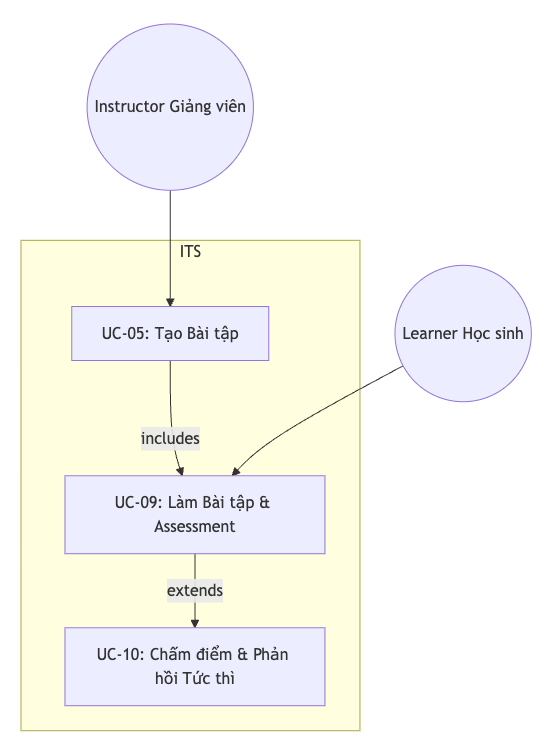
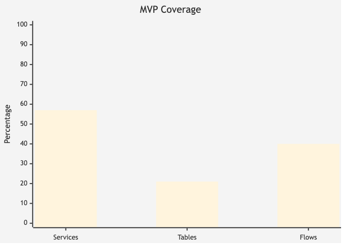
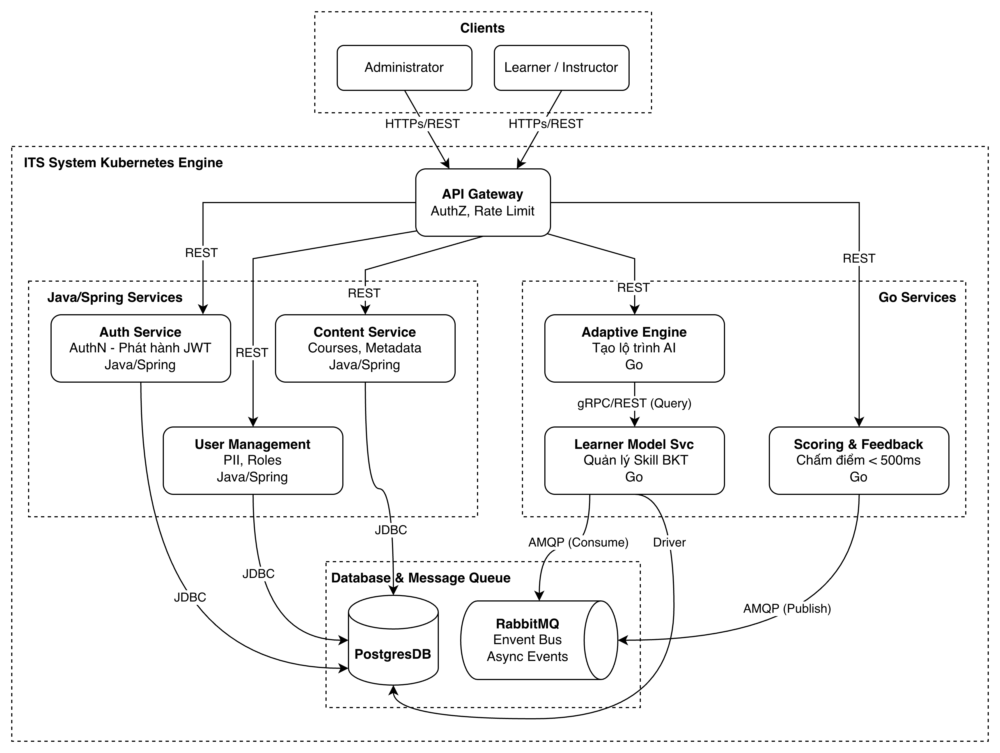
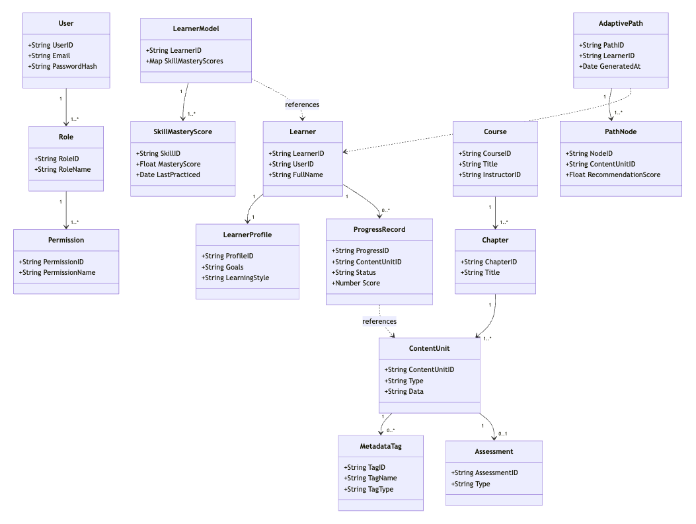
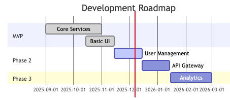
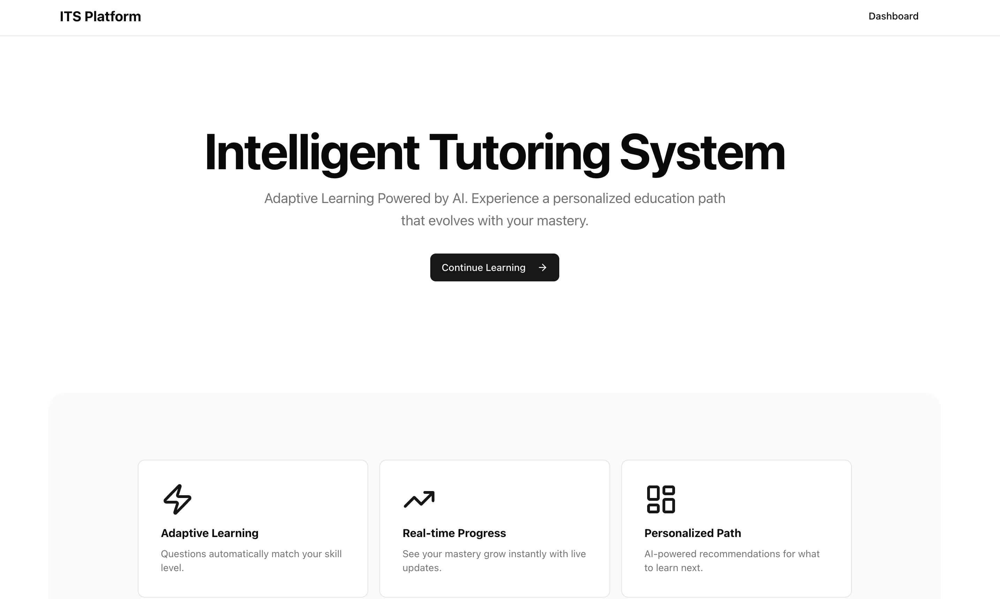
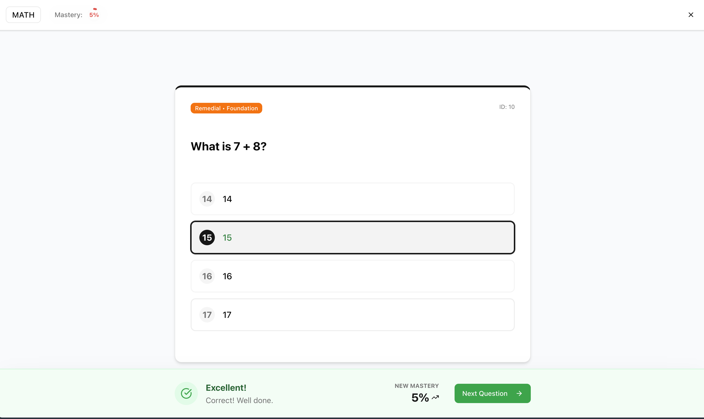

<!-- _class: title-slide -->

# Intelligent Tutoring System - ITS

**Môn học:** Kiến Trúc Phần Mềm (CO3017)
**Trường:** Đại học Bách Khoa TP.HCM - Khoa Khoa học Máy tính
**Nhóm:** 13
**Sinh viên:** Nguyễn Tấn Tài - 2212990
**Thời gian:** 12/2025

---

<!-- _class: lead -->

# 1. Tóm Tắt Tổng Quan

## Executive Summary

---

## Tầm Nhìn Dự Án

- Xây dựng hệ thống học tập thông minh cá nhân hóa trải nghiệm cho từng người học
- Mục tiêu phục vụ 5,000+ người dùng đồng thời với thời gian phản hồi < 500ms


---

## Thách Thức Chính

- Đảm bảo hiệu năng cao với 5,000 concurrent users
- Thiết kế kiến trúc mở rộng theo chiều ngang
- Hỗ trợ cập nhật mô hình AI không downtime
- Tuân thủ nguyên tắc SOLID và Clean Architecture

---

## Giải Pháp Kiến Trúc

- **Hybrid Microservices** kết hợp **Event-Driven Architecture**
- Polyglot Programming: Java (Spring Boot) + Go (Gin)
- PostgreSQL + RabbitMQ cho async communication



---

<!-- _class: lead -->

# 2. Phân Tích Bối Cảnh và Yêu Cầu

---

## Vision Statement

- Tái hiện trải nghiệm học 1-kèm-1 giữa người học và gia sư AI
- Hướng dẫn theo đúng tốc độ, năng lực và sở thích cá nhân
- Mở rộng phục vụ hàng nghìn người dùng đồng thời

---

## Bối Cảnh Kinh Doanh

- **Nhu cầu:** E-learning cá nhân hóa đang bùng nổ
- **Đối tượng:** Học sinh K-12, sinh viên đại học, giảng viên, admin
- **Tiêu chí thành công:** 5,000 CCU, SLA 99.5%, cải thiện 40% retention

---

## Bối Cảnh Kỹ Thuật

- Tích hợp LMS hiện có qua API
- Auth Service với JWT/OAuth2
- Kubernetes cho auto-scaling và CI/CD
- Prometheus/Grafana/Loki cho observability


---

<!-- _class: lead -->

# 3. Phân Tích Các Bên Liên Quan

---

## Ma Trận Stakeholder

- **Learner (Cao/Cao):** Trải nghiệm cá nhân hóa, phản hồi nhanh
- **Instructor (Cao/Cao):** Quản lý nội dung, báo cáo hiệu suất
- **Admin (TB/Cao):** Bảo mật, chi phí, khả năng mở rộng
- **AI Engineer (TB/TB):** Tích hợp thuật toán mới
- **System Architect (TB/Cao):** Đảm bảo Clean Architecture

---

## Chiến Lược Quản Lý

- **Manage Closely:** Learner, Instructor
- **Keep Satisfied:** Admin, Architect
- **Keep Informed:** AI Engineer



---

<!-- _class: lead -->

# 4. Yêu Cầu Chức Năng

---

## User Stories Chính

- **US0:** Đánh giá kiến thức - Đề xuất lộ trình tối ưu
- **US1:** Gợi ý và giải thích ngay khi mắc lỗi (< 500ms)
- **US2:** Dashboard tiến trình học tập cá nhân
- **US3:** Spaced repetition cho kỹ năng chưa thành thạo



---

## Use Cases Quan Trọng

- **UC-04:** Bài kiểm tra đầu vào - Xây dựng Learner Model
- **UC-08:** Học tập thích ứng với Adaptive Engine
- **UC-10:** Chấm điểm và phản hồi tức thì
- **UC-18:** Live swap mô hình AI không downtime

---

<!-- _class: lead -->

# 5. Yêu Cầu Phi Chức Năng

---

## Đặc Tính Kiến Trúc Chính (Primary ACs)

- **AC-1 Modularity:** Low coupling, high cohesion, swap module < 5 phút
- **AC-2 Scalability:** >= 5,000 CCU, auto-scale < 60s
- **AC-3 Performance:** p95 < 500ms, cache hit > 90%
- **AC-4 Testability:** Coverage >= 80%, mutation score > 70%

---

## Architectural Characteristics



---

<!-- _class: lead -->

# 6. Thiết Kế Kiến Trúc

---

## So Sánh Các Phương Án

- **Monolith:** Đơn giản nhưng khó scale, tight coupling
- **Microservices:** Modular, scale độc lập, phức tạp hơn
- **Serverless:** Chi phí biến đổi, cold start issues


---

## Quyết Định: Hybrid Microservices + Event-Driven

- Mỗi service có Bounded Context riêng
- Scale độc lập theo nhu cầu
- Async communication qua RabbitMQ
- Clean Architecture cho mỗi service



---

<!-- _class: lead -->

# 7. Architecture Decision Records (ADRs)

---

## ADR-1: Polyglot Programming

- **Quyết định:** Java cho business logic, Go cho performance
- **Lý do:** Best of both worlds - maintainability + speed
- **Kết quả:** Content Service (Java), Scoring/Learner/Adaptive (Go)

---

## ADR-2: PostgreSQL Database-per-Service

- **Quyết định:** Mỗi service có database riêng
- **Lý do:** Loose coupling, independent scaling
- **Kết quả:** content_db, scoring_db, learner_db

---

## ADR-3: Clean/Hexagonal Architecture

- **Quyết định:** 4 layers - Domain, Application, Adapters, Infrastructure
- **Lý do:** Testability, maintainability, DIP compliance
- **Kết quả:** Domain models tách biệt khỏi ORM entities


---

<!-- _class: lead -->

# 8. Architecture Views

---

## Module View

- **Content Service:** Quản lý câu hỏi và nội dung học tập
- **Scoring Service:** Chấm điểm tự động
- **Learner Model:** Theo dõi tiến độ và skill mastery
- **Adaptive Engine:** Đề xuất nội dung thích ứng



---

## Component & Connector View

- REST APIs cho synchronous communication
- RabbitMQ cho asynchronous events
- PostgreSQL cho data persistence


---

## Allocation View

- Docker containers cho mỗi service
- Kubernetes orchestration
- PostgreSQL instances riêng biệt


---

<!-- _class: lead -->

# 9. Behavior View

---

## Adaptive Content Delivery Flow

1. Client request next lesson - Adaptive Engine
2. Engine query Learner Model - Get skill mastery
3. Engine request Content Service - Get appropriate question
4. Return personalized content to Client


---

## Assessment & Scoring Flow

1. Student submit answer - Scoring Service
2. Scoring evaluates - Store result
3. Publish event to RabbitMQ
4. Learner Model consume - Update skill mastery


---

<!-- _class: lead -->

# 10. Áp Dụng Nguyên Tắc SOLID

---

## Single Responsibility Principle (SRP)

- Mỗi microservice có một Bounded Context duy nhất
- Mỗi class có một trách nhiệm rõ ràng
- Ví dụ: ScoringService chỉ chấm điểm, không quản lý content


---

## Open/Closed Principle (OCP)

- Strategy Pattern cho scoring algorithms
- Interface-based design cho extensibility
- Thêm algorithm mới không sửa code hiện có

---

## Dependency Inversion Principle (DIP)

- Application layer phụ thuộc abstractions
- Infrastructure layer implement interfaces
- Dễ dàng mock trong unit tests

---

<!-- _class: lead -->

# 11. Triển Khai Hệ Thống

---

## MVP Hiện Tại (Đã Triển Khai)

- **Services:** 4/7 (Content, Scoring, Learner Model, Adaptive Engine)
- **Database Tables:** 3/14 (questions, submissions, skill_mastery)
- **Core Flows:** 2/5 verified (Adaptive Delivery, Assessment Scoring)


---

## Kết Quả Đạt Được

- Modularity: 4 microservices độc lập
- Testability: Clean Architecture cho phép mock
- Maintainability: Complexity 7.2, Coupling 3.8, Cohesion 0.85
- Adaptive Learning: 100% core functionality hoạt động

---

<!-- _class: lead -->

# 12. Đánh Giá và Phản Hồi

---

## Những Gì Hoạt Động Tốt

- **Polyglot Strategy:** Đúng ngôn ngữ cho đúng công việc
- **Clean Architecture:** Code dễ test và maintain
- **Event-Driven:** RabbitMQ giảm coupling hiệu quả
- **Database-per-Service:** Tránh tight coupling

---

## Thách Thức Gặp Phải

- **Complexity:** Microservices phức tạp hơn monolith
- **Testing:** Integration testing cần Testcontainers
- **Polyglot Overhead:** Cần expertise cả Java và Go

---

<!-- _class: lead -->

# 13. Hướng Phát Triển Tương Lai

---

## Services Bổ Sung

- User Management Service với OAuth 2.0/OIDC
- Auth Service với JWT validation
- API Gateway cho centralized routing

---

## Roadmap



---

<!-- _class: lead -->

# 14. Demo & Code Showcase

---

## Giao Diện - Trang Chủ (Homepage)



- Tổng quan hệ thống
- Điều hướng dễ dàng
- Thiết kế hiện đại

---

## Giao Diện - Dashboard


- Thống kê tiến độ học tập
- Biểu đồ Mastery cá nhân
- Theo dõi hoạt động gần đây

---

## Giao Diện - Bài Học (Learning Page)



- Tương tác làm bài trực quan
- Feedback ngay lập tức
- Hỗ trợ đa dạng loại câu hỏi

---

## Cấu Trúc Code - Content Service (Java)

```
content-service/
├── src/main/java/
│   ├── domain/           # Domain models (Question.java)
│   ├── application/      # Use cases, interfaces
│   ├── adapters/         # Controllers, DTOs
│   └── infrastructure/   # JPA repositories, entities
├── src/main/resources/
│   └── application.yml
└── pom.xml
```

---

## Cấu Trúc Code - Scoring Service (Go)

```
scoring-service/
├── cmd/api/              # Entry point (main.go)
├── internal/
│   ├── model/            # Domain models
│   ├── handler/          # HTTP handlers (Gin)
│   ├── service/          # Business logic
│   ├── repository/       # Data access
│   └── sqlboiler/        # Generated ORM code
├── db/migrations/
└── go.mod
```

---

## Docker Compose & Infrastructure

```yaml
services:
  content-service: # Java Spring Boot - port 8081
  scoring-service: # Go Gin - port 8082
  learner-model-api: # Go Gin - port 8083
  adaptive-engine: # Go Gin - port 8080
  rabbitmq: # Message broker - port 5672
  postgres-content: # content_db
  postgres-scoring: # scoring_db
  postgres-learner: # learner_db
```

---

## API Endpoints Demo

| Service         | Endpoint                   | Method | Mô tả                 |
| :-------------- | :------------------------- | :----- | :-------------------- |
| Adaptive Engine | `/api/v1/next-lesson`      | GET    | Lấy bài học tiếp theo |
| Content Service | `/api/v1/questions/{id}`   | GET    | Lấy câu hỏi           |
| Scoring Service | `/api/v1/submissions`      | POST   | Nộp bài làm           |
| Learner Model   | `/api/v1/mastery/{userId}` | GET    | Lấy skill mastery     |

---

<!-- _class: lead -->

# 15. Kết Luận

---

## Key Takeaways

- Kiến trúc Microservices modular, dễ mở rộng
- Core adaptive learning functionality hoạt động 100%
- Code quality metrics đạt mục tiêu
- Clean Architecture đảm bảo separation of concerns
- Event-driven giảm coupling giữa services

---

<!-- _class: lead -->

# 16. Q&A

## Cảm ơn đã lắng nghe!

**Thông tin liên hệ:**

- **Sinh viên:** Nguyễn Tấn Tài
- **MSSV:** 2212990
- **Porfolio:** tantai.dev
