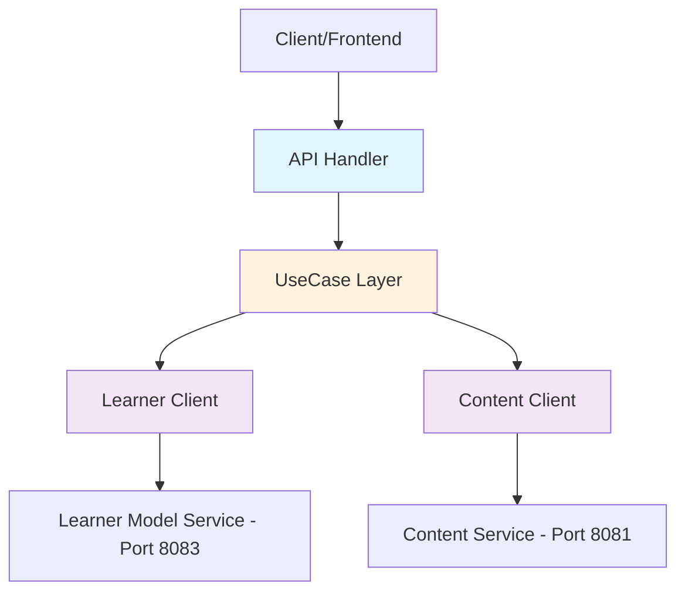
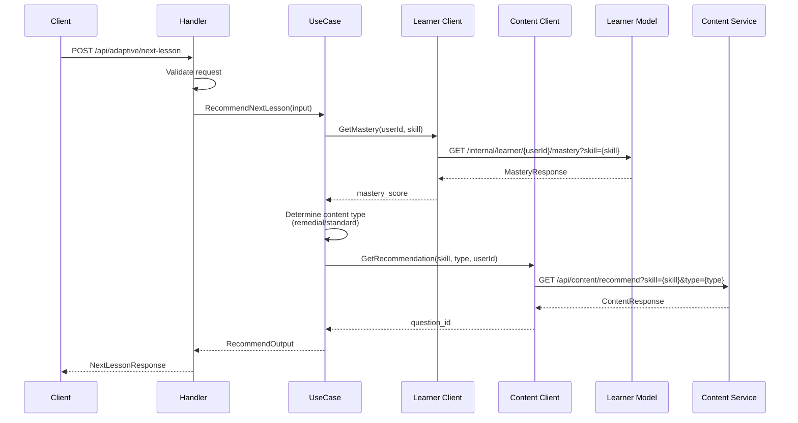
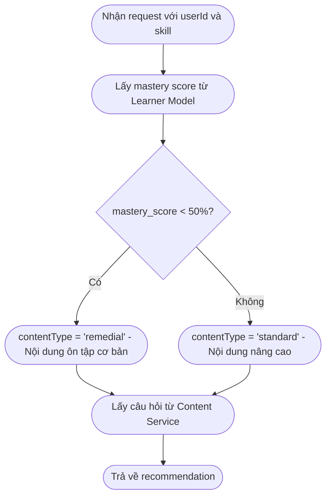
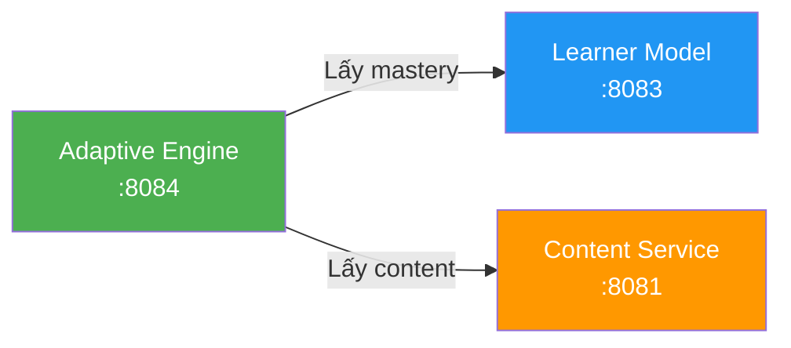
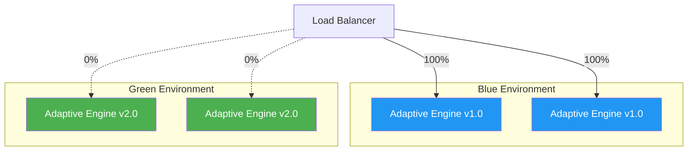

# Adaptive Engine Service

## Mục lục

- [Tổng quan](#tổng-quan)
- [Công nghệ](#công-nghệ)
- [Kiến trúc](#kiến-trúc)
- [Thuật toán Đề xuất](#thuật-toán-đề-xuất)
- [API Endpoints](#api-endpoints)
- [Phụ thuộc Dịch vụ](#phụ-thuộc-dịch-vụ)
- [Cấu hình](#cấu-hình)
- [Phát triển Local](#phát-triển-local)
- [Testing](#testing)
- [Triển khai Blue/Green](#triển-khai-bluegreen)
- [Cấu trúc Thư mục](#cấu-trúc-thư-mục)

---

## Tổng quan

**Adaptive Engine** (Công cụ Thích ứng) là service điều phối (orchestration) trong hệ thống ITS, chịu trách nhiệm đề xuất nội dung học tập được cá nhân hóa cho từng học sinh. Service này hoạt động như một "bộ não" của hệ thống, kết hợp thông tin từ Learner Model Service và Content Service để đưa ra quyết định thông minh về bài học tiếp theo.

### Vai trò chính

- **Điều phối (Orchestration)**: Kết nối và phối hợp giữa các services khác
- **Đề xuất Cá nhân hóa**: Phân tích mức độ thành thạo để đề xuất nội dung phù hợp
- **Stateless**: Không lưu trữ trạng thái, dễ dàng mở rộng theo chiều ngang

### Đặc điểm

| Thuộc tính    | Giá trị                                 |
| ------------- | --------------------------------------- |
| **Port**      | 8084                                    |
| **Database**  | Không có (Không trạng thái - Stateless) |
| **Ngôn ngữ**  | Go 1.25.4                               |
| **Framework** | Gin                                     |
| **Kiến trúc** | Kiến trúc Sạch (Clean Architecture)     |

---

## Công nghệ

### Ngăn xếp Công nghệ (Technology Stack)

| Công nghệ   | Phiên bản | Mục đích                 |
| ----------- | --------- | ------------------------ |
| **Go**      | 1.25.4    | Ngôn ngữ lập trình chính |
| **Gin**     | 1.11.0    | HTTP web framework       |
| **Swagger** | 1.16.6    | Tài liệu API tự động     |
| **Zap**     | 1.27.0    | Structured logging       |
| **Testify** | 1.11.1    | Testing framework        |

### Thư viện Chính

```go
// HTTP Framework
github.com/gin-gonic/gin v1.11.0

// Configuration
github.com/caarlos0/env/v9 v9.0.0
github.com/joho/godotenv v1.5.1

// Documentation
github.com/swaggo/swag v1.16.6
github.com/swaggo/gin-swagger v1.6.1

// Logging
go.uber.org/zap v1.27.0

// Testing
github.com/stretchr/testify v1.11.1
```

---

## Kiến trúc

### Kiến trúc Điều phối (Orchestration Architecture)

Adaptive Engine đóng vai trò là service điều phối, không có database riêng mà lấy dữ liệu từ các services khác:



/_ Note: Mermaid class diagram syntax does not support curly braces in edge labels (e.g., |...|).
So direct the diagram only with node relationships to avoid parse errors. _/

### Clean Architecture Layers

```
┌─────────────────────────────────────────────────────────────────┐
│                    1. Delivery Layer (HTTP)                     │
│  ├─ handler.go      - Xử lý HTTP requests                       │
│  ├─ routes.go       - Định nghĩa routes                         │
│  ├─ presenter.go    - Format response                           │
│  └─ process_request.go - Parse và validate request              │
└─────────────────────────────┬───────────────────────────────────┘
                              │
┌─────────────────────────────▼───────────────────────────────────┐
│                    2. UseCase Layer                             │
│  ├─ adaptive.go     - Business logic đề xuất                    │
│  ├─ new.go          - Constructor                               │
│  └─ errors.go       - Error definitions                         │
└─────────────────────────────┬───────────────────────────────────┘
                              │
┌─────────────────────────────▼───────────────────────────────────┐
│                    3. External Clients (pkg/curl)               │
│  ├─ learner_service.go  - Client gọi Learner Model Service      │
│  └─ content_service.go  - Client gọi Content Service            │
└─────────────────────────────────────────────────────────────────┘
```

### Luồng Xử lý Request



---

## Thuật toán Đề xuất

### Recommendation Algorithm

Adaptive Engine sử dụng thuật toán đề xuất dựa trên ngưỡng thành thạo (Mastery Threshold):

```go
const MASTERY_THRESHOLD = 50  // Ngưỡng 50%
```

### Logic Đề xuất



/_ End of Selection _/

### Chi tiết Thuật toán

| Điều kiện              | Content Type | Mô tả                                       |
| ---------------------- | ------------ | ------------------------------------------- |
| `mastery_score < 50%`  | `remedial`   | Học sinh cần ôn tập lại kiến thức cơ bản    |
| `mastery_score >= 50%` | `standard`   | Học sinh sẵn sàng cho nội dung mới/nâng cao |

### Ví dụ Response

**Khi mastery thấp (< 50%):**

```json
{
  "next_lesson_id": 5,
  "reason": "Your mastery is 30%. Let's review the basics.",
  "mastery_score": 30,
  "content_type": "remedial"
}
```

**Khi mastery cao (>= 50%):**

```json
{
  "next_lesson_id": 12,
  "reason": "Great! Your mastery is 75%. Continue with the next challenge.",
  "mastery_score": 75,
  "content_type": "standard"
}
```

---

## API Endpoints

### Base URL

```
http://localhost:8084/api/adaptive
```

### Swagger Documentation

Truy cập Swagger UI tại: `http://localhost:8084/adaptive-engine/swagger/index.html`

---

### POST /api/adaptive/next-lesson

Đề xuất bài học tiếp theo dựa trên mức độ thành thạo của học sinh.

**Request:**

```bash
curl -X POST http://localhost:8084/api/adaptive/next-lesson \
  -H "Content-Type: application/json" \
  -d '{
    "user_id": "user_01",
    "current_skill": "devops_basics"
  }'
```

**Request Body:**

| Field           | Type   | Required | Mô tả                     |
| --------------- | ------ | -------- | ------------------------- |
| `user_id`       | string | ✓        | ID của học sinh           |
| `current_skill` | string | ✓        | Kỹ năng hiện tại đang học |

**Response (200 OK):**

```json
{
  "error_code": 0,
  "message": "Success",
  "data": {
    "next_lesson_id": 5,
    "reason": "Your mastery is 30%. Let's review the basics.",
    "mastery_score": 30,
    "content_type": "remedial"
  }
}
```

**Response Fields:**

| Field            | Type   | Mô tả                                     |
| ---------------- | ------ | ----------------------------------------- |
| `next_lesson_id` | int    | ID của câu hỏi/bài học được đề xuất       |
| `reason`         | string | Lý do đề xuất (tiếng Anh)                 |
| `mastery_score`  | int    | Điểm thành thạo hiện tại (0-100)          |
| `content_type`   | string | Loại nội dung: `remedial` hoặc `standard` |

**Error Responses:**

| Status | Error Code | Mô tả                        |
| ------ | ---------- | ---------------------------- |
| 400    | 1          | Invalid request body         |
| 400    | 2          | Missing user_id              |
| 400    | 3          | Missing current_skill        |
| 400    | 4          | Failed to get recommendation |

---

### GET /api/adaptive/health

Kiểm tra trạng thái hoạt động của service.

**Request:**

```bash
curl http://localhost:8084/api/adaptive/health
```

**Response (200 OK):**

```json
{
  "error_code": 0,
  "message": "Healthy",
  "data": {
    "status": "healthy",
    "service": "adaptive-engine"
  }
}
```

---

## Phụ thuộc Dịch vụ

Adaptive Engine phụ thuộc vào hai services khác để hoạt động:

### 1. Learner Model Service

**Mục đích:** Lấy thông tin mức độ thành thạo của học sinh

| Thuộc tính   | Giá trị                                                |
| ------------ | ------------------------------------------------------ |
| **URL**      | `http://learner-model-api:8083`                        |
| **Endpoint** | `GET /internal/learner/{userId}/mastery?skill={skill}` |
| **Timeout**  | 10 giây                                                |

**Ví dụ Request:**

```bash
curl "http://localhost:8083/internal/learner/user_01/mastery?skill=devops_basics"
```

### 2. Content Service

**Mục đích:** Lấy câu hỏi/bài học phù hợp với loại nội dung

| Thuộc tính   | Giá trị                                                                |
| ------------ | ---------------------------------------------------------------------- |
| **URL**      | `http://content-service:8081`                                          |
| **Endpoint** | `GET /api/content/recommend?skill={skill}&type={type}&userId={userId}` |
| **Timeout**  | 10 giây                                                                |

**Ví dụ Request:**

```bash
curl "http://localhost:8081/api/content/recommend?skill=devops_basics&type=remedial&userId=user_01"
```

### Sơ đồ Phụ thuộc



---

## Cấu hình

### Biến Môi trường (Environment Variables)

| Biến                  | Mô tả                                      | Giá trị Mặc định        |
| --------------------- | ------------------------------------------ | ----------------------- |
| `APP_PORT`            | Port của service                           | `8084`                  |
| `API_MODE`            | Chế độ chạy (`debug`/`release`)            | `debug`                 |
| `CONTENT_SERVICE_URL` | URL của Content Service                    | `http://localhost:8081` |
| `LEARNER_SERVICE_URL` | URL của Learner Model Service              | `http://localhost:8083` |
| `LOGGER_LEVEL`        | Mức độ log (`debug`/`info`/`warn`/`error`) | `info`                  |
| `LOGGER_MODE`         | Chế độ logger                              | `debug`                 |
| `LOGGER_ENCODING`     | Định dạng log (`console`/`json`)           | `console`               |

### File .env Mẫu

```bash
# Server Configuration
APP_PORT=8084
API_MODE=debug

# External Services
CONTENT_SERVICE_URL=http://localhost:8081
LEARNER_SERVICE_URL=http://localhost:8083

# Logger Configuration
LOGGER_LEVEL=info
LOGGER_MODE=debug
LOGGER_ENCODING=console
```

### Cấu hình Docker Compose

```yaml
adaptive-engine:
  build:
    context: ./adaptive-engine
    dockerfile: cmd/api/Dockerfile
  environment:
    APP_HOST: 0.0.0.0
    APP_PORT: 8084
    CONTENT_SERVICE_URL: http://content-service:8081
    LEARNER_SERVICE_URL: http://learner-model-api:8083
    LOG_LEVEL: debug
  ports:
    - "8084:8084"
  depends_on:
    - content-service
    - learner-model-api
```

---

## Phát triển Local

### Yêu cầu Hệ thống

- **Go**: >= 1.21 (khuyến nghị 1.25.4)
- **Make**: Để chạy các lệnh Makefile
- **Docker**: Để chạy các services phụ thuộc

### Cài đặt

1. **Clone repository và di chuyển đến thư mục:**

   ```bash
   cd sources/adaptive-engine
   ```

2. **Cài đặt dependencies:**

   ```bash
   go mod download
   ```

3. **Tạo file .env:**
   ```bash
   cp template.env .env
   # Chỉnh sửa .env với các giá trị phù hợp
   ```

### Chạy Service

**Cách 1: Sử dụng Make (khuyến nghị)**

```bash
# Chạy API server (tự động generate swagger)
make run-api
```

**Cách 2: Sử dụng Go trực tiếp**

```bash
go run cmd/api/main.go
```

### Chạy với Docker Compose

```bash
# Từ thư mục sources/
docker compose up adaptive-engine -d

# Xem logs
docker compose logs -f adaptive-engine
```

### Kiểm tra Service

```bash
# Health check
curl http://localhost:8084/api/adaptive/health

# Test recommendation (cần Content và Learner services đang chạy)
curl -X POST http://localhost:8084/api/adaptive/next-lesson \
  -H "Content-Type: application/json" \
  -d '{"user_id": "user_01", "current_skill": "devops_basics"}'
```

### Generate Swagger Documentation

```bash
make swagger
```

Swagger UI sẽ có tại: `http://localhost:8084/adaptive-engine/swagger/index.html`

---

## Testing

### Chạy Tests

```bash
# Chạy tất cả tests
make test

# Chạy tests với coverage report
make test-coverage

# Chạy short tests (bỏ qua slow tests)
make test-short
```

### Coverage Report

```bash
make test-coverage
# Mở coverage.html trong browser để xem chi tiết
```

### Cấu trúc Tests

```
internal/adaptive/
├── usecase/
│   └── adaptive_test.go      # Unit tests cho business logic
└── delivery/http/
    ├── handler_test.go       # Unit tests cho HTTP handlers
    └── handler_integration_test.go  # Integration tests
```

### Ví dụ Test Case

```go
func TestRecommendNextLesson_LowMastery(t *testing.T) {
    // Arrange: Setup mock với mastery score thấp
    mockLearner.On("GetMastery", ctx, "user_01", "math").
        Return(&MasteryResponse{Data: MasteryData{MasteryScore: 30}}, nil)

    // Act: Gọi recommendation
    result, err := usecase.RecommendNextLesson(ctx, input)

    // Assert: Expect remedial content
    assert.NoError(t, err)
    assert.Equal(t, "remedial", result.ContentType)
}
```

---

## Triển khai Blue/Green

### Tổng quan

Adaptive Engine hỗ trợ triển khai Blue/Green (Xanh/Lục) nhờ thiết kế stateless:



### Đặc điểm Hỗ trợ Triển khai Xanh/Lục (Blue/Green)

| Đặc điểm                                  | Mô tả                                                    |
| ----------------------------------------- | -------------------------------------------------------- |
| **Không trạng thái (Stateless)**          | Không lưu trữ trạng thái, có thể chuyển đổi ngay lập tức |
| **Kiểm tra Sức khỏe (Health Check)**      | Endpoint `/health` để kiểm tra sẵn sàng                  |
| **Tắt máy Nhẹ nhàng (Graceful Shutdown)** | Xử lý các yêu cầu đang chạy trước khi tắt                |
| **Cấu hình (Configuration)**              | Cấu hình qua biến môi trường (environment variables)     |

### Hoán đổi Mô hình Trực tiếp (Live Model Swapping)

Vì Adaptive Engine không có trạng thái và lấy dữ liệu từ các dịch vụ bên ngoài, việc thay đổi thuật toán đề xuất có thể thực hiện bằng cách:

1. **Deploy phiên bản mới** với thuật toán cập nhật
2. **Chuyển traffic** từ Blue sang Green
3. **Rollback** nếu có vấn đề bằng cách chuyển lại Blue

```bash
# Ví dụ: Cập nhật MASTERY_THRESHOLD
# Trong phiên bản mới, thay đổi:
const MASTERY_THRESHOLD = 60  # Từ 50 lên 60
```

---

## Cấu trúc Thư mục

```
adaptive-engine/
├── cmd/
│   └── api/
│       ├── main.go           # Entry point
│       └── Dockerfile        # Docker build file
├── config/
│   └── config.go             # Configuration loader
├── docs/
│   ├── docs.go               # Swagger generated
│   ├── swagger.json          # OpenAPI spec (JSON)
│   └── swagger.yaml          # OpenAPI spec (YAML)
├── document/
│   ├── api.md                # API documentation
│   ├── architecture.md       # Architecture details
│   └── overview.md           # Service overview
├── internal/
│   └── adaptive/
│       ├── delivery/
│       │   └── http/
│       │       ├── handler.go        # HTTP handlers
│       │       ├── routes.go         # Route definitions
│       │       ├── presenter.go      # Response formatting
│       │       ├── process_request.go # Request DTOs
│       │       ├── errors.go         # HTTP errors
│       │       └── new.go            # Constructor
│       ├── usecase/
│       │   ├── adaptive.go           # Business logic
│       │   ├── errors.go             # UseCase errors
│       │   └── new.go                # Constructor
│       ├── interface.go              # UseCase interface
│       ├── type.go                   # Input/Output types
│       └── error.go                  # Domain errors
├── pkg/
│   ├── curl/
│   │   ├── learner_service.go        # Learner Model client
│   │   ├── content_service.go        # Content Service client
│   │   ├── interfaces.go             # Client interfaces
│   │   └── types.go                  # Response types
│   ├── errors/                       # Error utilities
│   ├── log/                          # Logging utilities
│   └── response/                     # HTTP response helpers
├── scripts/
│   ├── build.sh                      # Build script
│   └── build-consumer.sh             # Consumer build script
├── .env                              # Environment variables
├── go.mod                            # Go modules
├── go.sum                            # Dependencies checksum
├── Makefile                          # Build commands
└── README.md                         # This file
```

---

## Lệnh Makefile

| Lệnh                 | Mô tả                                    |
| -------------------- | ---------------------------------------- |
| `make run-api`       | Chạy API server (với swagger generation) |
| `make swagger`       | Generate Swagger documentation           |
| `make test`          | Chạy tất cả tests                        |
| `make test-coverage` | Chạy tests với coverage report           |
| `make test-short`    | Chạy short tests                         |
| `make docker-build`  | Build Docker image                       |
| `make docker-run`    | Build và chạy Docker container           |
| `make help`          | Hiển thị tất cả lệnh có sẵn              |

---

## Xử lý Lỗi

### Error Codes

| Code | Mô tả                       |
| ---- | --------------------------- |
| 0    | Success                     |
| 400  | Bad Request - Invalid input |
| 500  | Internal Server Error       |

### Logging

Service sử dụng structured logging với Zap:

```go
// Info log
log.Infof(ctx, "adaptive.usecase.RecommendNextLesson: starting | user_id=%s | skill=%s",
    input.UserID, input.CurrentSkill)

// Error log
log.Errorf(ctx, "adaptive.usecase.RecommendNextLesson: failed to fetch mastery | error=%v", err)
```

### Xem Logs

```bash
# Docker logs
docker compose logs -f adaptive-engine

# Local logs (file)
tail -f adaptive.log
```

---

## Liên kết Liên quan

### Tài liệu Dự án

| Tài liệu           | Đường dẫn                                        | Mô tả                                |
| ------------------ | ------------------------------------------------ | ------------------------------------ |
| **Root README**    | [../../README.md](../../README.md)               | Tổng quan dự án, cấu trúc repository |
| **Sources README** | [../README.md](../README.md)                     | Hướng dẫn microservices và Docker    |
| **Report README**  | [../../report/README.md](../../report/README.md) | Hướng dẫn build báo cáo LaTeX        |
| **Báo cáo PDF**    | [../../report/main.pdf](../../report/main.pdf)   | Báo cáo kiến trúc phần mềm           |

### Service READMEs Khác

| Service                   | Đường dẫn                                                | Mô tả                          |
| ------------------------- | -------------------------------------------------------- | ------------------------------ |
| **Content Service**       | [../content/README.md](../content/README.md)             | Quản lý nội dung học tập       |
| **Scoring Service**       | [../scoring/README.md](../scoring/README.md)             | Chấm điểm, RabbitMQ publishing |
| **Learner Model Service** | [../learner-model/README.md](../learner-model/README.md) | Skill mastery tracking         |
| **Client**                | [../client/README.md](../client/README.md)               | Frontend UI/UX                 |

### Tài liệu Kiến trúc

| Tài liệu                   | Đường dẫn                                                                                              | Nội dung              |
| -------------------------- | ------------------------------------------------------------------------------------------------------ | --------------------- |
| **SOLID Principles**       | [../../markdown/report/6-SOLID-principles.md](../../markdown/report/6-SOLID-principles.md)             | Ví dụ áp dụng SOLID   |
| **Architecture Decisions** | [../../markdown/report/5-architecture-decisions.md](../../markdown/report/5-architecture-decisions.md) | ADRs                  |
| **Microservices Analysis** | [../../markdown/microservices.md](../../markdown/microservices.md)                                     | Chi tiết domain model |

### API Documentation

- **Swagger UI**: [http://localhost:8084/adaptive-engine/swagger/index.html](http://localhost:8084/adaptive-engine/swagger/index.html)
- **OpenAPI Spec**: [docs/swagger.json](./docs/swagger.json)

### Internal Documentation

- **Architecture**: [document/architecture.md](./document/architecture.md) - Chi tiết Clean Architecture
- **API Flows**: [document/api.md](./document/api.md) - API documentation
- **Overview**: [document/overview.md](./document/overview.md) - Service overview

### Configuration Files

- **Docker Compose**: [../docker-compose.yml](../docker-compose.yml) - Cấu hình deployment

---

**Adaptive Engine** - Phần của Intelligent Tutoring System (ITS)  
CO3017 - Kiến Trúc Phần Mềm - HCMUT
