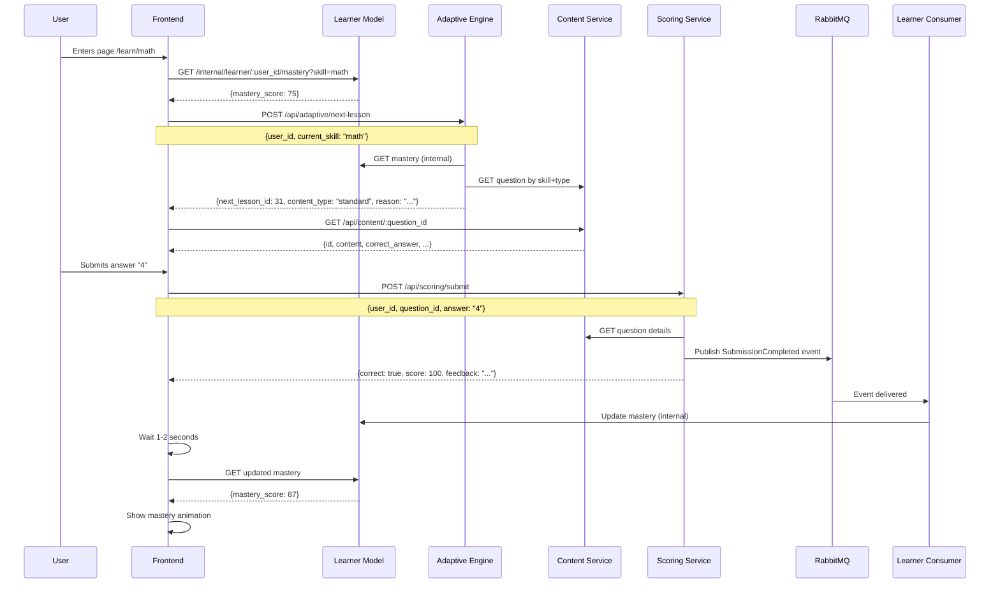

# Frontend Pages Specification for Intelligent Tutoring System

## Overview
This system requires **2-3 main pages** to support the adaptive learning flow with event-driven architecture.

## 🔥 SIMPLIFIED FOR DEMO (Fake Authentication)

**WHY FAKE LOGIN/REGISTER?**
- Real authentication (JWT, sessions, password hashing) takes **significant time** to implement
- It's **NOT related** to the core microservices architecture we're demonstrating
- The focus is on: **Adaptive Engine, Event-Driven Architecture, RabbitMQ, Microservices Communication**

**SOLUTION: Home Page with Fake Login/Register Buttons**
- User sees a nice landing page with "Login" and "Register" buttons
- **Clicking either button** → auto-generates a random `user_id` → redirects to Dashboard
- No password, no forms, no database - just instant access!

---

## 1. **Home/Landing Page** (Entry Point)

### Purpose
Welcome page with fake authentication buttons for demo purposes

### URL Structure
`/` or `/home`

### UI Components

#### Hero Section
- **App Logo/Title**: "Intelligent Tutoring System"
- **Tagline**: "Adaptive Learning Powered by AI"
- **Hero Image**: Illustration of students learning (optional)

#### Call-to-Action Buttons
- **"Login" Button** (Primary CTA - Large, Blue)
- **"Register" Button** (Secondary CTA - Large, Green)
- Small text below: "Demo mode - No password required!"

#### Features Section (Optional)
- 3 feature cards:
  1. 🎯 **Adaptive Learning** - Questions match your skill level
  2. 📊 **Real-time Progress** - See your mastery grow instantly
  3. 🚀 **Personalized Path** - AI-powered recommendations

#### Footer
- "Built with Clean Architecture & Event-Driven Microservices"
- Links: About, Documentation, GitHub

### Behavior & Logic

#### When User Clicks "Login" or "Register"
```javascript
function handleLogin() {
  // Generate random user ID
  const userId = `student-${Date.now()}`;

  // Store in localStorage
  localStorage.setItem('user_id', userId);

  // Optional: Show welcome toast
  showToast(`Welcome! Your ID: ${userId}`, 'success');

  // Redirect to dashboard after 0.5s
  setTimeout(() => {
    window.location.href = '/dashboard';
  }, 500);
}

function handleRegister() {
  // Same as login - no difference in demo mode
  handleLogin();
}
```

#### Alternative Implementation (Pre-defined Demo Users)
```javascript
const DEMO_USERS = [
  'student-alpha',
  'student-beta',
  'student-gamma',
  'student-demo'
];

function handleLogin() {
  // Pick random user from predefined list
  const randomUser = DEMO_USERS[Math.floor(Math.random() * DEMO_USERS.length)];
  localStorage.setItem('user_id', randomUser);

  window.location.href = '/dashboard';
}
```

#### Returning User Detection
```javascript
// On page load, check if user already has ID
window.addEventListener('DOMContentLoaded', () => {
  const existingUserId = localStorage.getItem('user_id');

  if (existingUserId) {
    // User already "logged in" - show different message
    document.querySelector('.hero-title').textContent =
      `Welcome back, ${existingUserId}!`;
    document.querySelector('.login-btn').textContent = 'Continue Learning';
  }
});
```

### Design Notes
- **Clean, modern design** - Think Duolingo, Khan Academy style
- **Color scheme**: Blue/Green gradients for trust and growth
- **Animations**: Smooth fade-in on load, button hover effects
- **Responsive**: Mobile-first design (stack buttons vertically on mobile)

### Optional: "Guest Mode" Button
Add a third button: **"Try as Guest"**
- Generates temporary ID: `guest-${Date.now()}`
- Perfect for quick demos without any clicks

---

## 2. **Dashboard Page**

### Purpose
Overview of learner's progress across all skills

### UI Components
- **Header**: App title, current user ID display (e.g., "User: demo-student-001")
- **Skill Cards Grid**: Display all available skills (math, science, history, etc.)
  - Each card shows:
    - Skill name and icon
    - Current mastery percentage (0-100%)
    - Progress bar (color-coded: red <50%, yellow 50-79%, green ≥80%)
    - Last activity timestamp
    - "Continue Learning" button
- **Statistics Panel**:
  - Total questions answered
  - Average mastery across all skills
  - Streak counter (days in a row)

### API Calls
1. **GET** `/internal/learner/:user_id/mastery?skill=all` (new endpoint needed)
   - Response:
   ```json
   {
     "error_code": 0,
     "message": "Success",
     "data": {
       "skills": [
         {"skill_tag": "math", "mastery_score": 75, "last_updated": "2025-11-22T10:00:00Z"},
         {"skill_tag": "science", "mastery_score": 50, "last_updated": "2025-11-21T15:30:00Z"}
       ]
     }
   }
   ```

2. **GET** `/api/user/:user_id/stats` (future endpoint)
   - Response: `{total_questions, average_mastery, streak_days}`

### Behavior
- **On Load**: Fetch all mastery data for user, display loading skeleton while fetching
- **Click Skill Card**: Navigate to Learning Session page for that skill
- **Empty State**: If user has 0 mastery in all skills, show welcome message + "Start Learning" CTA
- **Auto-refresh**: Poll mastery data every 30 seconds to show live updates

### Error Handling
- **API Failure**: Show retry button, cache last successful data
- **No Skills Available**: Show "No skills available yet" message

---

## 3. **Learning Session Page** (Core Learning Experience - MOST IMPORTANT)

### Purpose
Main adaptive learning interface where user answers questions

### URL Structure
`/learn/:skill` (e.g., `/learn/math`)

### UI Components

#### Header Section
- Skill name and current topic
- **Mastery Display**:
  - Circular progress indicator showing current percentage
  - Text: "Your Mastery: 75%"
- "Exit" button (returns to Dashboard)

#### Question Display Section
- **Question Type Badge**: "Remedial" (orange) or "Standard" (blue)
- **Question Content**: Large, readable text
  - For math: Render LaTeX if needed (e.g., "Solve: 2x + 5 = 13")
- **Answer Input**:
  - Text input field (single line for short answers)
  - Multiple choice buttons (if question type supports it in future)
- **Submit Button**: Primary CTA, disabled until answer is entered
- **Skip Button**: Secondary action (optional, for user experience)

#### Feedback Section (appears after submission)
- **Correct Answer**:
  - ✅ Green checkmark icon
  - "Correct! Well done." message
  - Show earned score: "+100 points"
  - Mastery update animation: "75% → 87%" with upward arrow
  - "Next Question" button (auto-appears after 1.5s)

- **Incorrect Answer**:
  - ❌ Red X icon
  - "Incorrect answer. Please try again!" message
  - Show correct answer: "The correct answer is: 4"
  - Show earned score: "+0 points"
  - Mastery update animation: "75% → 37%" with downward arrow
  - "Try Another" button

#### Progress Sidebar (right panel)
- **Session Stats**:
  - Questions answered this session: 5
  - Correct: 4, Incorrect: 1
  - Session time: 5m 23s
- **Recent Performance**:
  - Last 5 questions with ✅/❌ indicators
- **Mastery Trend Graph**: Mini line chart showing mastery changes

### API Call Flow



### Detailed API Calls

1. **Initialize Session**
   - **GET** `/internal/learner/:user_id/mastery?skill=:skill`
   - Response: Current mastery score

2. **Get Next Question**
   - **POST** `/api/adaptive/next-lesson`
   - Request: `{user_id: "user123", current_skill: "math"}`
   - Response:
   ```json
   {
     "error_code": 0,
     "message": "Success",
     "data": {
       "next_lesson_id": 31,
       "reason": "Great! Your mastery is 75%. Continue with the next challenge.",
       "mastery_score": 75,
       "content_type": "standard"
     }
   }
   ```

3. **Fetch Question Details**
   - **GET** `/api/content/:question_id`
   - Response:
   ```json
   {
     "error_code": 0,
     "message": "Success",
     "data": {
       "id": 31,
       "content": "Solve: 2x + 5 = 13. What is x?",
       "difficulty_level": 2,
       "skill_tag": "math",
       "correct_answer": "4",
       "is_remedial": false,
       "created_at": "2025-11-22T07:17:18Z"
     }
   }
   ```
   ⚠️ **Note**: Never display `correct_answer` to user before submission!

4. **Submit Answer**
   - **POST** `/api/scoring/submit`
   - Request: `{user_id: "user123", question_id: 31, answer: "4"}`
   - Response:
   ```json
   {
     "error_code": 0,
     "message": "Success",
     "data": {
       "correct": true,
       "score": 100,
       "feedback": "Correct! Well done."
     }
   }
   ```

5. **Poll for Mastery Update** (after submission)
   - **GET** `/internal/learner/:user_id/mastery?skill=:skill`
   - Retry every 200ms for max 10 seconds
   - Response: `{mastery_score: 87}` (updated value)

### Behavior & Logic

#### Page Load
1. Show loading spinner
2. Fetch current mastery (step 1)
3. Fetch next question recommendation (steps 2-3)
4. Display question with current mastery in header
5. If API fails: Show error message with "Retry" button

#### Answer Submission Flow
1. User types answer and clicks "Submit"
2. Disable submit button, show loading spinner on button
3. Call scoring API (step 4)
4. **If correct**:
   - Show success feedback immediately
   - Start polling for mastery update (step 5)
   - Once updated mastery received, animate the change
   - After 1.5s, enable "Next Question" button
5. **If incorrect**:
   - Show error feedback with correct answer
   - Poll for mastery update (may decrease)
   - Animate mastery change
   - Enable "Try Another" button
6. Click "Next Question" → Repeat from step 2 (Get Next Question)

#### Adaptive Logic Display
- Show **why** this question was chosen in a subtle info tooltip:
  - "Your mastery is 75%. Continue with the next challenge." (from adaptive engine response)
- Change question type badge color:
  - Remedial: Orange/Yellow background
  - Standard: Blue/Green background

#### Edge Cases & Fallbacks

**Mastery Update Timeout**
- If mastery doesn't update after 10 seconds:
  - Show warning: "⚠️ Progress saved, but display may be delayed"
  - Allow user to continue (don't block learning)
  - Retry in background

**Scoring Service Error (400/500)**
```json
{
  "error_code": 400,
  "message": "failed to submit answer: internal service error"
}
```
- Show user-friendly error: "Oops! Something went wrong. Please try again."
- Keep answer in input field
- Re-enable submit button for retry
- Log error to monitoring service

**Adaptive Engine Returns No Questions**
- Fallback: Show default question from content service
- Message: "Great job! You've mastered this topic. Try another skill?"

**Content Service Unavailable**
- Show: "Unable to load questions. Please check your connection."
- Provide "Go to Dashboard" button

#### Performance Optimizations
- **Prefetch Next Question**: After user submits, immediately call adaptive engine for next question in background
- **Optimistic UI Updates**: Show expected mastery change immediately (formula: `(old + score) / 2`), then confirm with actual value
- **Cache Questions**: Store last 3 questions in sessionStorage to enable "Previous" button

---

## 4. **Progress Analytics Page** (Optional - Can Skip for Demo)

### Purpose
Detailed view of learning history and statistics

### URL Structure
`/progress` or `/analytics`

### UI Components

#### Time Range Selector
- Dropdown: "Last 7 days", "Last 30 days", "All time"
- Date picker for custom range

#### Skill Performance Section
- **Table View**:
  | Skill | Current Mastery | Questions Answered | Success Rate | Trend |
  |-------|-----------------|-------------------|--------------|-------|
  | Math | 87% | 45 | 89% | ↗️ +12% |
  | Science | 50% | 30 | 67% | ↘️ -5% |

- **Graph View**: Line chart showing mastery over time for each skill

#### Question History
- **List of Recent Submissions**:
  - Question text (truncated)
  - Skill tag
  - Correct/Incorrect badge
  - Score earned
  - Timestamp
  - "Review" button (navigates to Question Review modal)

#### Achievement Badges (gamification)
- "First Question" 🎯
- "10 Correct in a Row" 🔥
- "Master of Math" (90%+ mastery) 🏆
- "Week Streak" ⏰

### API Calls

1. **GET** `/api/user/:user_id/submissions?skill=:skill&from=:date&to=:date`
   - Response: List of all submissions with scores and timestamps

2. **GET** `/api/user/:user_id/analytics`
   - Response:
   ```json
   {
     "error_code": 0,
     "data": {
       "by_skill": [
         {
           "skill_tag": "math",
           "current_mastery": 87,
           "total_questions": 45,
           "correct_count": 40,
           "success_rate": 89,
           "mastery_trend": [
             {"date": "2025-11-20", "score": 75},
             {"date": "2025-11-21", "score": 81},
             {"date": "2025-11-22", "score": 87}
           ]
         }
       ],
       "total_time_spent_minutes": 320,
       "current_streak_days": 5
     }
   }
   ```

### Behavior
- **Filter by Skill**: Dropdown to show analytics for specific skill
- **Export Data**: "Download CSV" button to export submission history
- **Interactive Charts**: Hover to see exact values, click to drill down

---

## 5. **Admin/Teacher Dashboard** (Optional - Skip for Demo)

### Purpose
For instructors to manage content and monitor student progress

### UI Components

#### Student Overview
- List of all students with:
  - Average mastery across all skills
  - Last active timestamp
  - Total questions completed
  - Click to view detailed student analytics

#### Content Management
- **Question Library**:
  - Table of all questions
  - Filters: Skill, Difficulty, Type (remedial/standard)
  - Actions: Edit, Delete, Add New
- **Add/Edit Question Form**:
  - Content (text input or rich text editor for LaTeX)
  - Skill tag (dropdown)
  - Difficulty level (1-5 slider)
  - Correct answer
  - Is remedial? (checkbox)
  - "Save" button

#### System Health Monitor
- Service status indicators:
  - Content Service: 🟢 Healthy
  - Scoring Service: 🟢 Healthy
  - Learner Model: 🟢 Healthy
  - Adaptive Engine: 🟢 Healthy
  - RabbitMQ: 🟢 Connected
- Recent error logs (last 50 entries)

### API Calls

1. **GET** `/api/admin/students`
   - List all students with summary stats

2. **GET** `/api/admin/students/:user_id`
   - Detailed analytics for one student

3. **GET** `/api/content` (with admin auth)
   - List all questions with filters

4. **POST** `/api/content`
   - Request:
   ```json
   {
     "content": "What is 5 + 5?",
     "difficulty_level": 1,
     "skill_tag": "math",
     "correct_answer": "10",
     "is_remedial": true
   }
   ```

5. **PUT** `/api/content/:question_id`
   - Update existing question

6. **DELETE** `/api/content/:question_id`
   - Remove question from database

7. **GET** `/api/admin/health`
   - System health status for all services

### Behavior
- **Role-based Access**: Only users with `role: "admin"` can access
- **Real-time Updates**: Use WebSocket for live student activity feed
- **Bulk Actions**: Select multiple questions and delete/update skill tags

---

## Additional Components (Used Across Pages)

### Navigation Bar (Global - SIMPLIFIED)
- Logo/Brand name
- Links: Dashboard, Learn, Progress
- Current User ID display: "👤 demo-student-001"
- Optional: "Change User" button (redirects to User Selection page)

### Loading States
- **Skeleton Screens**: For question loading, mastery fetching
- **Spinners**: For button actions (submit, next question)
- **Progress Bars**: For page-level loading

### Error Modals
- **Network Error**: "Unable to connect. Please check your internet."
- **Generic Error**: "Something went wrong. Please try again."

### Toast Notifications
- Success: "Answer submitted successfully!" (green)
- Error: "Failed to load question. Retrying..." (red)
- Info: "Mastery updated to 87%!" (blue)

---

## Technical Implementation Notes

### State Management
Recommended: **Redux Toolkit** or **Zustand**

**Global State**:
```javascript
{
  user: {
    id: "demo-student-001", // Hard-coded, no authentication
  },
  currentSession: {
    skill: "math",
    currentMastery: 75,
    currentQuestion: {...},
    sessionStats: {
      questionsAnswered: 5,
      correct: 4,
      incorrect: 1
    }
  },
  masteryData: {
    math: 75,
    science: 50,
    lastUpdated: "2025-11-22T10:00:00Z"
  }
}
```

### API Client Setup
```javascript
// axios interceptor for error handling
axios.interceptors.response.use(
  (response) => {
    // Check for error_code in response data
    if (response.data.error_code && response.data.error_code !== 0) {
      return Promise.reject(new Error(response.data.message));
    }
    return response;
  },
  (error) => {
    // Handle network errors
    if (!error.response) {
      showToast('Network error. Please check your connection.', 'error');
    }
    return Promise.reject(error);
  }
);
```

### Polling Strategy for Mastery Updates
```javascript
async function waitForMasteryUpdate(userId, skill, expectedScore, timeout = 10000) {
  const startTime = Date.now();
  const pollInterval = 200;

  while (Date.now() - startTime < timeout) {
    const mastery = await getMastery(userId, skill);
    if (mastery.mastery_score === expectedScore) {
      return mastery;
    }
    await sleep(pollInterval);
  }

  // Timeout - show warning but don't block
  showToast('Progress saved, but display may be delayed', 'warning');
  return await getMastery(userId, skill); // Return latest value
}
```

### Responsive Design Breakpoints
- Mobile: < 768px (stack question and sidebar vertically)
- Tablet: 768px - 1024px (condensed sidebar)
- Desktop: > 1024px (full layout)

---

## Summary Table (SIMPLIFIED FOR DEMO)

| # | Page | Primary Purpose | Key APIs | Required? | Complexity |
|---|------|----------------|----------|-----------|-----------|
| 1 | **Home/Landing** | Fake login/register | None (frontend only) | ✅ **YES** | Very Low |
| 2 | **Dashboard** | Progress overview | `/internal/learner/:user_id/mastery` | ✅ **YES** | Medium |
| 3 | **Learning Session** | Main learning flow | `/api/adaptive/next-lesson`, `/api/scoring/submit`, `/api/content/:id` | ✅ **YES** | High |
| 4 | **Progress Analytics** | Historical data | `/api/user/:user_id/submissions`, `/api/user/:user_id/analytics` | ❌ Optional | Medium |
| 5 | **Admin Dashboard** | Content management | `/api/admin/*`, `/api/content` (CRUD) | ❌ Optional | High |

### 🔥 MINIMUM VIABLE DEMO
For a working demo that showcases the microservices architecture, you need **3 pages**:
1. **Home/Landing Page** - Fake login/register (generates random user_id)
2. **Dashboard** - Shows mastery progress
3. **Learning Session** - Core learning experience with adaptive questions

**Pages 4-5 are optional** and can be skipped for demo purposes.

---

## Critical User Flows (SIMPLIFIED)

### Flow 1: First Time User (Demo)
1. Open app → Lands on **Home/Landing Page**
2. User sees "Login" and "Register" buttons
3. User clicks **"Login"** or **"Register"** → System generates random `user_id = "student-1732265432123"`
4. Auto-redirect to **Dashboard** → sees all skills at 0% (new user)
5. Clicks "Start Learning Math" → **Learning Session Page**
6. System fetches first remedial question (mastery = 0%)
7. User answers correctly → Mastery updates 0% → 50%
8. Next question becomes standard type (mastery ≥ 50%)
9. Continues learning with adaptive difficulty

### Flow 2: Returning User (Demo)
1. Open app → Lands on **Home/Landing Page**
2. System detects existing `user_id` in localStorage
3. Home page shows "Welcome back, student-1732265432123!" with "Continue Learning" button
4. User clicks "Continue Learning" → **Dashboard**
5. Dashboard shows current mastery (e.g., Math: 75%, Science: 50%)
6. Clicks "Continue Learning Math" → **Learning Session Page**
7. System recommends standard question (mastery ≥ 50%)
8. User answers incorrectly → Mastery drops 75% → 37%
9. Next question becomes remedial (mastery < 50%)
10. User improves and mastery rises again

### Flow 3: Guest Mode / Quick Demo
1. User clicks **"Try as Guest"** button on Home page
2. System generates `user_id = "guest-1732265432123"`
3. Immediately redirects to Dashboard
4. Perfect for quick demo without clicking anything

---

## API Response Format (Standardized)

All APIs follow this response structure:

```json
{
  "error_code": 0,
  "message": "Success",
  "data": { ... },
  "errors": null
}
```

**Error Codes:**
- `0`: Success
- `400`: Bad Request (validation error, missing fields)
- `401`: Unauthorized (invalid/expired token)
- `404`: Not Found (question/user doesn't exist)
- `500`: Internal Server Error

---

This specification provides complete coverage for building a frontend that integrates seamlessly with your event-driven microservices architecture. The **Learning Session Page** is the most complex and critical component, orchestrating real-time interactions between all four services (Content, Scoring, Learner Model, Adaptive Engine) through both synchronous HTTP calls and asynchronous RabbitMQ events.
