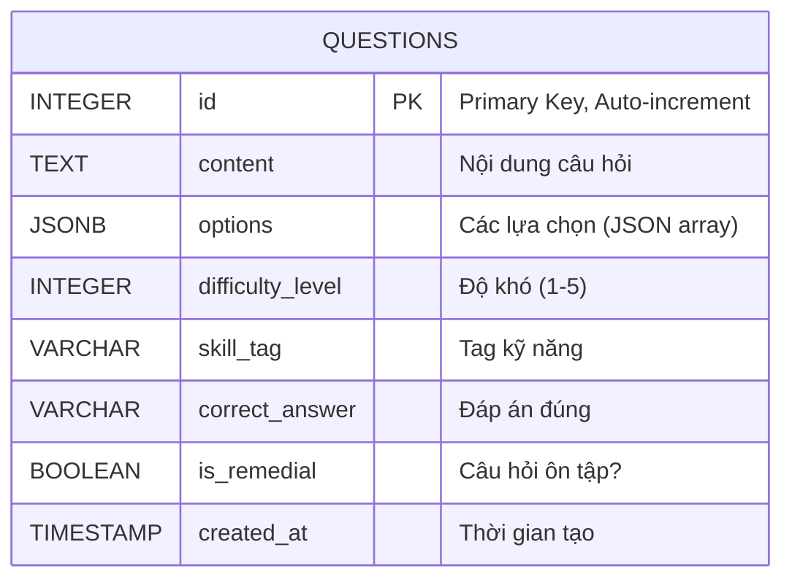

# Content Service

**Microservice quản lý nội dung học tập và câu hỏi**

---

## Mục lục

- [Tổng quan](#tổng-quan)
- [Công nghệ](#công-nghệ)
- [Kiến trúc](#kiến-trúc)
- [Cơ sở dữ liệu](#cơ-sở-dữ-liệu)
- [API Endpoints](#api-endpoints)
- [Cấu hình](#cấu-hình)
- [Phát triển Local](#phát-triển-local)
- [Testing](#testing)
- [Nguyên tắc SOLID](#nguyên-tắc-solid)

---

## Tổng quan

Content Service là microservice chịu trách nhiệm quản lý toàn bộ nội dung học tập trong hệ thống ITS (Intelligent Tutoring System). Service này cung cấp các chức năng:

- **Quản lý câu hỏi**: Tạo, cập nhật, xóa và truy vấn câu hỏi
- **Phân loại nội dung**: Quản lý câu hỏi theo độ khó và kỹ năng
- **Đề xuất nội dung**: Cung cấp API để đề xuất câu hỏi phù hợp
- **Hỗ trợ học tập**: Quản lý câu hỏi remedial (ôn tập) và câu hỏi thử thách

Content Service hoạt động như một **nguồn dữ liệu trung tâm** cho các service khác trong hệ thống, đặc biệt là Adaptive Engine và Scoring Service.

---

## Công nghệ

### Core Technologies

- **Java 17**: Ngôn ngữ lập trình chính
- **Spring Boot 3.5.6**: Framework backend
- **Spring Data JPA**: ORM và data access layer
- **PostgreSQL**: Cơ sở dữ liệu quan hệ
- **Maven**: Build tool và dependency management

### Libraries & Tools

- **Lombok**: Giảm boilerplate code
- **SpringDoc OpenAPI**: Tự động tạo API documentation (Swagger)
- **JUnit 5**: Unit testing framework
- **H2 Database**: In-memory database cho testing
- **Jackson**: JSON serialization/deserialization

### Architecture Pattern

- **Clean Architecture**: Tách biệt business logic khỏi infrastructure
- **Hexagonal Architecture**: Ports and Adapters pattern
- **Repository Pattern**: Abstraction cho data access

---

## Kiến trúc

Content Service được thiết kế theo **Clean Architecture** với 4 layers chính:

```
┌─────────────────────────────────────────────────────────┐
│                    Domain Layer                         │
│  (models/) - Pure Business Logic, No Dependencies       │
└─────────────────────────────────────────────────────────┘
                        ↑
┌─────────────────────────────────────────────────────────┐
│                Application Layer                        │
│  (usecase/) - Business Rules & Orchestration            │
└─────────────────────────────────────────────────────────┘
                        ↑
┌─────────────────────────────────────────────────────────┐
│              Interface Adapters Layer                   │
│  (adapter/http/) - HTTP Controllers, DTOs, Mappers      │
└─────────────────────────────────────────────────────────┘
                        ↑
┌─────────────────────────────────────────────────────────┐
│              Infrastructure Layer                       │
│  (repository/postgresql/) - Database, JPA, Entities     │
└─────────────────────────────────────────────────────────┘
```

### Dependency Rule

**Dependencies chỉ trỏ vào trong (inward):**

- Domain layer không phụ thuộc vào bất kỳ layer nào
- Application layer chỉ phụ thuộc vào Domain
- Interface Adapters phụ thuộc vào Application và Domain
- Infrastructure phụ thuộc vào tất cả các layer trên

### Request Flow

```
HTTP Request
    ↓
Controller (adapter/http/QuestionController)
    ↓ [Request DTO → Command]
UseCase Interface (usecase/QuestionUseCase)
    ↓
UseCase Service (usecase/service/QuestionService)
    ↓ [Business Validation]
Domain Model (models/Question)
    ↓ [Domain Validation]
Repository Interface (repository/QuestionRepository)
    ↓
JPA Repository (repository/postgresql/JpaQuestionRepository)
    ↓ [Domain ↔ Entity Mapping]
PostgreSQL Database
    ↓
HTTP Response (wrapped in ApiResponse)
```

### Directory Structure

```
src/main/java/co3017/microservices/content_service/
│
├── models/                          # Domain Layer
│   └── Question.java                # Pure business entity
│
├── usecase/                         # Application Layer
│   ├── QuestionUseCase.java         # Use case interface
│   ├── service/
│   │   └── QuestionService.java     # Business logic implementation
│   └── types/
│       ├── CreateQuestionCommand.java
│       ├── UpdateQuestionCommand.java
│       └── QuestionQuery.java
│
├── adapter/                         # Interface Adapters Layer
│   └── http/
│       ├── QuestionController.java  # REST controller
│       ├── dto/
│       │   ├── ApiResponse.java     # Standardized response wrapper
│       │   ├── CreateQuestionRequest.java
│       │   ├── UpdateQuestionRequest.java
│       │   └── QuestionResponse.java
│       └── response/
│           └── CommandBuilder.java  # DTO ↔ Command converters
│
├── repository/                      # Repository Interfaces
│   ├── QuestionRepository.java      # Port Out interface
│   └── postgresql/                  # Infrastructure Layer
│       ├── JpaQuestionRepository.java
│       ├── SpringDataQuestionRepository.java
│       ├── entity/
│       │   └── QuestionEntity.java  # JPA entity
│       └── mapper/
│           └── QuestionMapper.java  # Domain ↔ Entity mapper
│
└── config/
    ├── ContentServiceApplication.java
    └── JpaConfig.java
```

---

## Cơ sở dữ liệu

### Database Schema

Content Service sử dụng PostgreSQL database với schema sau:



### Table: questions

| Column             | Type         | Constraints                 | Description                         |
| ------------------ | ------------ | --------------------------- | ----------------------------------- |
| `id`               | INTEGER      | PRIMARY KEY, AUTO_INCREMENT | ID duy nhất của câu hỏi             |
| `content`          | TEXT         | NOT NULL                    | Nội dung câu hỏi                    |
| `options`          | JSONB        |                             | Các lựa chọn trả lời (JSON array)   |
| `difficulty_level` | INTEGER      | NOT NULL                    | Độ khó (1-5)                        |
| `skill_tag`        | VARCHAR(100) | NOT NULL                    | Tag kỹ năng (vd: "math_arithmetic") |
| `correct_answer`   | VARCHAR      | NOT NULL                    | Đáp án đúng                         |
| `is_remedial`      | BOOLEAN      | NOT NULL, DEFAULT false     | Câu hỏi ôn tập hay không            |
| `created_at`       | TIMESTAMP    | NOT NULL                    | Thời gian tạo                       |

### Indexes

```sql
CREATE INDEX idx_questions_skill_tag ON questions(skill_tag);
CREATE INDEX idx_questions_difficulty ON questions(difficulty_level);
CREATE INDEX idx_questions_remedial ON questions(is_remedial);
```

---

## API Endpoints

### Base URL

```
http://localhost:8081
```

### Swagger UI

Truy cập API documentation tại:

```
http://localhost:8081/swagger-ui.html
```

### Endpoints

#### 1. Health Check

**GET** `/health`

Kiểm tra trạng thái service.

**Response:**

```json
{
  "service": "content-service",
  "status": "healthy"
}
```

**Curl Example:**

```bash
curl http://localhost:8081/health
```

---

#### 2. Create Question

**POST** `/api/content`

Tạo câu hỏi mới.

**Request Body:**

```json
{
  "content": "What is 2 + 2?",
  "options": ["3", "4", "5"],
  "difficultyLevel": 1,
  "skillTag": "math_arithmetic",
  "correctAnswer": "4",
  "isRemedial": false
}
```

**Response:**

```json
{
  "error_code": 0,
  "message": "Question created successfully",
  "data": {
    "id": 1,
    "content": "What is 2 + 2?",
    "difficultyLevel": 1,
    "skillTag": "math_arithmetic",
    "correctAnswer": "4",
    "isRemedial": false,
    "createdAt": "2024-12-07T10:30:00"
  }
}
```

**Curl Example:**

```bash
curl -X POST http://localhost:8081/api/content \
  -H "Content-Type: application/json" \
  -d '{
    "content": "What is 2 + 2?",
    "options": ["3", "4", "5"],
    "difficultyLevel": 1,
    "skillTag": "math_arithmetic",
    "correctAnswer": "4",
    "isRemedial": false
  }'
```

---

#### 3. Get Question by ID

**GET** `/api/content/{id}`

Lấy thông tin chi tiết của một câu hỏi.

**Path Parameters:**

- `id` (integer): ID của câu hỏi

**Response:**

```json
{
  "error_code": 0,
  "message": "Success",
  "data": {
    "id": 1,
    "content": "What is 2 + 2?",
    "difficultyLevel": 1,
    "skillTag": "math_arithmetic",
    "correctAnswer": "4",
    "isRemedial": false,
    "createdAt": "2024-12-07T10:30:00"
  }
}
```

**Curl Example:**

```bash
curl http://localhost:8081/api/content/1
```

---

#### 4. Get All Questions

**GET** `/api/content`

Lấy danh sách câu hỏi với filter tùy chọn.

**Query Parameters:**

- `difficultyLevel` (integer, optional): Lọc theo độ khó
- `skillTag` (string, optional): Lọc theo kỹ năng

**Response:**

```json
{
  "error_code": 0,
  "message": "Success",
  "data": [
    {
      "id": 1,
      "content": "What is 2 + 2?",
      "difficultyLevel": 1,
      "skillTag": "math_arithmetic",
      "correctAnswer": "4",
      "isRemedial": false,
      "createdAt": "2024-12-07T10:30:00"
    }
  ]
}
```

**Curl Examples:**

```bash
# Lấy tất cả câu hỏi
curl http://localhost:8081/api/content

# Lọc theo độ khó
curl "http://localhost:8081/api/content?difficultyLevel=1"

# Lọc theo kỹ năng
curl "http://localhost:8081/api/content?skillTag=math_arithmetic"

# Lọc theo cả hai
curl "http://localhost:8081/api/content?difficultyLevel=1&skillTag=math_arithmetic"
```

---

#### 5. Update Question

**PUT** `/api/content/{id}`

Cập nhật thông tin câu hỏi.

**Path Parameters:**

- `id` (integer): ID của câu hỏi

**Request Body:**

```json
{
  "content": "What is 3 + 3?",
  "options": ["5", "6", "7"],
  "difficultyLevel": 2,
  "skillTag": "math_advanced",
  "correctAnswer": "6",
  "isRemedial": false
}
```

**Response:**

```json
{
  "error_code": 0,
  "message": "Question updated successfully",
  "data": {
    "id": 1,
    "content": "What is 3 + 3?",
    "difficultyLevel": 2,
    "skillTag": "math_advanced",
    "correctAnswer": "6",
    "isRemedial": false,
    "createdAt": "2024-12-07T10:30:00"
  }
}
```

**Curl Example:**

```bash
curl -X PUT http://localhost:8081/api/content/1 \
  -H "Content-Type: application/json" \
  -d '{
    "content": "What is 3 + 3?",
    "options": ["5", "6", "7"],
    "difficultyLevel": 2,
    "skillTag": "math_advanced",
    "correctAnswer": "6",
    "isRemedial": false
  }'
```

---

#### 6. Delete Question

**DELETE** `/api/content/{id}`

Xóa một câu hỏi.

**Path Parameters:**

- `id` (integer): ID của câu hỏi

**Response:**

```json
{
  "error_code": 0,
  "message": "Question deleted successfully",
  "data": null
}
```

**Curl Example:**

```bash
curl -X DELETE http://localhost:8081/api/content/1
```

---

#### 7. Recommend Question

**GET** `/api/content/recommend`

Đề xuất câu hỏi phù hợp dựa trên kỹ năng và loại.

**Query Parameters:**

- `skill` (string, required): Kỹ năng cần luyện tập
- `type` (string, required): Loại câu hỏi ("remedial" hoặc "challenge")
- `userId` (string, optional): ID của người dùng

**Response:**

```json
{
  "error_code": 0,
  "message": "Success",
  "data": {
    "id": 5,
    "content": "Advanced math question",
    "difficultyLevel": 3,
    "skillTag": "math_advanced",
    "correctAnswer": "42",
    "isRemedial": false,
    "createdAt": "2024-12-07T10:30:00"
  }
}
```

**Curl Example:**

```bash
curl "http://localhost:8081/api/content/recommend?skill=math_arithmetic&type=remedial"
```

---

#### 8. Get Available Skills

**GET** `/api/content/skills`

Lấy danh sách tất cả các kỹ năng có sẵn.

**Response:**

```json
{
  "error_code": 0,
  "message": "Success",
  "data": [
    "math_arithmetic",
    "math_advanced",
    "programming_basics",
    "data_structures"
  ]
}
```

**Curl Example:**

```bash
curl http://localhost:8081/api/content/skills
```

---

## Cấu hình

### Environment Variables

Content Service sử dụng các biến môi trường sau:

| Variable                        | Description               | Default                                       | Required |
| ------------------------------- | ------------------------- | --------------------------------------------- | -------- |
| `SPRING_DATASOURCE_URL`         | PostgreSQL connection URL | `jdbc:postgresql://localhost:5432/content_db` | Yes      |
| `SPRING_DATASOURCE_USERNAME`    | Database username         | `postgres`                                    | Yes      |
| `SPRING_DATASOURCE_PASSWORD`    | Database password         | `postgres`                                    | Yes      |
| `SPRING_JPA_HIBERNATE_DDL_AUTO` | Hibernate DDL mode        | `update`                                      | No       |
| `SERVER_PORT`                   | HTTP server port          | `8081`                                        | No       |
| `LOGGING_LEVEL_ROOT`            | Root logging level        | `INFO`                                        | No       |
| `LOGGING_LEVEL_CO3017`          | Application logging level | `DEBUG`                                       | No       |

### Application Properties

File `src/main/resources/application.properties`:

```properties
# Server Configuration
server.port=${SERVER_PORT:8081}

# Database Configuration
spring.datasource.url=${SPRING_DATASOURCE_URL:jdbc:postgresql://localhost:5432/content_db}
spring.datasource.username=${SPRING_DATASOURCE_USERNAME:postgres}
spring.datasource.password=${SPRING_DATASOURCE_PASSWORD:postgres}
spring.datasource.driver-class-name=org.postgresql.Driver

# JPA Configuration
spring.jpa.hibernate.ddl-auto=${SPRING_JPA_HIBERNATE_DDL_AUTO:update}
spring.jpa.show-sql=false
spring.jpa.properties.hibernate.dialect=org.hibernate.dialect.PostgreSQLDialect
spring.jpa.properties.hibernate.format_sql=true

# Logging Configuration
logging.level.root=${LOGGING_LEVEL_ROOT:INFO}
logging.level.co3017=${LOGGING_LEVEL_CO3017:DEBUG}
logging.level.org.hibernate.SQL=DEBUG
logging.level.org.hibernate.type.descriptor.sql.BasicBinder=TRACE

# Swagger/OpenAPI Configuration
springdoc.api-docs.path=/api-docs
springdoc.swagger-ui.path=/swagger-ui.html
```

---

## Phát triển Local

### Prerequisites

- **Java 17** hoặc cao hơn
- **Maven 3.8+**
- **PostgreSQL 14+** (hoặc sử dụng Docker)
- **IDE**: IntelliJ IDEA, Eclipse, hoặc VS Code với Java extensions

### Setup Database

#### Option 1: Sử dụng Docker

```bash
# Chạy PostgreSQL container
docker run -d \
  --name content-postgres \
  -e POSTGRES_DB=content_db \
  -e POSTGRES_USER=postgres \
  -e POSTGRES_PASSWORD=postgres \
  -p 5432:5432 \
  postgres:14-alpine
```

#### Option 2: PostgreSQL Local

```bash
# Tạo database
createdb content_db

# Hoặc sử dụng psql
psql -U postgres
CREATE DATABASE content_db;
```

### Build Project

```bash
# Clone repository (nếu chưa có)
cd sources/content

# Build với Maven
mvn clean install

# Skip tests nếu cần
mvn clean install -DskipTests
```

### Run Application

#### Option 1: Maven

```bash
mvn spring-boot:run
```

#### Option 2: Java JAR

```bash
# Build JAR
mvn clean package

# Run JAR
java -jar target/content-service-0.0.1-SNAPSHOT.jar
```

#### Option 3: IDE

1. Mở project trong IDE
2. Tìm class `ContentServiceApplication.java`
3. Right-click → Run

### Verify Service

```bash
# Check health
curl http://localhost:8081/health

# Expected output:
# {"service":"content-service","status":"healthy"}

# Access Swagger UI
open http://localhost:8081/swagger-ui.html
```

### Hot Reload (Development)

Thêm Spring Boot DevTools vào `pom.xml`:

```xml
<dependency>
    <groupId>org.springframework.boot</groupId>
    <artifactId>spring-boot-devtools</artifactId>
    <scope>runtime</scope>
    <optional>true</optional>
</dependency>
```

---

## Testing

### Test Structure

```
src/test/java/co3017/microservices/content_service/
├── adapter/
│   └── http/
│       └── QuestionControllerTest.java    # Controller integration tests
├── usecase/
│   └── service/
│       └── QuestionServiceTest.java       # Business logic unit tests
└── repository/
    └── postgresql/
        └── JpaQuestionRepositoryTest.java # Repository integration tests
```

### Running Tests

```bash
# Run all tests
mvn test

# Run specific test class
mvn test -Dtest=QuestionControllerTest

# Run with coverage
mvn test jacoco:report

# View coverage report
open target/site/jacoco/index.html
```

### Test Categories

#### 1. Unit Tests

Test business logic trong isolation:

```java
@Test
void createQuestion_ValidData_Success() {
    // Arrange
    CreateQuestionCommand command = new CreateQuestionCommand(
        "What is 2 + 2?",
        Arrays.asList("3", "4", "5"),
        1,
        "math_arithmetic",
        "4",
        false
    );

    // Act
    Question question = questionService.createQuestion(command);

    // Assert
    assertNotNull(question);
    assertEquals("What is 2 + 2?", question.getContent());
}
```

#### 2. Integration Tests

Test controller với MockMvc:

```java
@WebMvcTest(QuestionController.class)
class QuestionControllerTest {

    @Autowired
    private MockMvc mockMvc;

    @MockBean
    private QuestionUseCase questionUseCase;

    @Test
    void createQuestion_Success() throws Exception {
        mockMvc.perform(post("/api/content")
                .contentType(MediaType.APPLICATION_JSON)
                .content(requestJson))
                .andExpect(status().isCreated())
                .andExpect(jsonPath("$.error_code").value(0));
    }
}
```

#### 3. Repository Tests

Test data access với H2 in-memory database:

```java
@DataJpaTest
class JpaQuestionRepositoryTest {

    @Autowired
    private SpringDataQuestionRepository repository;

    @Test
    void save_ValidQuestion_Success() {
        QuestionEntity entity = new QuestionEntity();
        entity.setContent("Test question");

        QuestionEntity saved = repository.save(entity);

        assertNotNull(saved.getId());
    }
}
```

### Test Coverage Goals

- **Unit Tests**: > 80% coverage
- **Integration Tests**: All API endpoints
- **Repository Tests**: All CRUD operations

---

## Nguyên tắc SOLID

Content Service được thiết kế tuân thủ các nguyên tắc SOLID:

### 1. Single Responsibility Principle (SRP)

**Mỗi class chỉ có một lý do để thay đổi.**

**Ví dụ:**

- `Question.java`: Chỉ chứa business logic của domain Question
- `QuestionController.java`: Chỉ xử lý HTTP requests/responses
- `QuestionService.java`: Chỉ chứa business orchestration logic
- `JpaQuestionRepository.java`: Chỉ xử lý data persistence

```java
// GOOD: Single responsibility
public class Question {
    // Chỉ chứa business logic
    public boolean isValid() {
        return content != null && !content.trim().isEmpty();
    }
}

// BAD: Multiple responsibilities
public class Question {
    public boolean isValid() { ... }
    public void saveToDatabase() { ... }  // Không nên ở đây!
    public String toJson() { ... }        // Không nên ở đây!
}
```

### 2. Open/Closed Principle (OCP)

**Open for extension, closed for modification.**

**Ví dụ:** Repository pattern cho phép thay đổi implementation mà không sửa code sử dụng nó.

```java
// Interface (closed for modification)
public interface QuestionRepository {
    Question save(Question question);
    Optional<Question> findById(Integer id);
}

// Implementation 1: PostgreSQL (extension)
public class JpaQuestionRepository implements QuestionRepository {
    // PostgreSQL implementation
}

// Implementation 2: MongoDB (extension - future)
public class MongoQuestionRepository implements QuestionRepository {
    // MongoDB implementation
}

// Service không cần thay đổi khi đổi implementation
public class QuestionService {
    private final QuestionRepository repository;  // Depends on interface

    public QuestionService(QuestionRepository repository) {
        this.repository = repository;
    }
}
```

### 3. Liskov Substitution Principle (LSP)

**Subclasses phải có thể thay thế base class mà không làm hỏng chương trình.**

**Ví dụ:** Bất kỳ implementation nào của `QuestionRepository` đều có thể thay thế cho nhau.

```java
// Có thể thay thế implementation mà không ảnh hưởng behavior
QuestionRepository repo1 = new JpaQuestionRepository(...);
QuestionRepository repo2 = new MongoQuestionRepository(...);

// Cả hai đều hoạt động giống nhau từ góc nhìn của client
Question q1 = repo1.findById(1).orElse(null);
Question q2 = repo2.findById(1).orElse(null);
```

### 4. Interface Segregation Principle (ISP)

**Clients không nên phụ thuộc vào interfaces mà chúng không sử dụng.**

**Ví dụ:** Tách interfaces thành các phần nhỏ, specific.

```java
// GOOD: Segregated interfaces
public interface QuestionReader {
    Optional<Question> findById(Integer id);
    List<Question> findAll();
}

public interface QuestionWriter {
    Question save(Question question);
    void delete(Integer id);
}

// Service chỉ cần read operations
public class QuestionQueryService {
    private final QuestionReader reader;  // Chỉ phụ thuộc vào read interface
}

// BAD: Fat interface
public interface QuestionRepository {
    // Read operations
    Optional<Question> findById(Integer id);
    List<Question> findAll();
    // Write operations
    Question save(Question question);
    void delete(Integer id);
    // Admin operations
    void backup();
    void restore();
    // Reporting operations
    Report generateReport();
}
```

### 5. Dependency Inversion Principle (DIP)

**High-level modules không nên phụ thuộc vào low-level modules. Cả hai nên phụ thuộc vào abstractions.**

**Ví dụ:** Clean Architecture implementation.

```java
// GOOD: Depend on abstraction
public class QuestionService {
    private final QuestionRepository repository;  // Interface (abstraction)

    public QuestionService(QuestionRepository repository) {
        this.repository = repository;
    }
}

// BAD: Depend on concrete implementation
public class QuestionService {
    private final JpaQuestionRepository repository;  // Concrete class

    public QuestionService() {
        this.repository = new JpaQuestionRepository();  // Tight coupling
    }
}
```

### SOLID Benefits trong Content Service

1. **Testability**: Dễ dàng mock dependencies
2. **Maintainability**: Thay đổi một phần không ảnh hưởng phần khác
3. **Flexibility**: Dễ dàng thêm features mới
4. **Reusability**: Components có thể tái sử dụng
5. **Scalability**: Dễ dàng mở rộng hệ thống

---

## Tài liệu tham khảo

- [Architecture Documentation](./architecture.md) - Chi tiết về Clean Architecture
- [Swagger API Docs](http://localhost:8081/swagger-ui.html) - Interactive API documentation
- [Spring Boot Documentation](https://spring.io/projects/spring-boot)
- [Spring Data JPA](https://spring.io/projects/spring-data-jpa)

---

## Liên kết Liên quan

### Tài liệu Dự án

| Tài liệu           | Đường dẫn                                        | Mô tả                                |
| ------------------ | ------------------------------------------------ | ------------------------------------ |
| **Root README**    | [../../README.md](../../README.md)               | Tổng quan dự án, cấu trúc repository |
| **Sources README** | [../README.md](../README.md)                     | Hướng dẫn microservices và Docker    |
| **Report README**  | [../../report/README.md](../../report/README.md) | Hướng dẫn build báo cáo LaTeX        |
| **Báo cáo PDF**    | [../../report/main.pdf](../../report/main.pdf)   | Báo cáo kiến trúc phần mềm           |

### Service READMEs Khác

| Service                   | Đường dẫn                                                    | Mô tả                          |
| ------------------------- | ------------------------------------------------------------ | ------------------------------ |
| **Scoring Service**       | [../scoring/README.md](../scoring/README.md)                 | Chấm điểm, RabbitMQ publishing |
| **Learner Model Service** | [../learner-model/README.md](../learner-model/README.md)     | Skill mastery tracking         |
| **Adaptive Engine**       | [../adaptive-engine/README.md](../adaptive-engine/README.md) | Recommendation algorithm       |
| **Client**                | [../client/README.md](../client/README.md)                   | Frontend UI/UX                 |

### Tài liệu Kiến trúc

| Tài liệu                   | Đường dẫn                                                                                              | Nội dung              |
| -------------------------- | ------------------------------------------------------------------------------------------------------ | --------------------- |
| **SOLID Principles**       | [../../markdown/report/6-SOLID-principles.md](../../markdown/report/6-SOLID-principles.md)             | Ví dụ áp dụng SOLID   |
| **Architecture Decisions** | [../../markdown/report/5-architecture-decisions.md](../../markdown/report/5-architecture-decisions.md) | ADRs                  |
| **Microservices Analysis** | [../../markdown/microservices.md](../../markdown/microservices.md)                                     | Chi tiết domain model |

### API Documentation

- **Swagger UI**: [http://localhost:8081/swagger-ui.html](http://localhost:8081/swagger-ui.html)
- **OpenAPI Spec**: [docs/swagger.json](./docs/swagger.json)

---

**Content Service** - Phần của Intelligent Tutoring System (ITS)  
CO3017 - Kiến Trúc Phần Mềm - HCMUT
