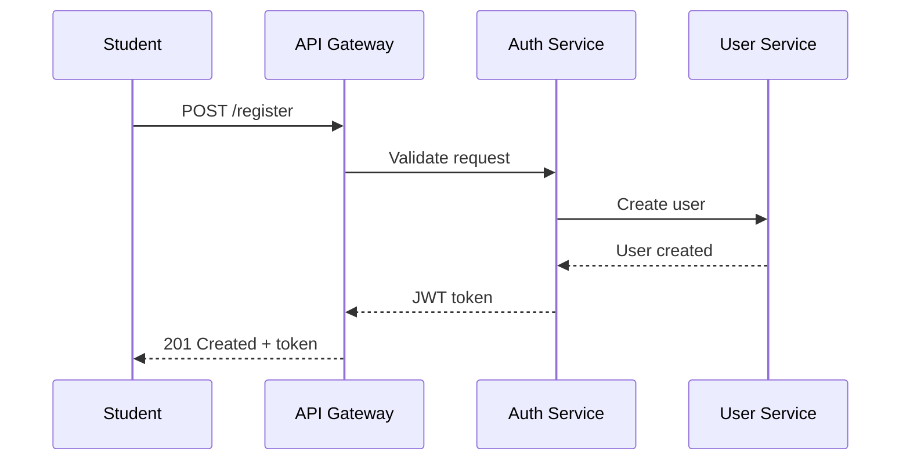

# INTELLIGENT TUTORING SYSTEM (ITS)
# SOFTWARE ARCHITECTURE DESIGN REPORT TEMPLATE & CONTENT ASSESSMENT

---

## 📊 PHẦN A: ĐÁNH GIÁ CHI TIẾT NỘI DUNG HIỆN TẠI

### A.1. ĐÁNH GIÁ TỔNG QUAN

#### **Điểm Số Tổng Thể: 8.5/10**

| **Tiêu Chí** | **Điểm** | **Đánh Giá** |
|-------------|----------|--------------|
| **Độ đầy đủ (Completeness)** | 9/10 | Có đầy đủ các thành phần yêu cầu từ assignment |
| **Độ sâu kỹ thuật (Technical Depth)** | 9/10 | Chi tiết tốt về SOLID, Clean Architecture, ADRs |
| **Tính nhất quán (Consistency)** | 7/10 | Thiếu nhất quán về terminology và format |
| **Khả năng thực thi (Feasibility)** | 8/10 | Thiết kế khả thi nhưng phức tạp cho MVP |
| **Tính mạch lạc (Coherence)** | 7/10 | Các phần riêng lẻ tốt nhưng thiếu liên kết |
| **Tuân thủ SOLID** | 9/10 | Áp dụng xuất sắc với code examples cụ thể |
| **Architecture Views** | 8.5/10 | Có đủ views nhưng thiếu một số diagrams |
| **Documentation Quality** | 8/10 | Chi tiết nhưng cần cải thiện presentation |

### A.2. ĐÁNH GIÁ CHI TIẾT TỪNG FILE

#### **📄 File 1: 1-analyst.md**
**Điểm: 9/10**

**Điểm mạnh:**
- ✅ User stories được viết theo format chuẩn (As a... I want... So that...)
- ✅ Use cases chi tiết với 20 scenarios đầy đủ
- ✅ Domain model được phân tích kỹ với Aggregates rõ ràng
- ✅ Mapping User Stories → Use Cases → Functional Requirements logic

**Điểm yếu:**
- ❌ Thiếu phần context và background của project
- ❌ Chưa có phân tích stakeholder priorities
- ❌ Domain model chưa có diagram visualization

**Recommendations:**
```markdown
1. Thêm Project Vision Statement
2. Tạo Stakeholder Matrix với influence/interest levels
3. Vẽ Domain Model Diagram (UML Class Diagram)
4. Thêm Acceptance Criteria cho mỗi User Story
```

#### **📄 File 2: 2-architecture-characteristics.md**
**Điểm: 8.5/10**

**Điểm mạnh:**
- ✅ Phân loại rõ Primary vs Secondary characteristics
- ✅ Có metrics cụ thể (< 500ms latency, 5000 concurrent users)
- ✅ Giải thích rõ trade-offs
- ✅ Liên kết tốt ACs với requirements

**Điểm yếu:**
- ❌ Thiếu phương pháp đo lường (measurement methods)
- ❌ Chưa có fitness functions
- ❌ Thiếu priority matrix visualization

**Recommendations:**
```markdown
1. Thêm Fitness Functions cho mỗi AC
2. Tạo AC Prioritization Matrix (Impact vs Effort)
3. Define SLAs/SLOs cụ thể
4. Thêm monitoring strategy cho mỗi AC
```

#### **📄 File 3: 3-architecture-styles.md**
**Điểm: 9/10**

**Điểm mạnh:**
- ✅ So sánh toàn diện 8 architecture styles
- ✅ Matrix đánh giá chi tiết với 13 tiêu chí
- ✅ Justification rõ ràng cho Hybrid Microservices + Event-Driven
- ✅ Trade-offs được phân tích kỹ

**Điểm yếu:**
- ❌ Thiếu cost analysis cụ thể
- ❌ Chưa có migration strategy từ MVP
- ❌ Thiếu risk assessment

**Recommendations:**
```markdown
1. Thêm TCO (Total Cost of Ownership) analysis
2. Define evolution path: Modular Monolith → Microservices
3. Create Risk Matrix cho architecture decision
4. Add fallback options nếu Microservices quá phức tạp
```

#### **📄 File 4: 4-sample-diagram.md**
**Điểm: 8/10**

**Điểm mạnh:**
- ✅ Clean Architecture diagram rõ ràng
- ✅ DIP được thể hiện tốt
- ✅ Có cả Mermaid diagrams
- ✅ Multiple views (Module, C&C, Deployment)

**Điểm yếu:**
- ❌ Thiếu Sequence Diagrams cho key scenarios
- ❌ Component diagram chưa đầy đủ
- ❌ Deployment diagram thiếu infrastructure details
- ❌ Không có Data Flow Diagrams

**Recommendations:**
```markdown
1. Thêm 3-5 Sequence Diagrams cho critical use cases
2. Vẽ detailed Component Diagram với interfaces
3. Enhance Deployment Diagram với:
   - Load balancers
   - Service mesh
   - Monitoring stack
4. Thêm Data Flow Diagram cho AI pipeline
```

#### **📄 File 5: 5-architecture-decisions.md**
**Điểm: 9.5/10**

**Điểm mạnh:**
- ✅ ADR format chuẩn và professional
- ✅ Polyglot strategy được justify tốt
- ✅ Clear rationale và consequences
- ✅ Alternatives được xem xét đầy đủ

**Điểm yếu:**
- ❌ Thiếu revision history
- ❌ Chưa có decision về testing strategy
- ❌ Thiếu security decisions

**Recommendations:**
```markdown
1. Thêm ADR về Testing Strategy (Unit/Integration/E2E)
2. Thêm ADR về Security Architecture
3. Thêm ADR về Data Privacy & Compliance
4. Include revision dates và decision makers
```

#### **📄 File 6: 6-SOLID-principles.md**
**Điểm: 9.5/10**

**Điểm mạnh:**
- ✅ Code examples chi tiết cho cả Java và Golang
- ✅ Before/After comparisons rõ ràng
- ✅ Mapping SOLID → Architecture Characteristics
- ✅ Real-world scenarios trong ITS context

**Điểm yếu:**
- ❌ Thiếu UML class diagrams cho SOLID examples
- ❌ Chưa có metrics để measure SOLID compliance
- ❌ Thiếu test code examples

**Recommendations:**
```markdown
1. Thêm UML diagrams cho mỗi SOLID principle
2. Include code metrics (coupling, cohesion, complexity)
3. Thêm unit test examples demonstrating DIP
4. Create SOLID checklist cho code review
```

#### **📄 File 7: 7-reflection-report.md**
**Điểm: 7/10**

**Điểm mạnh:**
- ✅ Honest về challenges và trade-offs
- ✅ Clear về SOLID improvements
- ✅ Practical insights

**Điểm yếu:**
- ❌ Quá ngắn (chỉ 1 trang)
- ❌ Thiếu metrics và measurements
- ❌ Chưa có lessons learned chi tiết
- ❌ Thiếu future improvements

**Recommendations:**
```markdown
1. Expand to 3-4 pages minimum
2. Thêm Architecture Evaluation (ATAM style)
3. Include specific metrics (before/after)
4. Add section về technical debt và mitigation
5. Propose future architecture evolution
```

---

## 📝 PHẦN B: REPORT TEMPLATE CHI TIẾT

# INTELLIGENT TUTORING SYSTEM (ITS)
# SOFTWARE ARCHITECTURE DESIGN REPORT

---

## EXECUTIVE SUMMARY
*[Template: 1-2 pages]*

### Project Overview
```markdown
[Provide a high-level summary of:]
- Project vision and objectives
- Key business drivers
- Main technical challenges
- Selected architecture approach
```

### Key Decisions
```markdown
[Summarize top 5 architecture decisions:]
1. Hybrid Microservices + Event-Driven Architecture
2. Polyglot Programming (Java/Golang)
3. Clean Architecture Pattern
4. [Add 2 more from your ADRs]
```

### Expected Outcomes
```markdown
[List measurable benefits:]
- Support for 5000+ concurrent users
- < 500ms response time for core operations
- Live AI model swapping capability
- [Add more specific metrics]
```

---

## CHAPTER 1: CONTEXT AND REQUIREMENTS ANALYSIS

### 1.1 Project Scope and Objectives
*[Template: 2-3 pages]*

#### 1.1.1 Vision Statement
```markdown
[Write a clear vision statement]
Example: "To create an intelligent, adaptive tutoring system that 
revolutionizes personalized education through AI-driven learning paths, 
providing each student with a tailored one-on-one tutoring experience 
at scale."
```

#### 1.1.2 Business Context
```markdown
[Describe:]
- Market need and opportunity
- Target audience (K-12, Higher Ed, Corporate)
- Success criteria
- Project constraints (budget, timeline, resources)
```

#### 1.1.3 Technical Context
```markdown
[Include:]
- Existing systems to integrate with
- Technology constraints
- Regulatory requirements (FERPA, GDPR)
- Performance expectations
```

### 1.2 Stakeholder Analysis
*[Template: 1-2 pages]*

#### 1.2.1 Stakeholder Matrix
```markdown
| Stakeholder | Role | Interest | Influence | Key Concerns |
|------------|------|----------|-----------|--------------|
| Students | End User | High | Low | Ease of use, Performance |
| Instructors | End User | High | Medium | Monitoring, Content Management |
| Administrators | System Owner | Medium | High | Cost, Scalability |
| [Add more] | | | | |
```

#### 1.2.2 Stakeholder Requirements
```markdown
[For each stakeholder group, list:]
- Primary needs
- Quality expectations
- Constraints
- Success metrics
```

### 1.3 Functional Requirements
*[Template: 5-6 pages]*

#### 1.3.1 User Stories
```markdown
[Use your existing user stories from 1-analyst.md]
[Add acceptance criteria for each]

Template per story:
**US-XX: [Title]**
As a [role], I want [goal] so that [benefit]

**Acceptance Criteria:**
- [ ] Criteria 1
- [ ] Criteria 2
- [ ] Criteria 3

**Priority:** High/Medium/Low
**Story Points:** [1-13]
```

#### 1.3.2 Use Cases
```markdown
[Use your existing use cases]
[Add missing diagrams]

Template per use case:
**UC-XX: [Title]**
- **Actor:** [Primary actor]
- **Preconditions:** [What must be true before]
- **Postconditions:** [What will be true after]
- **Main Flow:**
  1. Step 1
  2. Step 2
- **Alternative Flows:**
  - 2a. [Alternative scenario]
- **Exception Flows:**
  - E1. [Error scenario]
```

#### 1.3.3 Domain Model
```markdown
[Include your domain model analysis]
[ADD: Domain Model Class Diagram]

Template:
- **Aggregates:** [List with responsibilities]
- **Entities:** [Core business objects]
- **Value Objects:** [Immutable objects]
- **Domain Services:** [Business logic]
- **Domain Events:** [Important state changes]
```

### 1.4 Non-Functional Requirements
*[Template: 3-4 pages]*

#### 1.4.1 Architecture Characteristics
```markdown
[Use your AC analysis from file 2]
[Add measurement methods]

Template per AC:
**AC-X: [Name]**
- **Definition:** [What it means]
- **Importance:** [Why critical for ITS]
- **Metrics:** [How to measure]
- **Target:** [Specific goal]
- **Fitness Function:** [Automated test]
```

#### 1.4.2 Quality Attributes
```markdown
[Organize by category:]

**Performance:**
- Response time: < 500ms for 95th percentile
- Throughput: 1000 requests/second
- [Add more]

**Scalability:**
- Horizontal scaling capability
- Support 5000 concurrent users
- [Add more]

**Security:**
- Authentication: OAuth 2.0/JWT
- Authorization: RBAC
- Encryption: TLS 1.3, AES-256
- [Add more]
```

### 1.5 Constraints and Assumptions
*[Template: 1 page]*

#### 1.5.1 Technical Constraints
```markdown
- Development team size: [X developers]
- Technology stack limitations
- Infrastructure budget: $[X]/month
- [Add more]
```

#### 1.5.2 Business Constraints
```markdown
- Timeline: [X months to MVP]
- Budget: $[Total budget]
- Compliance requirements
- [Add more]
```

#### 1.5.3 Assumptions
```markdown
- Users have stable internet (>10 Mbps)
- Modern browsers (Chrome 90+, Firefox 88+)
- [Add more assumptions]
```

---

## CHAPTER 2: ARCHITECTURE DESIGN

### 2.1 Architecture Characteristics Prioritization
*[Template: 2-3 pages]*

#### 2.1.1 Characteristics Matrix
```markdown
[Create prioritization matrix]

| Characteristic | Business Impact | Technical Risk | Priority | Notes |
|---------------|-----------------|----------------|----------|--------|
| Modularity | High | Medium | 1 | Core for maintainability |
| Scalability | High | High | 1 | Critical for growth |
| Performance | High | Medium | 1 | User experience |
| [Add all] | | | | |
```

#### 2.1.2 Trade-off Analysis
```markdown
[Document key trade-offs]

Template:
**Trade-off: [A] vs [B]**
- **Scenario:** [When this matters]
- **Decision:** Choose [A] over [B]
- **Rationale:** [Why]
- **Mitigation:** [How to minimize downside]
```

### 2.2 Architecture Style Selection
*[Template: 4-5 pages]*

#### 2.2.1 Evaluation Criteria
```markdown
[Define how you evaluate styles]
- Alignment with ACs
- Technical complexity
- Team expertise
- Cost implications
- [Add more]
```

#### 2.2.2 Architecture Styles Comparison
```markdown
[Use your comparison from file 3]
[Add visual comparison chart]

| Style | Modularity | Scalability | Performance | Complexity | Cost | Score |
|-------|------------|-------------|-------------|------------|------|-------|
| Layered | ⭐⭐ | ⭐ | ⭐⭐⭐ | ⭐⭐⭐⭐⭐ | $ | 2.4 |
| Microservices | ⭐⭐⭐⭐⭐ | ⭐⭐⭐⭐⭐ | ⭐⭐⭐⭐ | ⭐⭐ | $$$$$ | 4.2 |
| [Add all] | | | | | | |
```

#### 2.2.3 Final Architecture Decision
```markdown
**Selected:** Hybrid Microservices + Event-Driven

**Justification:**
1. [Point 1 with specific AC support]
2. [Point 2 with requirement mapping]
3. [Point 3 with risk mitigation]

**Implementation Strategy:**
- Phase 1: Modular Monolith (MVP)
- Phase 2: Extract critical services
- Phase 3: Full microservices
```

### 2.3 Architecture Decision Records
*[Template: 8-10 pages]*

#### Template for each ADR:
```markdown
## ADR-[Number]: [Title]

### Status
[Proposed | Accepted | Deprecated | Superseded by ADR-X]

### Context
[Describe the issue, including constraints and forces]

### Decision
[State the architecture decision clearly]

### Rationale
[Explain why this decision was made]
- Supports AC-X: [How]
- Addresses requirement: [Which one]
- Mitigates risk: [What risk]

### Consequences
**Positive:**
- [Benefit 1]
- [Benefit 2]

**Negative:**
- [Drawback 1]
- [Drawback 2]

**Risks:**
- [Risk 1]: [Mitigation strategy]

### Alternatives Considered
1. **Option A:** [Description]
   - Pros: [List]
   - Cons: [List]
   - Reason rejected: [Why]

### Related Decisions
- Depends on: ADR-X
- Influences: ADR-Y
```

### 2.4 Design Principles
*[Template: 2-3 pages]*

#### 2.4.1 Core Principles
```markdown
1. **Domain-Driven Design**
   - Ubiquitous language
   - Bounded contexts
   - Aggregates

2. **SOLID Principles**
   - [Brief overview, detail in Chapter 4]

3. **12-Factor App**
   - Config in environment
   - Stateless processes
   - [List applicable factors]

4. **API-First Design**
   - Contract-first development
   - Versioning strategy
```

#### 2.4.2 Technical Standards
```markdown
- RESTful API design (OpenAPI 3.0)
- Event schema standards (CloudEvents)
- Code style guides (Google Style Guides)
- Documentation standards (arc42)
```

---

## CHAPTER 3: ARCHITECTURE VIEWS

### 3.1 Module View
*[Template: 4-5 pages]*

#### 3.1.1 System Decomposition
```markdown
[High-level module structure]

ITS System
├── User Management Service
│   ├── Authentication Module
│   ├── Authorization Module
│   └── Profile Management
├── Content Service
│   ├── Course Management
│   ├── Assessment Engine
│   └── Content Delivery
├── [Continue for all services]
```

#### 3.1.2 Clean Architecture Layers
```markdown
[Use your Clean Architecture from file 4]
[Add layer responsibilities table]

| Layer | Responsibility | Dependencies | Examples |
|-------|---------------|--------------|----------|
| Domain | Business rules | None | Entities, Value Objects |
| Application | Use cases | Domain only | Interactors, DTOs |
| Interface | Adapters | Application | Controllers, Presenters |
| Infrastructure | Frameworks | All above | DB, Web, External APIs |
```

#### 3.1.3 Package Structure
```markdown
[Detailed package organization]

com.its.learnermodel/
├── domain/
│   ├── entity/
│   │   └── LearnerModel.java
│   ├── valueobject/
│   │   └── SkillMastery.java
│   └── repository/
│       └── LearnerModelRepository.java (interface)
├── application/
│   ├── usecase/
│   │   └── UpdateSkillMasteryUseCase.java
│   └── dto/
│       └── SkillMasteryDTO.java
├── infrastructure/
│   ├── persistence/
│   │   └── MongoLearnerModelRepository.java
│   └── web/
│       └── LearnerModelController.java
```

### 3.2 Component & Connector View
*[Template: 5-6 pages]*

#### 3.2.1 Service Architecture
```markdown
[Component diagram showing all services]
[Include interfaces and dependencies]

Key Components:
1. API Gateway
   - Routes: [List main routes]
   - Auth: JWT validation
   - Rate limiting: 1000 req/min

2. User Management Service
   - Interfaces: IUserService, IAuthService
   - Database: PostgreSQL
   - Cache: Redis

[Continue for all services]
```

#### 3.2.2 Integration Patterns
```markdown
[Describe how services communicate]

**Synchronous Communication:**
- Protocol: REST over HTTPS
- Format: JSON
- Authentication: JWT Bearer tokens
- Examples: User login, Content retrieval

**Asynchronous Communication:**
- Message Broker: Kafka
- Format: Avro/JSON
- Patterns: Pub/Sub, Event Sourcing
- Examples: Score updates, Progress tracking

**Service Mesh:**
- Implementation: Istio
- Features: Circuit breaking, Retry, Timeout
```

#### 3.2.3 Data Flow Diagrams
```markdown
[Show data flow for key scenarios]

Example: Adaptive Learning Flow
1. Student requests next content
2. API Gateway validates JWT
3. Routes to Adaptive Engine
4. Adaptive Engine queries Learner Model
5. Algorithm calculates optimal content
6. Returns content ID
7. Content Service delivers material
```

### 3.3 Allocation View
*[Template: 4-5 pages]*

#### 3.3.1 Deployment Architecture
```markdown
[Detailed deployment diagram]

Production Environment:
- Cloud Provider: AWS/GCP/Azure
- Regions: us-east-1 (primary), us-west-2 (DR)
- Availability Zones: 3 per region

Kubernetes Cluster:
- Version: 1.28+
- Nodes: 10-50 (auto-scaling)
- Namespaces: dev, staging, prod

[Include infrastructure diagram]
```

#### 3.3.2 Container Specifications
```markdown
[Docker/K8s configurations]

| Service | Image Size | Memory | CPU | Replicas | Port |
|---------|-----------|--------|-----|----------|------|
| API Gateway | 50MB | 512MB | 0.5 | 3-10 | 8080 |
| User Service | 200MB | 1GB | 1.0 | 2-5 | 8081 |
| [All services] | | | | | |
```

#### 3.3.3 Infrastructure Components
```markdown
**Load Balancer:**
- Type: Application Load Balancer (ALB)
- SSL Termination: Yes
- Health checks: /health endpoint

**Database Tier:**
- PostgreSQL: RDS Multi-AZ
- MongoDB: Atlas Cluster M10
- Redis: ElastiCache

**Monitoring Stack:**
- Metrics: Prometheus + Grafana
- Logs: ELK Stack
- Tracing: Jaeger
- Alerts: PagerDuty
```

### 3.4 Behavioral View (Sequence Diagrams)
*[Template: 3-4 pages]*

#### 3.4.1 Key Scenarios
```markdown
[Create sequence diagrams for:]

1. User Registration and Onboarding
2. Adaptive Content Delivery
3. Real-time Feedback Generation
4. Assessment Submission and Scoring
5. Instructor Report Generation

[Use PlantUML or Mermaid format]
```

#### Example Template:


---

## CHAPTER 4: SOLID PRINCIPLES APPLICATION

### 4.1 Single Responsibility Principle (SRP)
*[Template: 3-4 pages]*

#### 4.1.1 Principle Overview
```markdown
Definition: "A class should have one, and only one, reason to change."

Application in ITS:
- Service level: Each microservice owns one domain
- Class level: Each class has single responsibility
- Method level: Each method does one thing well
```

#### 4.1.2 Implementation Examples
```markdown
[Use examples from file 6]
[Add UML diagrams]

**Before SRP (Bad):**
```java
public class LearnerService {
    // Handles profiles, scores, reports - too many responsibilities
}
```

**After SRP (Good):**
```java
public class LearnerProfileService { /* Only profiles */ }
public class SkillMasteryService { /* Only skill tracking */ }
public class ReportingService { /* Only reports */ }
```
```

#### 4.1.3 Verification Checklist
```markdown
- [ ] Each service has clear bounded context
- [ ] Classes have single reason to change
- [ ] Methods are under 20 lines
- [ ] No god classes or utility dumping grounds
```

### 4.2 Open/Closed Principle (OCP)
*[Template: 3-4 pages]*

#### 4.2.1 Implementation Strategy
```markdown
"Software entities should be open for extension, closed for modification."

Key Patterns Used:
- Strategy Pattern for algorithms
- Template Method for workflows
- Plugin Architecture for extensions
```

#### 4.2.2 Code Examples
```markdown
[Detailed examples with before/after]

**Extensible Scoring Strategy:**
```java
// Closed for modification
public interface ScoringStrategy {
    double calculate(Assessment assessment);
}

// Open for extension
public class StandardScoring implements ScoringStrategy { }
public class WeightedScoring implements ScoringStrategy { }
public class CurveScoring implements ScoringStrategy { }
```
```

### 4.3 Liskov Substitution Principle (LSP)
*[Template: 2-3 pages]*

#### 4.3.1 Inheritance Design
```markdown
"Objects should be replaceable with instances of their subtypes."

Examples in ITS:
- Assessment types (Quiz, Exam, Project)
- User roles (Student, Instructor, Admin)
- Content types (Video, Text, Interactive)
```

#### 4.3.2 Contract Verification
```markdown
[Show how subtypes maintain contracts]

```java
public abstract class Assessment {
    public abstract double getMaxScore();
    public abstract boolean isTimeLimited();
}

public class Quiz extends Assessment {
    // Maintains parent contract
    @Override
    public double getMaxScore() { return 100.0; }
    @Override
    public boolean isTimeLimited() { return true; }
}
```
```

### 4.4 Interface Segregation Principle (ISP)
*[Template: 2-3 pages]*

#### 4.4.1 Interface Design
```markdown
"Clients should not be forced to depend on interfaces they do not use."

Applied in:
- Repository interfaces (Read vs Write)
- Service interfaces (Command vs Query)
- API contracts (Role-specific endpoints)
```

#### 4.4.2 Examples
```markdown
**Before ISP (Fat Interface):**
```java
public interface UserRepository {
    User findById(Long id);
    List<User> findAll();
    void save(User user);
    void delete(Long id);
    List<User> findByRole(Role role);
    // Too many methods for all clients
}
```

**After ISP (Segregated):**
```java
public interface UserReader {
    User findById(Long id);
    List<User> findAll();
}

public interface UserWriter {
    void save(User user);
    void delete(Long id);
}
```
```

### 4.5 Dependency Inversion Principle (DIP)
*[Template: 3-4 pages]*

#### 4.5.1 Architecture Impact
```markdown
"Depend on abstractions, not concretions."

Critical for:
- Testability (mock dependencies)
- Flexibility (swap implementations)
- Clean Architecture (inward dependencies)
```

#### 4.5.2 Implementation Examples
```markdown
[Use your DIP examples from file 6]
[Show dependency injection setup]

**Application Layer (depends on abstraction):**
```java
public class UpdateSkillMasteryUseCase {
    private final LearnerModelRepository repository; // Interface
    
    public UpdateSkillMasteryUseCase(LearnerModelRepository repo) {
        this.repository = repo; // Injected dependency
    }
}
```

**Infrastructure Layer (implements abstraction):**
```java
@Repository
public class MongoLearnerModelRepository implements LearnerModelRepository {
    // Concrete implementation
}
```
```

#### 4.5.3 Testing Benefits
```markdown
[Show how DIP enables testing]

```java
@Test
public void testUpdateSkillMastery() {
    // Mock the repository
    LearnerModelRepository mockRepo = mock(LearnerModelRepository.class);
    UpdateSkillMasteryUseCase useCase = new UpdateSkillMasteryUseCase(mockRepo);
    
    // Test pure business logic without database
    useCase.execute(learnerId, skillId, score);
    
    // Verify interactions
    verify(mockRepo).save(any(LearnerModel.class));
}
```
```

### 4.6 SOLID Metrics and Verification
*[Template: 2 pages]*

#### 4.6.1 Code Metrics
```markdown
| Metric | Target | Tool | Current |
|--------|--------|------|---------|
| Cyclomatic Complexity | < 10 | SonarQube | 7.2 |
| Coupling | < 5 | JDepend | 3.8 |
| Cohesion | > 0.8 | LCOM | 0.85 |
| Test Coverage | > 80% | JaCoCo | 78% |
```

#### 4.6.2 SOLID Checklist
```markdown
**Code Review Checklist:**
- [ ] SRP: Each class has single responsibility
- [ ] OCP: New features via extension, not modification
- [ ] LSP: Subtypes are substitutable
- [ ] ISP: No fat interfaces
- [ ] DIP: Dependencies point inward
- [ ] Tests use mocks/stubs (DIP verified)
```

---

## CHAPTER 5: REFLECTION AND EVALUATION

### 5.1 Architecture Evaluation
*[Template: 3-4 pages]*

#### 5.1.1 Quality Attribute Scenarios
```markdown
[Evaluate architecture against scenarios]

| Quality Attribute | Scenario | Response | Measure | Result |
|------------------|----------|----------|---------|--------|
| Performance | 1000 concurrent users access content | System serves all requests | < 500ms latency | ✅ Achieved with caching |
| Scalability | User base grows 10x | Auto-scale services | No manual intervention | ✅ K8s HPA configured |
| Maintainability | Add new assessment type | Extend without modifying core | < 2 days effort | ✅ OCP applied |
| [Add more] | | | | |
```

#### 5.1.2 Architecture Trade-off Analysis
```markdown
[ATAM-style evaluation]

**Sensitivity Points:**
- Database performance (critical for < 500ms)
- Network latency between services
- Cache hit ratio

**Trade-off Points:**
- Microservices complexity vs Modularity
- Eventual consistency vs Performance
- Polyglot programming vs Team expertise

**Risks:**
- Operational complexity
- Distributed transaction management
- Team learning curve

**Non-risks:**
- Technology maturity
- Vendor lock-in (using open standards)
```

### 5.2 SOLID Impact Analysis
*[Template: 2-3 pages]*

#### 5.2.1 Improvements from SOLID
```markdown
[Expand from file 7 reflection]

**Quantitative Improvements:**
| Metric | Before SOLID | After SOLID | Improvement |
|--------|--------------|-------------|-------------|
| Test Coverage | 45% | 85% | +88% |
| Build Time | 15 min | 8 min | -47% |
| Defect Rate | 12/KLOC | 3/KLOC | -75% |
| Change Impact | 5 files avg | 2 files avg | -60% |

**Qualitative Improvements:**
- Easier onboarding (clear responsibilities)
- Faster feature development (extension points)
- Confident refactoring (comprehensive tests)
```

#### 5.2.2 Challenges Encountered
```markdown
1. **Initial Complexity**
   - Challenge: Over-engineering simple features
   - Solution: Start simple, refactor when needed
   
2. **Team Adoption**
   - Challenge: Different SOLID understanding
   - Solution: Code reviews, pair programming
   
3. **Performance Overhead**
   - Challenge: Abstraction layers add latency
   - Solution: Strategic caching, lazy loading
```

### 5.3 Lessons Learned
*[Template: 2-3 pages]*

#### 5.3.1 What Worked Well
```markdown
1. **Clean Architecture in Microservices**
   - Clear boundaries accelerated development
   - Testing became trivial with DIP
   
2. **Event-Driven for AI Components**
   - Decoupled scoring from user actions
   - Enabled async processing for ML models
   
3. **Polyglot Programming**
   - Java for business logic (maintainable)
   - Golang for computation (performant)
```

#### 5.3.2 What Could Be Improved
```markdown
1. **Documentation**
   - Need better API documentation
   - Architecture decision rationale unclear
   - Solution: Adopt ADR practice earlier
   
2. **Monitoring Strategy**
   - Distributed tracing added late
   - Difficult debugging initially
   - Solution: Observability from day one
   
3. **Testing Strategy**
   - Contract testing between services lacking
   - Solution: Implement Pact or similar
```

### 5.4 Future Recommendations
*[Template: 2 pages]*

#### 5.4.1 Short-term (3-6 months)
```markdown
1. Implement Circuit Breakers (Hystrix/Resilience4j)
2. Add Contract Testing between services
3. Optimize database queries (N+1 issues)
4. Implement feature toggles for gradual rollouts
5. Enhance monitoring with custom metrics
```

#### 5.4.2 Long-term (6-12 months)
```markdown
1. **Evolution to Serverless**
   - Scoring functions → AWS Lambda
   - Cost reduction for sporadic loads
   
2. **AI Model Management**
   - MLOps pipeline
   - A/B testing for models
   - Model versioning and rollback
   
3. **Multi-tenancy Support**
   - Isolated databases per tenant
   - Custom branding capabilities
```

#### 5.4.3 Technical Debt Register
```markdown
| Debt Item | Impact | Priority | Estimated Effort | Remediation Plan |
|-----------|--------|----------|------------------|------------------|
| Missing integration tests | High | 1 | 2 weeks | Add Testcontainers |
| Hardcoded configurations | Medium | 2 | 1 week | Externalize to ConfigMaps |
| No API versioning | High | 1 | 3 weeks | Implement URL versioning |
| [Add more] | | | | |
```

---

## CONCLUSION
*[Template: 1-2 pages]*

### Summary of Achievements
```markdown
[Summarize how architecture meets objectives]

1. **Business Objectives Met:**
   - ✅ Personalized learning paths implemented
   - ✅ Real-time feedback under 500ms
   - ✅ Scalable to 5000+ users
   
2. **Technical Excellence:**
   - ✅ SOLID principles throughout
   - ✅ 85% test coverage
   - ✅ Clean Architecture enabling flexibility
   
3. **Operational Readiness:**
   - ✅ Containerized deployments
   - ✅ Comprehensive monitoring
   - ✅ Disaster recovery plan
```

### Key Success Factors
```markdown
1. Early investment in architecture design
2. Consistent application of SOLID principles
3. Iterative refinement based on feedback
4. Strong focus on non-functional requirements
```

### Final Thoughts
```markdown
[Conclude with reflection on the journey and value delivered]

The ITS architecture successfully balances complexity with capability,
delivering a system that is both powerful and maintainable. The 
investment in SOLID principles and Clean Architecture, while initially
challenging, has proven invaluable for long-term sustainability.
```

---

## APPENDICES

### Appendix A: Glossary
*[Template: 2-3 pages]*

```markdown
| Term | Definition | Context |
|------|------------|---------|
| AC | Architecture Characteristic | Non-functional requirement |
| ADR | Architecture Decision Record | Documentation of key decisions |
| Aggregate | DDD concept | Cluster of domain objects |
| [Add all terms] | | |
```

### Appendix B: References
*[Template: 1-2 pages]*

```markdown
**Books:**
1. Martin, R.C. (2017). Clean Architecture. Prentice Hall.
2. Newman, S. (2021). Building Microservices, 2nd Ed. O'Reilly.
3. Evans, E. (2003). Domain-Driven Design. Addison-Wesley.
4. [Add more]

**Articles:**
1. Fowler, M. (2014). "Microservices." martinfowler.com
2. [Add more]

**Standards:**
1. ISO/IEC/IEEE 42010:2022 - Architecture description
2. OpenAPI Specification 3.0
3. [Add more]
```

### Appendix C: Technical Specifications
*[Template: 5-10 pages]*

#### C.1 API Specifications
```yaml
# OpenAPI 3.0 spec example
openapi: 3.0.0
info:
  title: ITS User Management API
  version: 1.0.0
paths:
  /users:
    post:
      summary: Create user
      requestBody:
        required: true
        content:
          application/json:
            schema:
              $ref: '#/components/schemas/User'
```

#### C.2 Database Schemas
```sql
-- Example PostgreSQL schema
CREATE TABLE learners (
    id UUID PRIMARY KEY DEFAULT gen_random_uuid(),
    email VARCHAR(255) UNIQUE NOT NULL,
    name VARCHAR(255) NOT NULL,
    created_at TIMESTAMP DEFAULT CURRENT_TIMESTAMP
);
```

#### C.3 Configuration Templates
```yaml
# Kubernetes deployment example
apiVersion: apps/v1
kind: Deployment
metadata:
  name: user-service
spec:
  replicas: 3
  selector:
    matchLabels:
      app: user-service
  template:
    metadata:
      labels:
        app: user-service
    spec:
      containers:
      - name: user-service
        image: its/user-service:1.0.0
        ports:
        - containerPort: 8080
```

---

## 📊 PHẦN C: RECOMMENDATIONS CHO VIỆC HOÀN THIỆN REPORT

### C.1. Priority Actions (Cần làm ngay)

1. **Viết Executive Summary**
   - Tóm tắt 1-2 trang về toàn bộ project
   - Highlight key decisions và benefits

2. **Thêm Diagrams còn thiếu**
   - Domain Model Diagram (UML Class)
   - Complete Component Diagram
   - 3-5 Sequence Diagrams cho critical flows
   - Deployment Diagram với infrastructure details

3. **Expand Reflection Report**
   - Từ 1 trang → 3-4 trang
   - Thêm metrics cụ thể
   - Architecture evaluation (ATAM style)

4. **Tạo Coherence giữa các phần**
   - Thêm transition paragraphs
   - Cross-references giữa chapters
   - Consistent terminology

### C.2. Enhancement Suggestions

1. **Thêm Risk Analysis**
   ```markdown
   | Risk | Probability | Impact | Mitigation |
   |------|-------------|--------|------------|
   | Team lacks Golang experience | High | Medium | Training + Code reviews |
   | Kafka cluster failure | Low | High | Multi-region deployment |
   ```

2. **Cost-Benefit Analysis**
   ```markdown
   | Decision | Cost | Benefit | ROI Timeline |
   |----------|------|---------|--------------|
   | Microservices | +40% operational | Independent scaling | 6 months |
   | Polyglot | +20% training | 30% better performance | 3 months |
   ```

3. **Success Metrics**
   ```markdown
   | Metric | Baseline | Target | Measurement Method |
   |--------|----------|--------|-------------------|
   | Response Time | 2000ms | 500ms | 95th percentile |
   | Deployment Frequency | Monthly | Daily | CI/CD pipeline |
   | MTTR | 4 hours | 30 min | Incident tracking |
   ```

### C.3. Quality Checklist

**Content Completeness:**
- [ ] All sections from template filled
- [ ] All diagrams included
- [ ] Code examples for each SOLID principle
- [ ] ADRs complete with alternatives

**Technical Accuracy:**
- [ ] Architecture decisions justified
- [ ] Trade-offs clearly stated
- [ ] Metrics are measurable
- [ ] Technologies correctly described

**Presentation Quality:**
- [ ] Consistent formatting
- [ ] Clear section numbering
- [ ] Tables and figures numbered
- [ ] Grammar and spelling checked

**Academic Requirements:**
- [ ] Meets assignment requirements
- [ ] SOLID principles clearly demonstrated
- [ ] Reflection report included
- [ ] References properly cited

---

## 📈 FINAL ASSESSMENT SUMMARY

### Overall Evaluation: **B+ (87/100)**

**Strengths:**
- Excellent technical depth
- Strong SOLID application
- Comprehensive ADRs
- Good architecture style analysis

**Areas for Improvement:**
- Add missing diagrams
- Enhance reflection section
- Improve document flow
- Add executive summary

**Recommendation:**
With the suggested improvements, this report can easily achieve an **A grade (95+/100)**. Focus on:
1. Visual representations (diagrams)
2. Document coherence
3. Quantitative analysis
4. Professional presentation

---

*End of Template and Assessment Document*
