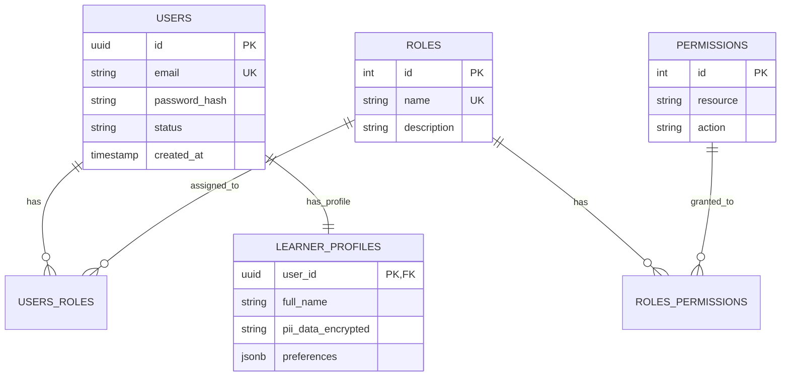
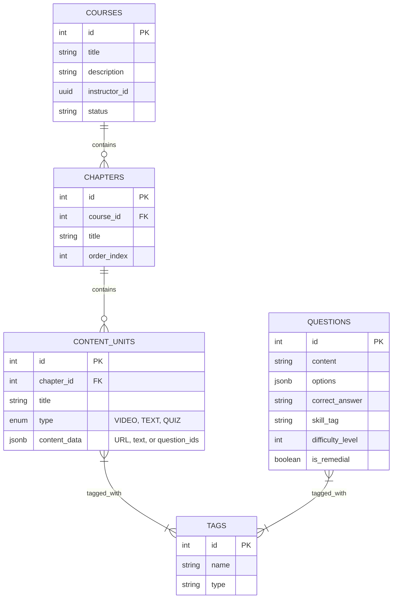
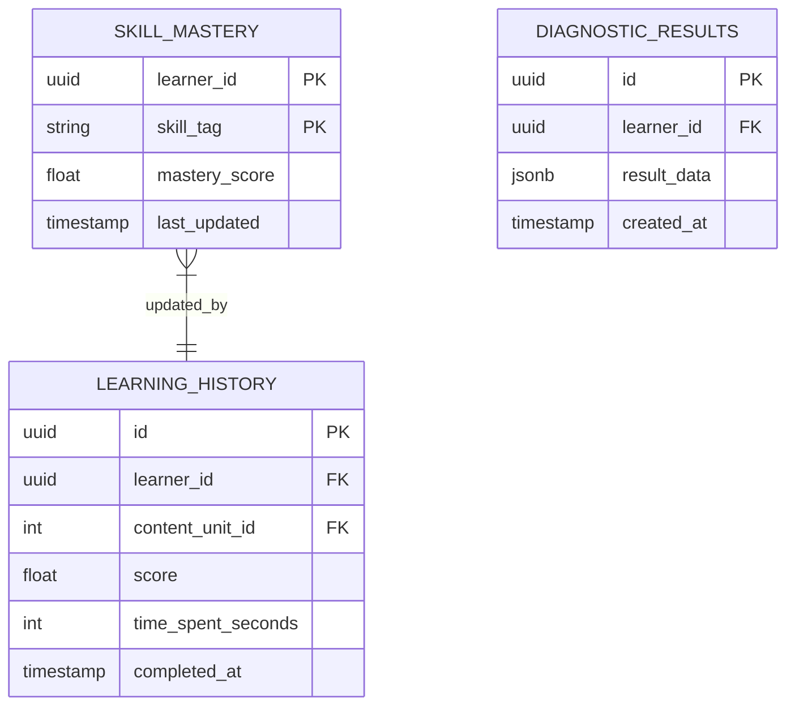

# Entity Relationship Diagrams (ERDs) for ITS

Dưới đây là mã Mermaid cho 3 ERD riêng biệt tương ứng với 3 Microservice chính, tuân thủ nguyên tắc Database-per-service.

## 1. User Management Service ERD (PostgreSQL)

Quản lý người dùng, phân quyền (RBAC) và thông tin cá nhân (PII).

## 2. Content Service ERD (PostgreSQL + JSONB)

Quản lý nội dung khóa học, chương, bài học và ngân hàng câu hỏi. Sử dụng JSONB cho cấu trúc linh hoạt.

## 3. Learner Model Service ERD (PostgreSQL / TimescaleDB)

Theo dõi tiến độ học tập, điểm số kỹ năng và lịch sử làm bài.

